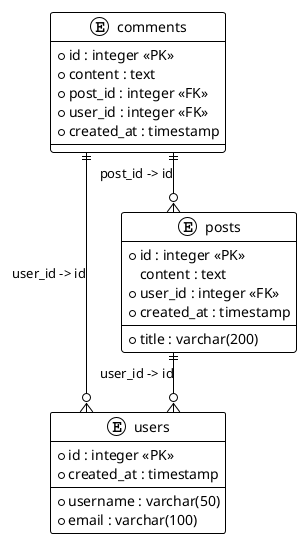

# 🗺️ Enhanced Entity-Relationship (ER) Diagram Features

## Overview

The PeerAI MongoMigrator now includes comprehensive ER diagram generation capabilities that automatically create detailed visual representations of your database schemas. These diagrams are generated in multiple formats and include comprehensive documentation.

## ✨ Key Features

### 🎯 **Multiple Diagram Formats**
- **Mermaid**: Interactive diagrams for GitHub, GitLab, and Markdown viewers
- **PlantUML**: Professional UML diagrams with extensive customization
- **DBML**: Database markup language for dbdiagram.io integration
- **JSON**: Structured data format for programmatic use

### 🎨 **Customizable Styles**
- **Detailed**: Full information including constraints, indexes, and data types
- **Simplified**: Essential relationships and table structures
- **Minimal**: Basic table and relationship overview

### 📊 **Comprehensive Coverage**
- Tables and their columns with data types
- Primary and foreign key relationships
- Indexes and constraints
- Views, functions, and triggers
- Relationship cardinality and constraints

## 🚀 **Usage**

### **Command Line Interface**

#### **Generate ER Diagram in Specific Format**
```bash
# Mermaid format (default)
peer-ai-mongo-migrator er-diagram

# PlantUML format
peer-ai-mongo-migrator er-diagram --format plantuml

# DBML format
peer-ai-mongo-migrator er-diagram --format dbml

# JSON format
peer-ai-mongo-migrator er-diagram --format json
```

#### **Customize Diagram Options**
```bash
# Detailed style with custom output directory
peer-ai-mongo-migrator er-diagram --format mermaid --style detailed --output ./diagrams

# Simplified style
peer-ai-mongo-migrator er-diagram --style simplified

# Include/exclude specific elements
peer-ai-mongo-migrator er-diagram --include-indexes --include-constraints --include-data-types
```

#### **Generate Comprehensive Documentation**
```bash
# Generate complete ER diagram documentation
peer-ai-mongo-migrator er-diagram --documentation
```

### **Natural Language Interface**

In interactive mode, you can use natural language to request ER diagrams:

```
🗺️ "Generate ER diagram for my postgres schema"
🗺️ "Show me the database relationships"
🗺️ "Create database diagram in plantuml format"
🗺️ "I want to see the entity relationships"
🗺️ "Generate comprehensive ER documentation"
```

### **Integration with Schema Analysis**

ER diagrams are automatically included when you run comprehensive schema analysis:

```bash
# This will include enhanced ER diagrams in the documentation
peer-ai-mongo-migrator schema --analyze
```

## 📁 **Generated Files**

### **Individual Format Files**
- **Mermaid**: `er-diagram-{timestamp}.md`
- **PlantUML**: `er-diagram-{timestamp}.puml`
- **DBML**: `er-diagram-{timestamp}.dbml`
- **JSON**: `er-diagram-{timestamp}.json`

### **Comprehensive Documentation**
- **Complete Documentation**: `er-diagram-documentation-{timestamp}.md`

## 🎨 **Diagram Examples**

### **Mermaid ER Diagram**
```mermaid
erDiagram
    users {
        integer id 🔑
        varchar(50) username
        varchar(100) email
        timestamp created_at
    }
    posts {
        integer id 🔑
        varchar(200) title
        text content
        integer user_id 🔗
        timestamp created_at
    }
    comments {
        integer id 🔑
        text content
        integer post_id 🔗
        integer user_id 🔗
        timestamp created_at
    }
    posts ||--o{ users : "user_id -> id"
    comments ||--o{ posts : "post_id -> id"
    comments ||--o{ users : "user_id -> id"
```

### **PlantUML ER Diagram**


### **DBML Schema**
```dbml
// Database Schema Definition
// Generated: 2024-01-15T10:30:00
// Tables: 3, Relationships: 3

Table users {
  id integer [pk]
  username varchar(50) [not null]
  email varchar(100) [not null]
  created_at timestamp [not null]
}

Table posts {
  id integer [pk]
  title varchar(200) [not null]
  content text
  user_id integer [ref: > users.id]
  created_at timestamp [not null]
}

Table comments {
  id integer [pk]
  content text [not null]
  post_id integer [ref: > posts.id]
  user_id integer [ref: > users.id]
  created_at timestamp [not null]
}

// Indexes
Index idx_users_username on users (username) [unique]
Index idx_posts_user_id on posts (user_id)
```

## 🔧 **Configuration Options**

### **Diagram Generation Options**
```typescript
interface ERDiagramOptions {
  format: 'mermaid' | 'plantuml' | 'dbml' | 'json';
  includeIndexes: boolean;
  includeConstraints: boolean;
  includeDataTypes: boolean;
  includeCardinality: boolean;
  includeDescriptions: boolean;
  outputPath?: string;
  diagramStyle?: 'detailed' | 'simplified' | 'minimal';
}
```

### **Default Values**
- **Format**: `mermaid`
- **Style**: `detailed`
- **Include Indexes**: `true`
- **Include Constraints**: `true`
- **Include Data Types**: `true`
- **Include Cardinality**: `true`
- **Include Descriptions**: `false`

## 🌐 **Online Viewing & Tools**

### **Mermaid Diagrams**
- **GitHub/GitLab**: Native support in markdown files
- **Mermaid Live Editor**: https://mermaid.live/
- **VS Code**: Install Mermaid extension

### **PlantUML Diagrams**
- **Online Server**: http://www.plantuml.com/plantuml/uml/
- **VS Code**: Install PlantUML extension
- **Local Installation**: Install Java and PlantUML

### **DBML Diagrams**
- **dbdiagram.io**: https://dbdiagram.io/
- **VS Code**: Install DBML extension
- **CLI Tools**: Install DBML tools

## 🧪 **Testing**

Run the test script to verify ER diagram functionality:

```bash
# Test ER diagram generation with mock data
node test-er-diagram.js
```

This will generate sample diagrams in all formats and create comprehensive documentation.

## 📚 **API Reference**

### **ERDiagramGenerator Class**

#### **Methods**
- `generateERDiagram(schema, options)`: Generate diagram in specified format
- `generateERDocumentation(schema)`: Generate comprehensive documentation

#### **Integration Points**
- **SchemaService**: Enhanced with ER diagram methods
- **MarkdownGenerator**: Includes enhanced ER diagrams
- **MCPAgent**: New ER diagram generation endpoints
- **CLI**: New `er-diagram` command with full options

## 🔄 **Migration from Previous Versions**

### **What's New**
- ✅ Enhanced ER diagram generation
- ✅ Multiple output formats
- ✅ Natural language support
- ✅ Comprehensive documentation
- ✅ Configurable options

### **Backward Compatibility**
- ✅ Existing schema analysis still works
- ✅ Previous Mermaid diagrams are enhanced
- ✅ No breaking changes to existing functionality

## 🎯 **Use Cases**

### **Database Documentation**
- Generate comprehensive schema documentation
- Create visual representations for stakeholders
- Document database relationships and constraints

### **Development & Design**
- Visualize database structure during development
- Plan database changes and migrations
- Communicate schema design to team members

### **Integration & Tools**
- Use with CI/CD pipelines for documentation
- Integrate with documentation generators
- Export to various diagram tools and platforms

## 🚀 **Future Enhancements**

### **Planned Features**
- **Interactive Diagrams**: Clickable elements with detailed information
- **Version Control**: Track schema changes over time
- **Export Formats**: Additional diagram formats (SVG, PNG, PDF)
- **Custom Styling**: User-defined colors and themes
- **Relationship Analysis**: Advanced relationship detection and analysis

### **Integration Plans**
- **Database Tools**: Integration with popular database management tools
- **API Endpoints**: RESTful API for diagram generation
- **Web Interface**: Web-based diagram viewer and editor
- **Collaboration**: Multi-user diagram editing and sharing

---

## 📞 **Support & Feedback**

For questions, issues, or feature requests related to ER diagram functionality:

1. **Check the documentation** for usage examples
2. **Run the test script** to verify functionality
3. **Review generated files** for output quality
4. **Submit issues** with detailed descriptions

---

*Generated by PeerAI MongoMigrator v2.0 with Enhanced ER Diagram Generator*
