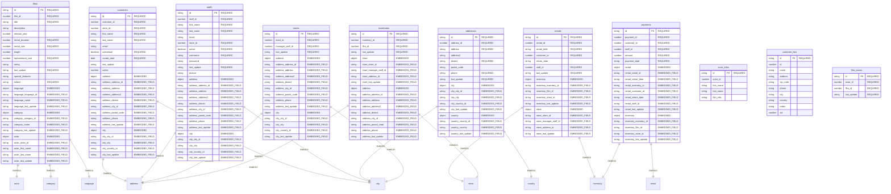

```mermaid
erDiagram

    films {
        string id PK "REQUIRED"
        number film_id "REQUIRED"
        string title "REQUIRED"
        string description
        number release_year
        number rental_duration "REQUIRED"
        number rental_rate "REQUIRED"
        number length
        number replacement_cost "REQUIRED"
        string rating
        string last_update "REQUIRED"
        string special_features
        string fulltext "REQUIRED"
        object language "EMBEDDED"
        string language_language_id "EMBEDDED_FIELD"
        string language_name "EMBEDDED_FIELD"
        string language_last_update "EMBEDDED_FIELD"
        object category "EMBEDDED"
        string category_category_id "EMBEDDED_FIELD"
        string category_name "EMBEDDED_FIELD"
        string category_last_update "EMBEDDED_FIELD"
        object actor "EMBEDDED"
        string actor_actor_id "EMBEDDED_FIELD"
        string actor_first_name "EMBEDDED_FIELD"
        string actor_last_name "EMBEDDED_FIELD"
        string actor_last_update "EMBEDDED_FIELD"
    }

    customers {
        string id PK "REQUIRED"
        number customer_id "REQUIRED"
        number store_id "REQUIRED"
        string first_name "REQUIRED"
        string last_name "REQUIRED"
        string email
        boolean activebool "REQUIRED"
        date create_date "REQUIRED"
        string last_update
        number active
        object address "EMBEDDED"
        string address_address_id "EMBEDDED_FIELD"
        string address_address "EMBEDDED_FIELD"
        string address_address2 "EMBEDDED_FIELD"
        string address_district "EMBEDDED_FIELD"
        string address_city_id "EMBEDDED_FIELD"
        string address_postal_code "EMBEDDED_FIELD"
        string address_phone "EMBEDDED_FIELD"
        string address_last_update "EMBEDDED_FIELD"
        object city "EMBEDDED"
        string city_city_id "EMBEDDED_FIELD"
        string city_city "EMBEDDED_FIELD"
        string city_country_id "EMBEDDED_FIELD"
        string city_last_update "EMBEDDED_FIELD"
    }

    staffs {
        string id PK "REQUIRED"
        number staff_id "REQUIRED"
        string first_name "REQUIRED"
        string last_name "REQUIRED"
        string email
        number store_id "REQUIRED"
        boolean active "REQUIRED"
        string username "REQUIRED"
        string password
        string last_update "REQUIRED"
        string picture
        object address "EMBEDDED"
        string address_address_id "EMBEDDED_FIELD"
        string address_address "EMBEDDED_FIELD"
        string address_address2 "EMBEDDED_FIELD"
        string address_district "EMBEDDED_FIELD"
        string address_city_id "EMBEDDED_FIELD"
        string address_postal_code "EMBEDDED_FIELD"
        string address_phone "EMBEDDED_FIELD"
        string address_last_update "EMBEDDED_FIELD"
        object city "EMBEDDED"
        string city_city_id "EMBEDDED_FIELD"
        string city_city "EMBEDDED_FIELD"
        string city_country_id "EMBEDDED_FIELD"
        string city_last_update "EMBEDDED_FIELD"
    }

    addresses {
        string id PK "REQUIRED"
        number address_id "REQUIRED"
        string address "REQUIRED"
        string address2
        string district "REQUIRED"
        string postal_code
        string phone "REQUIRED"
        string last_update "REQUIRED"
        object city "EMBEDDED"
        string city_city_id "EMBEDDED_FIELD"
        string city_city "EMBEDDED_FIELD"
        string city_country_id "EMBEDDED_FIELD"
        string city_last_update "EMBEDDED_FIELD"
        object country "EMBEDDED"
        string country_country_id "EMBEDDED_FIELD"
        string country_country "EMBEDDED_FIELD"
        string country_last_update "EMBEDDED_FIELD"
    }

    stores {
        string id PK "REQUIRED"
        number store_id "REQUIRED"
        number manager_staff_id "REQUIRED"
        string last_update "REQUIRED"
        object address "EMBEDDED"
        string address_address_id "EMBEDDED_FIELD"
        string address_address "EMBEDDED_FIELD"
        string address_address2 "EMBEDDED_FIELD"
        string address_district "EMBEDDED_FIELD"
        string address_city_id "EMBEDDED_FIELD"
        string address_postal_code "EMBEDDED_FIELD"
        string address_phone "EMBEDDED_FIELD"
        string address_last_update "EMBEDDED_FIELD"
        object city "EMBEDDED"
        string city_city_id "EMBEDDED_FIELD"
        string city_city "EMBEDDED_FIELD"
        string city_country_id "EMBEDDED_FIELD"
        string city_last_update "EMBEDDED_FIELD"
    }

    rentals {
        string id PK "REQUIRED"
        number rental_id "REQUIRED"
        string rental_date "REQUIRED"
        number customer_id "REQUIRED"
        string return_date
        number staff_id "REQUIRED"
        string last_update "REQUIRED"
        object inventory "EMBEDDED"
        string inventory_inventory_id "EMBEDDED_FIELD"
        string inventory_film_id "EMBEDDED_FIELD"
        string inventory_store_id "EMBEDDED_FIELD"
        string inventory_last_update "EMBEDDED_FIELD"
        object store "EMBEDDED"
        string store_store_id "EMBEDDED_FIELD"
        string store_manager_staff_id "EMBEDDED_FIELD"
        string store_address_id "EMBEDDED_FIELD"
        string store_last_update "EMBEDDED_FIELD"
    }

    payments {
        string id PK "REQUIRED"
        number payment_id "REQUIRED"
        number customer_id "REQUIRED"
        number staff_id "REQUIRED"
        number amount "REQUIRED"
        string payment_date "REQUIRED"
        object rental "EMBEDDED"
        string rental_rental_id "EMBEDDED_FIELD"
        string rental_rental_date "EMBEDDED_FIELD"
        string rental_inventory_id "EMBEDDED_FIELD"
        string rental_customer_id "EMBEDDED_FIELD"
        string rental_return_date "EMBEDDED_FIELD"
        string rental_staff_id "EMBEDDED_FIELD"
        string rental_last_update "EMBEDDED_FIELD"
        object inventory "EMBEDDED"
        string inventory_inventory_id "EMBEDDED_FIELD"
        string inventory_film_id "EMBEDDED_FIELD"
        string inventory_store_id "EMBEDDED_FIELD"
        string inventory_last_update "EMBEDDED_FIELD"
    }

    inventories {
        string id PK "REQUIRED"
        number inventory_id "REQUIRED"
        number film_id "REQUIRED"
        string last_update "REQUIRED"
        object store "EMBEDDED"
        string store_store_id "EMBEDDED_FIELD"
        string store_manager_staff_id "EMBEDDED_FIELD"
        string store_address_id "EMBEDDED_FIELD"
        string store_last_update "EMBEDDED_FIELD"
        object address "EMBEDDED"
        string address_address_id "EMBEDDED_FIELD"
        string address_address "EMBEDDED_FIELD"
        string address_address2 "EMBEDDED_FIELD"
        string address_district "EMBEDDED_FIELD"
        string address_city_id "EMBEDDED_FIELD"
        string address_postal_code "EMBEDDED_FIELD"
        string address_phone "EMBEDDED_FIELD"
        string address_last_update "EMBEDDED_FIELD"
    }

    actor_infos {
        string id PK "REQUIRED"
        number actor_id
        string first_name
        string last_name
        string film_info
    }

    customer_lists {
        string id PK "REQUIRED"
        number id
        string name
        string address
        string zip_code
        string phone
        string city
        string country
        string notes
        number sid
    }

    film_actors {
        string id PK "REQUIRED"
        number actor_id "REQUIRED"
        number film_id "REQUIRED"
        string last_update "REQUIRED"
    }

    films ||--|| language : "EMBEDS"
    films ||--|| category : "EMBEDS"
    films ||--|| actor : "EMBEDS"
    customers ||--|| address : "EMBEDS"
    customers ||--|| city : "EMBEDS"
    staffs ||--|| address : "EMBEDS"
    staffs ||--|| city : "EMBEDS"
    addresses ||--|| city : "EMBEDS"
    addresses ||--|| country : "EMBEDS"
    stores ||--|| address : "EMBEDS"
    stores ||--|| city : "EMBEDS"
    rentals ||--|| inventory : "EMBEDS"
    rentals ||--|| store : "EMBEDS"
    payments ||--|| rental : "EMBEDS"
    payments ||--|| inventory : "EMBEDS"
    inventories ||--|| store : "EMBEDS"
    inventories ||--|| address : "EMBEDS"
```
