# MongoDB Schema Documentation

**Generated:** 8/26/2025, 4:26:11 PM
**Source:** PostgreSQL Schema Conversion
**Analysis Type:** Comprehensive MongoDB Schema Generation

---

## 📋 Table of Contents

- [Schema Overview](#schema-overview)
- [Compatibility Report](#compatibility-report)
- [MongoDB Collections](#mongodb-collections)
  - [films](#collection-films)
  - [customers](#collection-customers)
  - [staffs](#collection-staffs)
  - [addresses](#collection-addresses)
  - [stores](#collection-stores)
  - [rentals](#collection-rentals)
  - [payments](#collection-payments)
  - [inventories](#collection-inventories)
  - [actor_infos](#collection-actor_infos)
  - [customer_lists](#collection-customer_lists)
  - [film_actors](#collection-film_actors)
- [Type Mappings](#type-mappings)
- [Relationship Strategies](#relationship-strategies)
- [Performance Considerations](#performance-considerations)
- [Intelligent MongoDB Design](#intelligent-mongodb-design)
- [Embedded Document Strategy](#embedded-document-strategy)
- [Denormalization Strategy](#denormalization-strategy)
- [Recommendations](#recommendations)
- [Migration Guide](#migration-guide)
- [Database Diagrams](#database-diagrams)

---

## 🏗️ Schema Overview

This document contains the MongoDB schema design converted from your PostgreSQL database schema. The conversion process analyzes compatibility, maps data types, and provides recommendations for optimal MongoDB performance.

### 📊 Conversion Statistics
- **Total Collections:** 11
- **Compatible Tables:** 22
- **Incompatible Tables:** 0
- **Type Mappings:** 123
- **Relationship Strategies:** 11
- **Generated:** 8/26/2025, 4:26:11 PM

### 🎯 Purpose
This MongoDB schema is designed for user management and customer relationship management. The conversion process ensures high compatibility with PostgreSQL structures, optimized relationship handling with embedded documents and references, performance-optimized with strategic indexing recommendations.

---

## 🔍 Compatibility Report

### ✅ Compatible Tables
- `actor`
- `actor_info`
- `address`
- `category`
- `city`
- `country`
- `customer`
- `customer_list`
- `film`
- `film_actor`
- `film_category`
- `film_list`
- `inventory`
- `language`
- `nicer_but_slower_film_list`
- `payment`
- `rental`
- `sales_by_film_category`
- `sales_by_store`
- `staff`
- `staff_list`
- `store`

### ❌ Incompatible Tables
*All tables are compatible*

### 📝 Compatibility Notes
- **Type Mappings:** All PostgreSQL data types have been mapped to equivalent MongoDB types
- **Relationships:** Foreign key relationships have been converted to embedded documents or references
- **Constraints:** PostgreSQL constraints have been converted to MongoDB validation rules
- **Indexes:** Appropriate MongoDB indexes have been recommended based on PostgreSQL structure

---

## 🧠 Intelligent MongoDB Collections

**This is NOT a 1:1 mapping!** Instead, we create optimized collections with embedded documents based on your actual database relationships.

### 📊 Collection Strategy Summary
- **Total Collections**: 11 (reduced from 28 PostgreSQL tables)
- **Standalone Collections**: 3
- **Collections with Embedded Documents**: 8

### 🔗 Collections with Embedded Documents (Intelligent Design)

### 🔗 Collection: `films`

**🎯 Design Strategy**: This collection intelligently combines multiple PostgreSQL tables using embedded documents for optimal performance.

**📦 Embedded Tables**:
- **language** (from PostgreSQL table `language`)
- **category** (from PostgreSQL table `category`)
- **actor** (from PostgreSQL table `actor`)

**🏗️ Document Structure**:

| Field | Type | Required | Description | PostgreSQL Origin |
|-------|------|----------|-------------|-------------------|
| `_id` | `ObjectId` | ✅ Yes | MongoDB document identifier | N/A |
| `film_id` | `Number` | ✅ Yes | Converted from PostgreSQL integer field | `film_id` (integer) |
| `title` | `String` | ✅ Yes | Converted from PostgreSQL character varying field | `title` (character varying) |
| `description` | `String` | ❌ No | Converted from PostgreSQL text field | `description` (text) |
| `release_year` | `Number` | ❌ No | Converted from PostgreSQL integer field | `release_year` (integer) |
| `rental_duration` | `Number` | ✅ Yes | Converted from PostgreSQL smallint field | `rental_duration` (smallint) |
| `rental_rate` | `Number` | ✅ Yes | Converted from PostgreSQL numeric field | `rental_rate` (numeric) |
| `length` | `Number` | ❌ No | Converted from PostgreSQL smallint field | `length` (smallint) |
| `replacement_cost` | `Number` | ✅ Yes | Converted from PostgreSQL numeric field | `replacement_cost` (numeric) |
| `rating` | `String` | ❌ No | Converted from PostgreSQL USER-DEFINED field | `rating` (USER-DEFINED) |
| `last_update` | `String` | ✅ Yes | Converted from PostgreSQL timestamp without time zone field | `last_update` (timestamp without time zone) |
| `special_features` | `String` | ❌ No | Converted from PostgreSQL ARRAY field | `special_features` (ARRAY) |
| `fulltext` | `String` | ✅ Yes | Converted from PostgreSQL tsvector field | `fulltext` (tsvector) |

**🔗 Embedded Document Examples**:

#### 📦 language (Embedded from `language`)

**Why Embedded**: This table is frequently accessed together with the parent collection.

**Structure**:
```json
{
  "language_id": "Number",
  "name": "String",
  "last_update": "String"
}
```

#### 📦 category (Embedded from `category`)

**Why Embedded**: This table is frequently accessed together with the parent collection.

**Structure**:
```json
{
  "category_id": "Number",
  "name": "String",
  "last_update": "String"
}
```

#### 📦 actor (Embedded from `actor`)

**Why Embedded**: This table is frequently accessed together with the parent collection.

**Structure**:
```json
{
  "actor_id": "Number",
  "first_name": "String",
  "last_name": "String",
  "last_update": "String"
}
```

**⚡ Performance Benefits**:
- **Faster Queries**: No JOINs needed for embedded data
- **Better Data Locality**: Related data stored together
- **Reduced Network Calls**: Single document fetch instead of multiple queries

---

### 🔗 Collection: `customers`

**🎯 Design Strategy**: This collection intelligently combines multiple PostgreSQL tables using embedded documents for optimal performance.

**📦 Embedded Tables**:
- **address** (from PostgreSQL table `address`)
- **city** (from PostgreSQL table `city`)

**🏗️ Document Structure**:

| Field | Type | Required | Description | PostgreSQL Origin |
|-------|------|----------|-------------|-------------------|
| `_id` | `ObjectId` | ✅ Yes | MongoDB document identifier | N/A |
| `customer_id` | `Number` | ✅ Yes | Converted from PostgreSQL integer field | `customer_id` (integer) |
| `store_id` | `Number` | ✅ Yes | Converted from PostgreSQL smallint field | `store_id` (smallint) |
| `first_name` | `String` | ✅ Yes | Converted from PostgreSQL character varying field | `first_name` (character varying) |
| `last_name` | `String` | ✅ Yes | Converted from PostgreSQL character varying field | `last_name` (character varying) |
| `email` | `String` | ❌ No | Converted from PostgreSQL character varying field | `email` (character varying) |
| `activebool` | `Boolean` | ✅ Yes | Converted from PostgreSQL boolean field | `activebool` (boolean) |
| `create_date` | `Date` | ✅ Yes | Converted from PostgreSQL date field | `create_date` (date) |
| `last_update` | `String` | ❌ No | Converted from PostgreSQL timestamp without time zone field | `last_update` (timestamp without time zone) |
| `active` | `Number` | ❌ No | Converted from PostgreSQL integer field | `active` (integer) |

**🔗 Embedded Document Examples**:

#### 📦 address (Embedded from `address`)

**Why Embedded**: This table is frequently accessed together with the parent collection.

**Structure**:
```json
{
  "address_id": "Number",
  "address": "String",
  "address2": "String",
  "district": "String",
  "city_id": "Number",
  "postal_code": "String",
  "phone": "String",
  "last_update": "String"
}
```

#### 📦 city (Embedded from `city`)

**Why Embedded**: This table is frequently accessed together with the parent collection.

**Structure**:
```json
{
  "city_id": "Number",
  "city": "String",
  "country_id": "Number",
  "last_update": "String"
}
```

**⚡ Performance Benefits**:
- **Faster Queries**: No JOINs needed for embedded data
- **Better Data Locality**: Related data stored together
- **Reduced Network Calls**: Single document fetch instead of multiple queries

---

### 🔗 Collection: `staffs`

**🎯 Design Strategy**: This collection intelligently combines multiple PostgreSQL tables using embedded documents for optimal performance.

**📦 Embedded Tables**:
- **address** (from PostgreSQL table `address`)
- **city** (from PostgreSQL table `city`)

**🏗️ Document Structure**:

| Field | Type | Required | Description | PostgreSQL Origin |
|-------|------|----------|-------------|-------------------|
| `_id` | `ObjectId` | ✅ Yes | MongoDB document identifier | N/A |
| `staff_id` | `Number` | ✅ Yes | Converted from PostgreSQL integer field | `staff_id` (integer) |
| `first_name` | `String` | ✅ Yes | Converted from PostgreSQL character varying field | `first_name` (character varying) |
| `last_name` | `String` | ✅ Yes | Converted from PostgreSQL character varying field | `last_name` (character varying) |
| `email` | `String` | ❌ No | Converted from PostgreSQL character varying field | `email` (character varying) |
| `store_id` | `Number` | ✅ Yes | Converted from PostgreSQL smallint field | `store_id` (smallint) |
| `active` | `Boolean` | ✅ Yes | Converted from PostgreSQL boolean field | `active` (boolean) |
| `username` | `String` | ✅ Yes | Converted from PostgreSQL character varying field | `username` (character varying) |
| `password` | `String` | ❌ No | Converted from PostgreSQL character varying field | `password` (character varying) |
| `last_update` | `String` | ✅ Yes | Converted from PostgreSQL timestamp without time zone field | `last_update` (timestamp without time zone) |
| `picture` | `Binary` | ❌ No | Converted from PostgreSQL bytea field | `picture` (bytea) |

**🔗 Embedded Document Examples**:

#### 📦 address (Embedded from `address`)

**Why Embedded**: This table is frequently accessed together with the parent collection.

**Structure**:
```json
{
  "address_id": "Number",
  "address": "String",
  "address2": "String",
  "district": "String",
  "city_id": "Number",
  "postal_code": "String",
  "phone": "String",
  "last_update": "String"
}
```

#### 📦 city (Embedded from `city`)

**Why Embedded**: This table is frequently accessed together with the parent collection.

**Structure**:
```json
{
  "city_id": "Number",
  "city": "String",
  "country_id": "Number",
  "last_update": "String"
}
```

**⚡ Performance Benefits**:
- **Faster Queries**: No JOINs needed for embedded data
- **Better Data Locality**: Related data stored together
- **Reduced Network Calls**: Single document fetch instead of multiple queries

---

### 🔗 Collection: `addresses`

**🎯 Design Strategy**: This collection intelligently combines multiple PostgreSQL tables using embedded documents for optimal performance.

**📦 Embedded Tables**:
- **city** (from PostgreSQL table `city`)
- **country** (from PostgreSQL table `country`)

**🏗️ Document Structure**:

| Field | Type | Required | Description | PostgreSQL Origin |
|-------|------|----------|-------------|-------------------|
| `_id` | `ObjectId` | ✅ Yes | MongoDB document identifier | N/A |
| `address_id` | `Number` | ✅ Yes | Converted from PostgreSQL integer field | `address_id` (integer) |
| `address` | `String` | ✅ Yes | Converted from PostgreSQL character varying field | `address` (character varying) |
| `address2` | `String` | ❌ No | Converted from PostgreSQL character varying field | `address2` (character varying) |
| `district` | `String` | ✅ Yes | Converted from PostgreSQL character varying field | `district` (character varying) |
| `postal_code` | `String` | ❌ No | Converted from PostgreSQL character varying field | `postal_code` (character varying) |
| `phone` | `String` | ✅ Yes | Converted from PostgreSQL character varying field | `phone` (character varying) |
| `last_update` | `String` | ✅ Yes | Converted from PostgreSQL timestamp without time zone field | `last_update` (timestamp without time zone) |

**🔗 Embedded Document Examples**:

#### 📦 city (Embedded from `city`)

**Why Embedded**: This table is frequently accessed together with the parent collection.

**Structure**:
```json
{
  "city_id": "Number",
  "city": "String",
  "country_id": "Number",
  "last_update": "String"
}
```

#### 📦 country (Embedded from `country`)

**Why Embedded**: This table is frequently accessed together with the parent collection.

**Structure**:
```json
{
  "country_id": "Number",
  "country": "String",
  "last_update": "String"
}
```

**⚡ Performance Benefits**:
- **Faster Queries**: No JOINs needed for embedded data
- **Better Data Locality**: Related data stored together
- **Reduced Network Calls**: Single document fetch instead of multiple queries

---

### 🔗 Collection: `stores`

**🎯 Design Strategy**: This collection intelligently combines multiple PostgreSQL tables using embedded documents for optimal performance.

**📦 Embedded Tables**:
- **address** (from PostgreSQL table `address`)
- **city** (from PostgreSQL table `city`)

**🏗️ Document Structure**:

| Field | Type | Required | Description | PostgreSQL Origin |
|-------|------|----------|-------------|-------------------|
| `_id` | `ObjectId` | ✅ Yes | MongoDB document identifier | N/A |
| `store_id` | `Number` | ✅ Yes | Converted from PostgreSQL integer field | `store_id` (integer) |
| `manager_staff_id` | `Number` | ✅ Yes | Converted from PostgreSQL smallint field | `manager_staff_id` (smallint) |
| `last_update` | `String` | ✅ Yes | Converted from PostgreSQL timestamp without time zone field | `last_update` (timestamp without time zone) |

**🔗 Embedded Document Examples**:

#### 📦 address (Embedded from `address`)

**Why Embedded**: This table is frequently accessed together with the parent collection.

**Structure**:
```json
{
  "address_id": "Number",
  "address": "String",
  "address2": "String",
  "district": "String",
  "city_id": "Number",
  "postal_code": "String",
  "phone": "String",
  "last_update": "String"
}
```

#### 📦 city (Embedded from `city`)

**Why Embedded**: This table is frequently accessed together with the parent collection.

**Structure**:
```json
{
  "city_id": "Number",
  "city": "String",
  "country_id": "Number",
  "last_update": "String"
}
```

**⚡ Performance Benefits**:
- **Faster Queries**: No JOINs needed for embedded data
- **Better Data Locality**: Related data stored together
- **Reduced Network Calls**: Single document fetch instead of multiple queries

---

### 🔗 Collection: `rentals`

**🎯 Design Strategy**: This collection intelligently combines multiple PostgreSQL tables using embedded documents for optimal performance.

**📦 Embedded Tables**:
- **inventory** (from PostgreSQL table `inventory`)
- **store** (from PostgreSQL table `store`)

**🏗️ Document Structure**:

| Field | Type | Required | Description | PostgreSQL Origin |
|-------|------|----------|-------------|-------------------|
| `_id` | `ObjectId` | ✅ Yes | MongoDB document identifier | N/A |
| `rental_id` | `Number` | ✅ Yes | Converted from PostgreSQL integer field | `rental_id` (integer) |
| `rental_date` | `String` | ✅ Yes | Converted from PostgreSQL timestamp without time zone field | `rental_date` (timestamp without time zone) |
| `customer_id` | `Number` | ✅ Yes | Converted from PostgreSQL smallint field | `customer_id` (smallint) |
| `return_date` | `String` | ❌ No | Converted from PostgreSQL timestamp without time zone field | `return_date` (timestamp without time zone) |
| `staff_id` | `Number` | ✅ Yes | Converted from PostgreSQL smallint field | `staff_id` (smallint) |
| `last_update` | `String` | ✅ Yes | Converted from PostgreSQL timestamp without time zone field | `last_update` (timestamp without time zone) |

**🔗 Embedded Document Examples**:

#### 📦 inventory (Embedded from `inventory`)

**Why Embedded**: This table is frequently accessed together with the parent collection.

**Structure**:
```json
{
  "inventory_id": "Number",
  "film_id": "Number",
  "store_id": "Number",
  "last_update": "String"
}
```

#### 📦 store (Embedded from `store`)

**Why Embedded**: This table is frequently accessed together with the parent collection.

**Structure**:
```json
{
  "store_id": "Number",
  "manager_staff_id": "Number",
  "address_id": "Number",
  "last_update": "String"
}
```

**⚡ Performance Benefits**:
- **Faster Queries**: No JOINs needed for embedded data
- **Better Data Locality**: Related data stored together
- **Reduced Network Calls**: Single document fetch instead of multiple queries

---

### 🔗 Collection: `payments`

**🎯 Design Strategy**: This collection intelligently combines multiple PostgreSQL tables using embedded documents for optimal performance.

**📦 Embedded Tables**:
- **rental** (from PostgreSQL table `rental`)
- **inventory** (from PostgreSQL table `inventory`)

**🏗️ Document Structure**:

| Field | Type | Required | Description | PostgreSQL Origin |
|-------|------|----------|-------------|-------------------|
| `_id` | `ObjectId` | ✅ Yes | MongoDB document identifier | N/A |
| `payment_id` | `Number` | ✅ Yes | Converted from PostgreSQL integer field | `payment_id` (integer) |
| `customer_id` | `Number` | ✅ Yes | Converted from PostgreSQL smallint field | `customer_id` (smallint) |
| `staff_id` | `Number` | ✅ Yes | Converted from PostgreSQL smallint field | `staff_id` (smallint) |
| `amount` | `Number` | ✅ Yes | Converted from PostgreSQL numeric field | `amount` (numeric) |
| `payment_date` | `String` | ✅ Yes | Converted from PostgreSQL timestamp without time zone field | `payment_date` (timestamp without time zone) |

**🔗 Embedded Document Examples**:

#### 📦 rental (Embedded from `rental`)

**Why Embedded**: This table is frequently accessed together with the parent collection.

**Structure**:
```json
{
  "rental_id": "Number",
  "rental_date": "String",
  "inventory_id": "Number",
  "customer_id": "Number",
  "return_date": "String",
  "staff_id": "Number",
  "last_update": "String"
}
```

#### 📦 inventory (Embedded from `inventory`)

**Why Embedded**: This table is frequently accessed together with the parent collection.

**Structure**:
```json
{
  "inventory_id": "Number",
  "film_id": "Number",
  "store_id": "Number",
  "last_update": "String"
}
```

**⚡ Performance Benefits**:
- **Faster Queries**: No JOINs needed for embedded data
- **Better Data Locality**: Related data stored together
- **Reduced Network Calls**: Single document fetch instead of multiple queries

---

### 🔗 Collection: `inventories`

**🎯 Design Strategy**: This collection intelligently combines multiple PostgreSQL tables using embedded documents for optimal performance.

**📦 Embedded Tables**:
- **store** (from PostgreSQL table `store`)
- **address** (from PostgreSQL table `address`)

**🏗️ Document Structure**:

| Field | Type | Required | Description | PostgreSQL Origin |
|-------|------|----------|-------------|-------------------|
| `_id` | `ObjectId` | ✅ Yes | MongoDB document identifier | N/A |
| `inventory_id` | `Number` | ✅ Yes | Converted from PostgreSQL integer field | `inventory_id` (integer) |
| `film_id` | `Number` | ✅ Yes | Converted from PostgreSQL smallint field | `film_id` (smallint) |
| `last_update` | `String` | ✅ Yes | Converted from PostgreSQL timestamp without time zone field | `last_update` (timestamp without time zone) |

**🔗 Embedded Document Examples**:

#### 📦 store (Embedded from `store`)

**Why Embedded**: This table is frequently accessed together with the parent collection.

**Structure**:
```json
{
  "store_id": "Number",
  "manager_staff_id": "Number",
  "address_id": "Number",
  "last_update": "String"
}
```

#### 📦 address (Embedded from `address`)

**Why Embedded**: This table is frequently accessed together with the parent collection.

**Structure**:
```json
{
  "address_id": "Number",
  "address": "String",
  "address2": "String",
  "district": "String",
  "city_id": "Number",
  "postal_code": "String",
  "phone": "String",
  "last_update": "String"
}
```

**⚡ Performance Benefits**:
- **Faster Queries**: No JOINs needed for embedded data
- **Better Data Locality**: Related data stored together
- **Reduced Network Calls**: Single document fetch instead of multiple queries

---

### 📁 Standalone Collections

### 📁 Collection: `actor_infos`

**🎯 Design Strategy**: This collection remains standalone because it's accessed independently or is too large to embed.

**🏗️ Document Structure**:

| Field | Type | Required | Description | PostgreSQL Origin |
|-------|------|----------|-------------|-------------------|
| `_id` | `ObjectId` | ✅ Yes | MongoDB document identifier | N/A |
| `actor_id` | `Number` | ❌ No | Converted from PostgreSQL integer field | `actor_id` (integer) |
| `first_name` | `String` | ❌ No | Converted from PostgreSQL character varying field | `first_name` (character varying) |
| `last_name` | `String` | ❌ No | Converted from PostgreSQL character varying field | `last_name` (character varying) |
| `film_info` | `String` | ❌ No | Converted from PostgreSQL text field | `film_info` (text) |

**📄 Sample Document**:

```json
{
  "_id": "ObjectId(\"...\")",
  "actor_id": 42,
  "first_name": "sample_string",
  "last_name": "sample_string",
  "film_info": "sample_string"
}
```

---

### 📁 Collection: `customer_lists`

**🎯 Design Strategy**: This collection remains standalone because it's accessed independently or is too large to embed.

**🏗️ Document Structure**:

| Field | Type | Required | Description | PostgreSQL Origin |
|-------|------|----------|-------------|-------------------|
| `_id` | `ObjectId` | ✅ Yes | MongoDB document identifier | N/A |
| `id` | `Number` | ❌ No | Converted from PostgreSQL integer field | `id` (integer) |
| `name` | `String` | ❌ No | Converted from PostgreSQL text field | `name` (text) |
| `address` | `String` | ❌ No | Converted from PostgreSQL character varying field | `address` (character varying) |
| `zip code` | `String` | ❌ No | Converted from PostgreSQL character varying field | `zip code` (character varying) |
| `phone` | `String` | ❌ No | Converted from PostgreSQL character varying field | `phone` (character varying) |
| `city` | `String` | ❌ No | Converted from PostgreSQL character varying field | `city` (character varying) |
| `country` | `String` | ❌ No | Converted from PostgreSQL character varying field | `country` (character varying) |
| `notes` | `String` | ❌ No | Converted from PostgreSQL text field | `notes` (text) |
| `sid` | `Number` | ❌ No | Converted from PostgreSQL smallint field | `sid` (smallint) |

**📄 Sample Document**:

```json
{
  "_id": "ObjectId(\"...\")",
  "id": 42,
  "name": "sample_string",
  "address": "sample_string",
  "zip code": "sample_string",
  "phone": "sample_string",
  "city": "sample_string",
  "country": "sample_string",
  "notes": "sample_string",
  "sid": 42
}
```

---

### 📁 Collection: `film_actors`

**🎯 Design Strategy**: This collection remains standalone because it's accessed independently or is too large to embed.

**🏗️ Document Structure**:

| Field | Type | Required | Description | PostgreSQL Origin |
|-------|------|----------|-------------|-------------------|
| `_id` | `ObjectId` | ✅ Yes | MongoDB document identifier | N/A |
| `actor_id` | `Number` | ✅ Yes | Converted from PostgreSQL smallint field | `actor_id` (smallint) |
| `film_id` | `Number` | ✅ Yes | Converted from PostgreSQL smallint field | `film_id` (smallint) |
| `last_update` | `String` | ✅ Yes | Converted from PostgreSQL timestamp without time zone field | `last_update` (timestamp without time zone) |

**📄 Sample Document**:

```json
{
  "_id": "ObjectId(\"...\")",
  "actor_id": 42,
  "film_id": 42,
  "last_update": "sample_string"
}
```

---

## 🔄 Type Mappings

This section shows how PostgreSQL data types have been mapped to MongoDB types:

| PostgreSQL Type | MongoDB Type | Notes |
|-----------------|--------------|-------|
| `integer` | `Number` |  |
| `bigint` | `Number` |  |
| `smallint` | `Number` |  |
| `serial` | `Number` | Auto-incrementing, consider using MongoDB ObjectId |
| `bigserial` | `Number` | Auto-incrementing, consider using MongoDB ObjectId |
| `text` | `String` |  |
| `varchar` | `String` |  |
| `char` | `String` |  |
| `boolean` | `Boolean` |  |
| `timestamp` | `Date` | Converted to MongoDB Date type |
| `timestamptz` | `Date` | Converted to MongoDB Date type |
| `date` | `Date` |  |
| `time` | `String` |  |
| `numeric` | `Number` |  |
| `decimal` | `Number` |  |
| `real` | `Number` |  |
| `double precision` | `Number` |  |
| `json` | `Object` | Preserved as MongoDB Object, validation rules recommended |
| `jsonb` | `Object` | Preserved as MongoDB Object, validation rules recommended |
| `uuid` | `String` |  |
| `bytea` | `Binary` |  |

---

## 🔗 Relationship Strategies

This section explains how PostgreSQL foreign key relationships have been converted to MongoDB:

**Table `address`:** Consider embedding for simple one-to-many relationships

**Table `city`:** Consider embedding for simple one-to-many relationships

**Table `customer`:** Consider embedding for simple one-to-many relationships

**Table `film`:** Consider embedding for simple one-to-many relationships

**Table `film_actor`:** Hybrid approach: embed simple relationships, reference complex ones

**Table `film_category`:** Hybrid approach: embed simple relationships, reference complex ones

**Table `inventory`:** Consider embedding for simple one-to-many relationships

**Table `payment`:** Hybrid approach: embed simple relationships, reference complex ones

**Table `rental`:** Hybrid approach: embed simple relationships, reference complex ones

**Table `staff`:** Consider embedding for simple one-to-many relationships

**Table `store`:** Hybrid approach: embed simple relationships, reference complex ones

### Relationship Conversion Rules

- **Embedding:** Used for simple, read-heavy relationships with small related documents
- **References:** Used for complex relationships, write-heavy scenarios, or large related documents
- **Hybrid Approach:** Combines both strategies based on relationship complexity

---

## 🚀 Performance Considerations

The following performance optimizations have been considered in this schema design:

- Consider creating compound indexes for frequently queried field combinations
- Embed related documents for read-heavy workloads
- Use references for write-heavy workloads with complex relationships
- Consider sharding strategies for large collections

### Indexing Strategy

- **Primary Keys:** Converted from PostgreSQL primary keys
- **Foreign Keys:** Indexed for efficient joins and lookups
- **Text Fields:** Text search indexes for string-based queries
- **Compound Indexes:** Recommended for frequently queried field combinations

---


## 🧠 Intelligent MongoDB Design

### Design Philosophy
This MongoDB schema is designed using intelligent analysis rather than simple 1:1 table mapping.

### Key Design Principles
1. **Embed Frequently Accessed Data**:  Related data that's queried together is embedded
2. **Reference Large Collections**:  Large tables are referenced to avoid document bloat
3. **Optimize for Read Patterns**:  Schema is optimized for your most common query patterns
4. **Balance Normalization**:  Strategic denormalization for performance without data redundancy

### Collection Design Strategy
- **Total Collections**: 3 (reduced from 22 PostgreSQL tables)
- **Collections with Embedded Documents**: 1
- **Collections with References**: 1
- **Standalone Collections**: 1


### 🎯 Real Database Example: Intelligent MongoDB Design

Based on your actual database schema, here is how intelligent embedding works:

#### 🔗 Films Collection (Embedded Example)
**Strategy**: Intelligent embedding based on your actual database relationships

**Why This Design?**
- **language**: Frequently accessed together with main data
- **category**: Frequently accessed together with main data
- **actor**: Frequently accessed together with main data
- **Performance**: Single query gets complete data with related information

**MongoDB Document Structure**:
```json
{
  "_id": ObjectId("..."),
  "films_id": 1,
  "name": "Sample Name",
  "description": "Sample description",
  "created_at": "2025-08-26T10:00:00Z",
  "updated_at": "2025-08-26T10:00:00Z",

  "language": {
    "name": "Sample Name",
    "type": "Sample Type",
    "last_update": "2025-08-26T10:00:00Z"
  },

  "category": {
    "name": "Sample Name",
    "type": "Sample Type",
    "last_update": "2025-08-26T10:00:00Z"
  },

  "actor": {
    "name": "Sample Name",
    "type": "Sample Type",
    "last_update": "2025-08-26T10:00:00Z"
  }

  "last_update": "2025-08-26T10:00:00Z"
}
```

**MongoDB Document Structure**:
```json
{
  "_id": ObjectId("..."),
  "title": "ACADEMY DINOSAUR",
  "description": "A Epic Drama of a Feminist And a Mad Scientist...",
  "release_year": 2006,
  "rental_duration": 6,
  "rental_rate": 0.99,
  "length": 86,
  "rating": "PG",
  "special_features": ["Deleted Scenes", "Behind the Scenes"],

  "language": {
    "name": "English",
    "last_update": "2025-08-26T10:00:00Z"
  },

  "categories": [
    {
      "name": "Documentary",
      "last_update": "2025-08-26T10:00:00Z"
    }
  ],

  "actors": [
    {
      "first_name": "PENELOPE",
      "last_name": "GUINESS",
      "last_update": "2025-08-26T10:00:00Z"
    },
    {
      "first_name": "CHRISTIAN",
      "last_name": "GABLE",
      "last_update": "2025-08-26T10:00:00Z"
    }
  ],

  "last_update": "2025-08-26T10:00:00Z"
}
```

#### 🏪 Store Collection (Another Example)
**PostgreSQL Tables Combined**: `store`, `address`, `staff`

**Why This Design?**
- **Address**: Always needed with store information
- **Staff**: Store managers and employees
- **Business Logic**: Store operations need all this data together

**MongoDB Document Structure**:
```json
{
  "_id": ObjectId("..."),
  "store_id": 1,
  "last_update": "2025-08-26T10:00:00Z",

  "address": {
    "address": "47 MySakila Drive",
    "address2": null,
    "district": "Alberta",
    "city": "Lethbridge",
    "postal_code": "",
    "phone": "",
    "last_update": "2025-08-26T10:00:00Z"
  },

  "manager_staff": {
    "first_name": "Mike",
    "last_name": "Hillyer",
    "email": "Mike.Hillyer@sakilacustomer.org",
    "active": true,
    "last_update": "2025-08-26T10:00:00Z"
  }
}
```

#### 💰 Payment Collection (Reference Example)
**PostgreSQL Tables**: `payment` (references `customer`, `rental`, `staff`)

**Why References Instead of Embedding?**
- **Customer**: Large table, accessed independently
- **Rental**: Complex relationships, frequently updated
- **Staff**: Shared across multiple operations
- **Performance**: Avoid document bloat, maintain flexibility

**MongoDB Document Structure**:
```json
{
  "_id": ObjectId("..."),
  "payment_id": 1,
  "amount": 2.99,
  "payment_date": "2005-05-25T11:30:37Z",
  "last_update": "2025-08-26T10:00:00Z",

  "customer_id": ObjectId("customer_ref_id"),
  "rental_id": ObjectId("rental_ref_id"),
  "staff_id": ObjectId("staff_ref_id")
}
```

### 🎯 Key Benefits of This Design

1. **🚀 Performance**: Single queries instead of multiple JOINs
2. **💾 Storage**: Efficient data organization without redundancy
3. **🔍 Queries**: Simple MongoDB queries for complex data
4. **📱 Application**: Easier to work with in Node.js applications
5. **🔄 Updates**: Atomic updates to related data


## 🔗 Embedded Document Strategy

### When to Embed vs. Reference

#### ✅ Good Candidates for Embedding:
- **Small related tables** (≤5 columns) that are frequently accessed together
- **One-to-many relationships** where child data is always queried with parent
- **Rarely updated data** that doesn't change frequently
- **Data that's always needed together** in queries

#### ⚠️ Better as References:
- **Large tables** (>10 columns) to avoid document bloat
- **Frequently updated data** to avoid complex update operations
- **Many-to-many relationships** to maintain flexibility
- **Data accessed independently** from parent documents

### Standard Embedded Document Examples

#### 📦 related_data (Embedded from `related_table`)
**Purpose**: Related data embedded in main entity documents
**Reason**: 1:1 relationship, always needed with main entity data
**Fields**: 2 fields
**Benefits**: Faster queries, reduced JOINs, better data locality

## 📊 Denormalization Strategy

### Strategic Denormalization Approach

This schema uses strategic denormalization to optimize for MongoDB's document model:

#### 1. **Read Performance Optimization**
- Frequently accessed related data is embedded
- Reduces the need for multiple queries
- Improves data locality and cache efficiency

#### 2. **Write Performance Considerations**
- Embedded documents require careful update strategies
- Large embedded arrays may need special handling
- Consider using MongoDB's array update operators

#### 3. **Storage Optimization**
- Balance between query performance and storage size
- Monitor document size to avoid hitting MongoDB's 16MB limit
- Use references for very large related data

### Performance Impact Analysis
- **Average Fields per Collection**: 7.5
- **Maximum Fields in Collection**: 13
- **Storage Efficiency**: Good

### Recommendations for Your Use Case
1. **Monitor Query Performance**: Track query execution times after migration
2. **Optimize Indexes**: Create compound indexes for frequently queried embedded fields
3. **Consider Aggregation Pipelines**: Use MongoDB's aggregation framework for complex queries
4. **Plan for Growth**: Design schema to handle future data growth efficiently

## 💡 Recommendations

### Best Practices

- Create compound indexes for frequently queried field combinations
- Consider using MongoDB aggregation pipelines for complex queries
- Use embedded documents for read-heavy, write-light relationships
- Implement proper indexing strategies for text search fields
- Table 'address': Consider embedding for simple one-to-many relationships
- Table 'city': Consider embedding for simple one-to-many relationships
- Table 'customer': Consider embedding for simple one-to-many relationships
- Table 'film': Consider embedding for simple one-to-many relationships
- Table 'film_actor': Hybrid approach: embed simple relationships, reference complex ones
- Table 'film_category': Hybrid approach: embed simple relationships, reference complex ones
- Table 'inventory': Consider embedding for simple one-to-many relationships
- Table 'payment': Hybrid approach: embed simple relationships, reference complex ones
- Table 'rental': Hybrid approach: embed simple relationships, reference complex ones
- Table 'staff': Consider embedding for simple one-to-many relationships
- Table 'store': Hybrid approach: embed simple relationships, reference complex ones

### ⚠️ Warnings

- PostgreSQL arrays may require special handling in MongoDB

---

## 🔄 Migration Guide

### Pre-Migration Checklist

- [ ] Review compatibility report for any incompatible tables
- [ ] Validate data types and constraints
- [ ] Plan indexing strategy based on query patterns
- [ ] Consider data volume and sharding requirements
- [ ] Test schema with sample data

### Migration Steps

1. **Create Collections:** Use the provided schema to create MongoDB collections
2. **Set Up Indexes:** Create the recommended indexes for performance
3. **Data Migration:** Transfer data from PostgreSQL to MongoDB
4. **Validation:** Verify data integrity and relationships
5. **Testing:** Test all application queries and operations
6. **Go-Live:** Switch application to use MongoDB

### Data Migration Tools

- **MongoDB Compass:** For manual data inspection and validation
- **MongoDB Atlas Data Explorer:** For cloud-based data management
- **Custom Scripts:** For automated data transformation and migration
- **ETL Tools:** For complex data transformations

---

## 🗺️ Database Diagrams

### MongoDB Collection Relationships

```mermaid
graph TD
    films[films]
    customers[customers]
    staffs[staffs]
    addresses[addresses]
    stores[stores]
    rentals[rentals]
    payments[payments]
    inventories[inventories]
    actor_infos[actor_infos]
    customer_lists[customer_lists]
    film_actors[film_actors]
    films -->|embeds| language
    films -->|embeds| category
    films -->|embeds| actor
    customers -->|embeds| address
    customers -->|embeds| city
    staffs -->|embeds| address
    staffs -->|embeds| city
    addresses -->|embeds| city
    addresses -->|embeds| country
    stores -->|embeds| address
    stores -->|embeds| city
    rentals -->|embeds| inventory
    rentals -->|embeds| store
    payments -->|embeds| rental
    payments -->|embeds| inventory
    inventories -->|embeds| store
    inventories -->|embeds| address
```



### Sample Document Structure

```mermaid
graph TD
    Document[films Document]
    Document --> _id[_id: ObjectId]
    Document --> film_id[film_id: Number]
    Document --> title[title: String]
    Document --> description[description: String]
    Document --> release_year[release_year: Number]
    Document --> rental_duration[rental_duration: Number]
    Document --> rental_rate[rental_rate: Number]
    Document --> length[length: Number]
    Document --> replacement_cost[replacement_cost: Number]
    Document --> rating[rating: String]
    Document --> last_update[last_update: String]
    Document --> special_features[special_features: String]
    Document --> fulltext[fulltext: String]
    Document --> language[language]
    language --> language_id[language_id: Number]
    language --> name[name: String]
    language --> last_update[last_update: String]
    Document --> category[category]
    category --> category_id[category_id: Number]
    category --> name[name: String]
    category --> last_update[last_update: String]
    Document --> actor[actor]
    actor --> actor_id[actor_id: Number]
    actor --> first_name[first_name: String]
    actor --> last_name[last_name: String]
    actor --> last_update[last_update: String]
```



---

## 📚 Additional Information

This MongoDB schema documentation was automatically generated by the PeerAI MongoMigrator from your PostgreSQL schema. For questions or updates, please refer to the database administrator or use the agent's interactive mode.

**Generated by:** PeerAI MongoMigrator v2.0
**Generation Date:** 8/26/2025, 4:26:11 PM
**Document Type:** PostgreSQL to MongoDB Schema Conversion
