# MongoDB Schema Documentation

**Generated:** 9/3/2025, 4:12:50 PM
**Source:** PostgreSQL Schema Conversion
**Analysis Type:** Comprehensive MongoDB Schema Generation

---

## 🌐 Interactive MongoDB ER Diagram Viewer

> **🎯 Click the button below to open the interactive MongoDB ER diagram in your browser**

**📱 [🖱️ Click to View Interactive MongoDB ER Diagram](file:///Users/prateek/Desktop/peer-ai-mongo-documents/diagrams/mongodb_er_diagram_1756896170734.html)**

**💻 Or run this command to open directly:** `open /Users/prateek/Desktop/peer-ai-mongo-documents/diagrams/mongodb_er_diagram_1756896170734.html`

---

## 📋 Table of Contents

- [Schema Overview](#schema-overview)
- [Compatibility Report](#compatibility-report)
- [MongoDB Collections](#mongodb-collections)
  - [films](#collection-films)
  - [customers](#collection-customers)
  - [staffs](#collection-staffs)
  - [addresses](#collection-addresses)
  - [stores](#collection-stores)
  - [rentals](#collection-rentals)
  - [payments](#collection-payments)
  - [inventories](#collection-inventories)
  - [actor_infos](#collection-actor_infos)
  - [customer_lists](#collection-customer_lists)
  - [film_actors](#collection-film_actors)
- [Type Mappings](#type-mappings)
- [Relationship Strategies](#relationship-strategies)
- [Performance Considerations](#performance-considerations)
- [Intelligent MongoDB Design](#intelligent-mongodb-design)
- [Embedded Document Strategy](#embedded-document-strategy)
- [Denormalization Strategy](#denormalization-strategy)
- [Recommendations](#recommendations)
- [Migration Guide](#migration-guide)
- [Database Diagrams](#database-diagrams)

---

## 🏗️ Schema Overview

This document contains the MongoDB schema design converted from your PostgreSQL database schema. The conversion process analyzes compatibility, maps data types, and provides recommendations for optimal MongoDB performance.

### 📊 Conversion Statistics
- **Total Collections:** 11
- **Compatible Tables:** 22
- **Incompatible Tables:** 0
- **Type Mappings:** 123
- **Relationship Strategies:** 11
- **Generated:** 9/3/2025, 4:12:50 PM

### 🎯 Purpose
This MongoDB schema is designed for user management and customer relationship management. The conversion process ensures high compatibility with PostgreSQL structures, optimized relationship handling with embedded documents and references, performance-optimized with strategic indexing recommendations.

---

## 🔍 Compatibility Report

### ✅ Compatible Tables
- `actor`
- `actor_info`
- `address`
- `category`
- `city`
- `country`
- `customer`
- `customer_list`
- `film`
- `film_actor`
- `film_category`
- `film_list`
- `inventory`
- `language`
- `nicer_but_slower_film_list`
- `payment`
- `rental`
- `sales_by_film_category`
- `sales_by_store`
- `staff`
- `staff_list`
- `store`

### ❌ Incompatible Tables
*All tables are compatible*

### 📝 Compatibility Notes
- **Type Mappings:** All PostgreSQL data types have been mapped to equivalent MongoDB types
- **Relationships:** Foreign key relationships have been converted to embedded documents or references
- **Constraints:** PostgreSQL constraints have been converted to MongoDB validation rules
- **Indexes:** Appropriate MongoDB indexes have been recommended based on PostgreSQL structure

---

## 🧠 Intelligent MongoDB Collections

**This is NOT a 1:1 mapping!** Instead, we create optimized collections with embedded documents based on your actual database relationships.

### 📊 Collection Strategy Summary
- **Total Collections**: 11 (reduced from 28 PostgreSQL tables)
- **Standalone Collections**: 3
- **Collections with Embedded Documents**: 8

### 🔗 Collections with Embedded Documents (Intelligent Design)

### 🔗 Collection: `films`

**🎯 Design Strategy**: This collection intelligently combines multiple PostgreSQL tables using embedded documents for optimal performance.

**📦 Embedded Tables**:
- **language** (from PostgreSQL table `language`)
- **category** (from PostgreSQL table `category`)
- **actor** (from PostgreSQL table `actor`)

**🏗️ Document Structure**:

| Field | Type | Required | Description | PostgreSQL Origin |
|-------|------|----------|-------------|-------------------|
| `_id` | `ObjectId` | ✅ Yes | MongoDB document identifier | N/A |
| `film_id` | `Number` | ✅ Yes | Converted from PostgreSQL integer field | `film_id` (integer) |
| `title` | `String` | ✅ Yes | Converted from PostgreSQL character varying field | `title` (character varying) |
| `description` | `String` | ❌ No | Converted from PostgreSQL text field | `description` (text) |
| `release_year` | `Number` | ❌ No | Converted from PostgreSQL integer field | `release_year` (integer) |
| `rental_duration` | `Number` | ✅ Yes | Converted from PostgreSQL smallint field | `rental_duration` (smallint) |
| `rental_rate` | `Number` | ✅ Yes | Converted from PostgreSQL numeric field | `rental_rate` (numeric) |
| `length` | `Number` | ❌ No | Converted from PostgreSQL smallint field | `length` (smallint) |
| `replacement_cost` | `Number` | ✅ Yes | Converted from PostgreSQL numeric field | `replacement_cost` (numeric) |
| `rating` | `String` | ❌ No | Converted from PostgreSQL USER-DEFINED field | `rating` (USER-DEFINED) |
| `last_update` | `String` | ✅ Yes | Converted from PostgreSQL timestamp without time zone field | `last_update` (timestamp without time zone) |
| `special_features` | `String` | ❌ No | Converted from PostgreSQL ARRAY field | `special_features` (ARRAY) |
| `fulltext` | `String` | ✅ Yes | Converted from PostgreSQL tsvector field | `fulltext` (tsvector) |

**🔗 Embedded Document Examples**:

#### 📦 language (Embedded from `language`)

**Why Embedded**: This table is frequently accessed together with the parent collection.

**Structure**:
```json
{
  "language_id": "Number",
  "name": "String",
  "last_update": "String"
}
```

#### 📦 category (Embedded from `category`)

**Why Embedded**: This table is frequently accessed together with the parent collection.

**Structure**:
```json
{
  "category_id": "Number",
  "name": "String",
  "last_update": "String"
}
```

#### 📦 actor (Embedded from `actor`)

**Why Embedded**: This table is frequently accessed together with the parent collection.

**Structure**:
```json
{
  "actor_id": "Number",
  "first_name": "String",
  "last_name": "String",
  "last_update": "String"
}
```

**⚡ Performance Benefits**:
- **Faster Queries**: No JOINs needed for embedded data
- **Better Data Locality**: Related data stored together
- **Reduced Network Calls**: Single document fetch instead of multiple queries

---

### 🔗 Collection: `customers`

**🎯 Design Strategy**: This collection intelligently combines multiple PostgreSQL tables using embedded documents for optimal performance.

**📦 Embedded Tables**:
- **address** (from PostgreSQL table `address`)
- **city** (from PostgreSQL table `city`)

**🏗️ Document Structure**:

| Field | Type | Required | Description | PostgreSQL Origin |
|-------|------|----------|-------------|-------------------|
| `_id` | `ObjectId` | ✅ Yes | MongoDB document identifier | N/A |
| `customer_id` | `Number` | ✅ Yes | Converted from PostgreSQL integer field | `customer_id` (integer) |
| `store_id` | `Number` | ✅ Yes | Converted from PostgreSQL smallint field | `store_id` (smallint) |
| `first_name` | `String` | ✅ Yes | Converted from PostgreSQL character varying field | `first_name` (character varying) |
| `last_name` | `String` | ✅ Yes | Converted from PostgreSQL character varying field | `last_name` (character varying) |
| `email` | `String` | ❌ No | Converted from PostgreSQL character varying field | `email` (character varying) |
| `activebool` | `Boolean` | ✅ Yes | Converted from PostgreSQL boolean field | `activebool` (boolean) |
| `create_date` | `Date` | ✅ Yes | Converted from PostgreSQL date field | `create_date` (date) |
| `last_update` | `String` | ❌ No | Converted from PostgreSQL timestamp without time zone field | `last_update` (timestamp without time zone) |
| `active` | `Number` | ❌ No | Converted from PostgreSQL integer field | `active` (integer) |

**🔗 Embedded Document Examples**:

#### 📦 address (Embedded from `address`)

**Why Embedded**: This table is frequently accessed together with the parent collection.

**Structure**:
```json
{
  "address_id": "Number",
  "address": "String",
  "address2": "String",
  "district": "String",
  "city_id": "Number",
  "postal_code": "String",
  "phone": "String",
  "last_update": "String"
}
```

#### 📦 city (Embedded from `city`)

**Why Embedded**: This table is frequently accessed together with the parent collection.

**Structure**:
```json
{
  "city_id": "Number",
  "city": "String",
  "country_id": "Number",
  "last_update": "String"
}
```

**⚡ Performance Benefits**:
- **Faster Queries**: No JOINs needed for embedded data
- **Better Data Locality**: Related data stored together
- **Reduced Network Calls**: Single document fetch instead of multiple queries

---

### 🔗 Collection: `staffs`

**🎯 Design Strategy**: This collection intelligently combines multiple PostgreSQL tables using embedded documents for optimal performance.

**📦 Embedded Tables**:
- **address** (from PostgreSQL table `address`)
- **city** (from PostgreSQL table `city`)

**🏗️ Document Structure**:

| Field | Type | Required | Description | PostgreSQL Origin |
|-------|------|----------|-------------|-------------------|
| `_id` | `ObjectId` | ✅ Yes | MongoDB document identifier | N/A |
| `staff_id` | `Number` | ✅ Yes | Converted from PostgreSQL integer field | `staff_id` (integer) |
| `first_name` | `String` | ✅ Yes | Converted from PostgreSQL character varying field | `first_name` (character varying) |
| `last_name` | `String` | ✅ Yes | Converted from PostgreSQL character varying field | `last_name` (character varying) |
| `email` | `String` | ❌ No | Converted from PostgreSQL character varying field | `email` (character varying) |
| `store_id` | `Number` | ✅ Yes | Converted from PostgreSQL smallint field | `store_id` (smallint) |
| `active` | `Boolean` | ✅ Yes | Converted from PostgreSQL boolean field | `active` (boolean) |
| `username` | `String` | ✅ Yes | Converted from PostgreSQL character varying field | `username` (character varying) |
| `password` | `String` | ❌ No | Converted from PostgreSQL character varying field | `password` (character varying) |
| `last_update` | `String` | ✅ Yes | Converted from PostgreSQL timestamp without time zone field | `last_update` (timestamp without time zone) |
| `picture` | `Binary` | ❌ No | Converted from PostgreSQL bytea field | `picture` (bytea) |

**🔗 Embedded Document Examples**:

#### 📦 address (Embedded from `address`)

**Why Embedded**: This table is frequently accessed together with the parent collection.

**Structure**:
```json
{
  "address_id": "Number",
  "address": "String",
  "address2": "String",
  "district": "String",
  "city_id": "Number",
  "postal_code": "String",
  "phone": "String",
  "last_update": "String"
}
```

#### 📦 city (Embedded from `city`)

**Why Embedded**: This table is frequently accessed together with the parent collection.

**Structure**:
```json
{
  "city_id": "Number",
  "city": "String",
  "country_id": "Number",
  "last_update": "String"
}
```

**⚡ Performance Benefits**:
- **Faster Queries**: No JOINs needed for embedded data
- **Better Data Locality**: Related data stored together
- **Reduced Network Calls**: Single document fetch instead of multiple queries

---

### 🔗 Collection: `addresses`

**🎯 Design Strategy**: This collection intelligently combines multiple PostgreSQL tables using embedded documents for optimal performance.

**📦 Embedded Tables**:
- **city** (from PostgreSQL table `city`)
- **country** (from PostgreSQL table `country`)

**🏗️ Document Structure**:

| Field | Type | Required | Description | PostgreSQL Origin |
|-------|------|----------|-------------|-------------------|
| `_id` | `ObjectId` | ✅ Yes | MongoDB document identifier | N/A |
| `address_id` | `Number` | ✅ Yes | Converted from PostgreSQL integer field | `address_id` (integer) |
| `address` | `String` | ✅ Yes | Converted from PostgreSQL character varying field | `address` (character varying) |
| `address2` | `String` | ❌ No | Converted from PostgreSQL character varying field | `address2` (character varying) |
| `district` | `String` | ✅ Yes | Converted from PostgreSQL character varying field | `district` (character varying) |
| `postal_code` | `String` | ❌ No | Converted from PostgreSQL character varying field | `postal_code` (character varying) |
| `phone` | `String` | ✅ Yes | Converted from PostgreSQL character varying field | `phone` (character varying) |
| `last_update` | `String` | ✅ Yes | Converted from PostgreSQL timestamp without time zone field | `last_update` (timestamp without time zone) |

**🔗 Embedded Document Examples**:

#### 📦 city (Embedded from `city`)

**Why Embedded**: This table is frequently accessed together with the parent collection.

**Structure**:
```json
{
  "city_id": "Number",
  "city": "String",
  "country_id": "Number",
  "last_update": "String"
}
```

#### 📦 country (Embedded from `country`)

**Why Embedded**: This table is frequently accessed together with the parent collection.

**Structure**:
```json
{
  "country_id": "Number",
  "country": "String",
  "last_update": "String"
}
```

**⚡ Performance Benefits**:
- **Faster Queries**: No JOINs needed for embedded data
- **Better Data Locality**: Related data stored together
- **Reduced Network Calls**: Single document fetch instead of multiple queries

---

### 🔗 Collection: `stores`

**🎯 Design Strategy**: This collection intelligently combines multiple PostgreSQL tables using embedded documents for optimal performance.

**📦 Embedded Tables**:
- **address** (from PostgreSQL table `address`)
- **city** (from PostgreSQL table `city`)

**🏗️ Document Structure**:

| Field | Type | Required | Description | PostgreSQL Origin |
|-------|------|----------|-------------|-------------------|
| `_id` | `ObjectId` | ✅ Yes | MongoDB document identifier | N/A |
| `store_id` | `Number` | ✅ Yes | Converted from PostgreSQL integer field | `store_id` (integer) |
| `manager_staff_id` | `Number` | ✅ Yes | Converted from PostgreSQL smallint field | `manager_staff_id` (smallint) |
| `last_update` | `String` | ✅ Yes | Converted from PostgreSQL timestamp without time zone field | `last_update` (timestamp without time zone) |

**🔗 Embedded Document Examples**:

#### 📦 address (Embedded from `address`)

**Why Embedded**: This table is frequently accessed together with the parent collection.

**Structure**:
```json
{
  "address_id": "Number",
  "address": "String",
  "address2": "String",
  "district": "String",
  "city_id": "Number",
  "postal_code": "String",
  "phone": "String",
  "last_update": "String"
}
```

#### 📦 city (Embedded from `city`)

**Why Embedded**: This table is frequently accessed together with the parent collection.

**Structure**:
```json
{
  "city_id": "Number",
  "city": "String",
  "country_id": "Number",
  "last_update": "String"
}
```

**⚡ Performance Benefits**:
- **Faster Queries**: No JOINs needed for embedded data
- **Better Data Locality**: Related data stored together
- **Reduced Network Calls**: Single document fetch instead of multiple queries

---

### 🔗 Collection: `rentals`

**🎯 Design Strategy**: This collection intelligently combines multiple PostgreSQL tables using embedded documents for optimal performance.

**📦 Embedded Tables**:
- **inventory** (from PostgreSQL table `inventory`)
- **store** (from PostgreSQL table `store`)

**🏗️ Document Structure**:

| Field | Type | Required | Description | PostgreSQL Origin |
|-------|------|----------|-------------|-------------------|
| `_id` | `ObjectId` | ✅ Yes | MongoDB document identifier | N/A |
| `rental_id` | `Number` | ✅ Yes | Converted from PostgreSQL integer field | `rental_id` (integer) |
| `rental_date` | `String` | ✅ Yes | Converted from PostgreSQL timestamp without time zone field | `rental_date` (timestamp without time zone) |
| `customer_id` | `Number` | ✅ Yes | Converted from PostgreSQL smallint field | `customer_id` (smallint) |
| `return_date` | `String` | ❌ No | Converted from PostgreSQL timestamp without time zone field | `return_date` (timestamp without time zone) |
| `staff_id` | `Number` | ✅ Yes | Converted from PostgreSQL smallint field | `staff_id` (smallint) |
| `last_update` | `String` | ✅ Yes | Converted from PostgreSQL timestamp without time zone field | `last_update` (timestamp without time zone) |

**🔗 Embedded Document Examples**:

#### 📦 inventory (Embedded from `inventory`)

**Why Embedded**: This table is frequently accessed together with the parent collection.

**Structure**:
```json
{
  "inventory_id": "Number",
  "film_id": "Number",
  "store_id": "Number",
  "last_update": "String"
}
```

#### 📦 store (Embedded from `store`)

**Why Embedded**: This table is frequently accessed together with the parent collection.

**Structure**:
```json
{
  "store_id": "Number",
  "manager_staff_id": "Number",
  "address_id": "Number",
  "last_update": "String"
}
```

**⚡ Performance Benefits**:
- **Faster Queries**: No JOINs needed for embedded data
- **Better Data Locality**: Related data stored together
- **Reduced Network Calls**: Single document fetch instead of multiple queries

---

### 🔗 Collection: `payments`

**🎯 Design Strategy**: This collection intelligently combines multiple PostgreSQL tables using embedded documents for optimal performance.

**📦 Embedded Tables**:
- **rental** (from PostgreSQL table `rental`)
- **inventory** (from PostgreSQL table `inventory`)

**🏗️ Document Structure**:

| Field | Type | Required | Description | PostgreSQL Origin |
|-------|------|----------|-------------|-------------------|
| `_id` | `ObjectId` | ✅ Yes | MongoDB document identifier | N/A |
| `payment_id` | `Number` | ✅ Yes | Converted from PostgreSQL integer field | `payment_id` (integer) |
| `customer_id` | `Number` | ✅ Yes | Converted from PostgreSQL smallint field | `customer_id` (smallint) |
| `staff_id` | `Number` | ✅ Yes | Converted from PostgreSQL smallint field | `staff_id` (smallint) |
| `amount` | `Number` | ✅ Yes | Converted from PostgreSQL numeric field | `amount` (numeric) |
| `payment_date` | `String` | ✅ Yes | Converted from PostgreSQL timestamp without time zone field | `payment_date` (timestamp without time zone) |

**🔗 Embedded Document Examples**:

#### 📦 rental (Embedded from `rental`)

**Why Embedded**: This table is frequently accessed together with the parent collection.

**Structure**:
```json
{
  "rental_id": "Number",
  "rental_date": "String",
  "inventory_id": "Number",
  "customer_id": "Number",
  "return_date": "String",
  "staff_id": "Number",
  "last_update": "String"
}
```

#### 📦 inventory (Embedded from `inventory`)

**Why Embedded**: This table is frequently accessed together with the parent collection.

**Structure**:
```json
{
  "inventory_id": "Number",
  "film_id": "Number",
  "store_id": "Number",
  "last_update": "String"
}
```

**⚡ Performance Benefits**:
- **Faster Queries**: No JOINs needed for embedded data
- **Better Data Locality**: Related data stored together
- **Reduced Network Calls**: Single document fetch instead of multiple queries

---

### 🔗 Collection: `inventories`

**🎯 Design Strategy**: This collection intelligently combines multiple PostgreSQL tables using embedded documents for optimal performance.

**📦 Embedded Tables**:
- **store** (from PostgreSQL table `store`)
- **address** (from PostgreSQL table `address`)

**🏗️ Document Structure**:

| Field | Type | Required | Description | PostgreSQL Origin |
|-------|------|----------|-------------|-------------------|
| `_id` | `ObjectId` | ✅ Yes | MongoDB document identifier | N/A |
| `inventory_id` | `Number` | ✅ Yes | Converted from PostgreSQL integer field | `inventory_id` (integer) |
| `film_id` | `Number` | ✅ Yes | Converted from PostgreSQL smallint field | `film_id` (smallint) |
| `last_update` | `String` | ✅ Yes | Converted from PostgreSQL timestamp without time zone field | `last_update` (timestamp without time zone) |

**🔗 Embedded Document Examples**:

#### 📦 store (Embedded from `store`)

**Why Embedded**: This table is frequently accessed together with the parent collection.

**Structure**:
```json
{
  "store_id": "Number",
  "manager_staff_id": "Number",
  "address_id": "Number",
  "last_update": "String"
}
```

#### 📦 address (Embedded from `address`)

**Why Embedded**: This table is frequently accessed together with the parent collection.

**Structure**:
```json
{
  "address_id": "Number",
  "address": "String",
  "address2": "String",
  "district": "String",
  "city_id": "Number",
  "postal_code": "String",
  "phone": "String",
  "last_update": "String"
}
```

**⚡ Performance Benefits**:
- **Faster Queries**: No JOINs needed for embedded data
- **Better Data Locality**: Related data stored together
- **Reduced Network Calls**: Single document fetch instead of multiple queries

---

### 📁 Standalone Collections

### 📁 Collection: `actor_infos`

**🎯 Design Strategy**: This collection remains standalone because it's accessed independently or is too large to embed.

**🏗️ Document Structure**:

| Field | Type | Required | Description | PostgreSQL Origin |
|-------|------|----------|-------------|-------------------|
| `_id` | `ObjectId` | ✅ Yes | MongoDB document identifier | N/A |
| `actor_id` | `Number` | ❌ No | Converted from PostgreSQL integer field | `actor_id` (integer) |
| `first_name` | `String` | ❌ No | Converted from PostgreSQL character varying field | `first_name` (character varying) |
| `last_name` | `String` | ❌ No | Converted from PostgreSQL character varying field | `last_name` (character varying) |
| `film_info` | `String` | ❌ No | Converted from PostgreSQL text field | `film_info` (text) |

**📄 Sample Document**:

```json
{
  "_id": "ObjectId(\"...\")",
  "actor_id": 42,
  "first_name": "sample_string",
  "last_name": "sample_string",
  "film_info": "sample_string"
}
```

---

### 📁 Collection: `customer_lists`

**🎯 Design Strategy**: This collection remains standalone because it's accessed independently or is too large to embed.

**🏗️ Document Structure**:

| Field | Type | Required | Description | PostgreSQL Origin |
|-------|------|----------|-------------|-------------------|
| `_id` | `ObjectId` | ✅ Yes | MongoDB document identifier | N/A |
| `id` | `Number` | ❌ No | Converted from PostgreSQL integer field | `id` (integer) |
| `name` | `String` | ❌ No | Converted from PostgreSQL text field | `name` (text) |
| `address` | `String` | ❌ No | Converted from PostgreSQL character varying field | `address` (character varying) |
| `zip code` | `String` | ❌ No | Converted from PostgreSQL character varying field | `zip code` (character varying) |
| `phone` | `String` | ❌ No | Converted from PostgreSQL character varying field | `phone` (character varying) |
| `city` | `String` | ❌ No | Converted from PostgreSQL character varying field | `city` (character varying) |
| `country` | `String` | ❌ No | Converted from PostgreSQL character varying field | `country` (character varying) |
| `notes` | `String` | ❌ No | Converted from PostgreSQL text field | `notes` (text) |
| `sid` | `Number` | ❌ No | Converted from PostgreSQL smallint field | `sid` (smallint) |

**📄 Sample Document**:

```json
{
  "_id": "ObjectId(\"...\")",
  "id": 42,
  "name": "sample_string",
  "address": "sample_string",
  "zip code": "sample_string",
  "phone": "sample_string",
  "city": "sample_string",
  "country": "sample_string",
  "notes": "sample_string",
  "sid": 42
}
```

---

### 📁 Collection: `film_actors`

**🎯 Design Strategy**: This collection remains standalone because it's accessed independently or is too large to embed.

**🏗️ Document Structure**:

| Field | Type | Required | Description | PostgreSQL Origin |
|-------|------|----------|-------------|-------------------|
| `_id` | `ObjectId` | ✅ Yes | MongoDB document identifier | N/A |
| `actor_id` | `Number` | ✅ Yes | Converted from PostgreSQL smallint field | `actor_id` (smallint) |
| `film_id` | `Number` | ✅ Yes | Converted from PostgreSQL smallint field | `film_id` (smallint) |
| `last_update` | `String` | ✅ Yes | Converted from PostgreSQL timestamp without time zone field | `last_update` (timestamp without time zone) |

**📄 Sample Document**:

```json
{
  "_id": "ObjectId(\"...\")",
  "actor_id": 42,
  "film_id": 42,
  "last_update": "sample_string"
}
```

---

## 🔄 Type Mappings

This section shows how PostgreSQL data types have been mapped to MongoDB types:

| PostgreSQL Type | MongoDB Type | Notes |
|-----------------|--------------|-------|
| `integer` | `Number` |  |
| `bigint` | `Number` |  |
| `smallint` | `Number` |  |
| `serial` | `Number` | Auto-incrementing, consider using MongoDB ObjectId |
| `bigserial` | `Number` | Auto-incrementing, consider using MongoDB ObjectId |
| `text` | `String` |  |
| `varchar` | `String` |  |
| `char` | `String` |  |
| `boolean` | `Boolean` |  |
| `timestamp` | `Date` | Converted to MongoDB Date type |
| `timestamptz` | `Date` | Converted to MongoDB Date type |
| `date` | `Date` |  |
| `time` | `String` |  |
| `numeric` | `Number` |  |
| `decimal` | `Number` |  |
| `real` | `Number` |  |
| `double precision` | `Number` |  |
| `json` | `Object` | Preserved as MongoDB Object, validation rules recommended |
| `jsonb` | `Object` | Preserved as MongoDB Object, validation rules recommended |
| `uuid` | `String` |  |
| `bytea` | `Binary` |  |

---

## 🔗 Relationship Strategies

This section explains how PostgreSQL foreign key relationships have been converted to MongoDB:

**Table `address`:** Consider embedding for simple one-to-many relationships

**Table `city`:** Consider embedding for simple one-to-many relationships

**Table `customer`:** Consider embedding for simple one-to-many relationships

**Table `film`:** Consider embedding for simple one-to-many relationships

**Table `film_actor`:** Hybrid approach: embed simple relationships, reference complex ones

**Table `film_category`:** Hybrid approach: embed simple relationships, reference complex ones

**Table `inventory`:** Consider embedding for simple one-to-many relationships

**Table `payment`:** Hybrid approach: embed simple relationships, reference complex ones

**Table `rental`:** Hybrid approach: embed simple relationships, reference complex ones

**Table `staff`:** Consider embedding for simple one-to-many relationships

**Table `store`:** Hybrid approach: embed simple relationships, reference complex ones

### Relationship Conversion Rules

- **Embedding:** Used for simple, read-heavy relationships with small related documents
- **References:** Used for complex relationships, write-heavy scenarios, or large related documents
- **Hybrid Approach:** Combines both strategies based on relationship complexity

---

## 🚀 Performance Considerations

The following performance optimizations have been considered in this schema design:

- Consider creating compound indexes for frequently queried field combinations
- Embed related documents for read-heavy workloads
- Use references for write-heavy workloads with complex relationships
- Consider sharding strategies for large collections

### Indexing Strategy

- **Primary Keys:** Converted from PostgreSQL primary keys
- **Foreign Keys:** Indexed for efficient joins and lookups
- **Text Fields:** Text search indexes for string-based queries
- **Compound Indexes:** Recommended for frequently queried field combinations

---


## 📊 Metadata Analysis (MongoDB Migration)

This section provides comprehensive analysis of how PostgreSQL metadata and statistics should be handled in MongoDB, including performance considerations, storage optimization, and monitoring strategies.

### 🗄️ Database Migration Overview

- **PostgreSQL Tables:** 22
- **MongoDB Collections:** 11
- **Migration Complexity:** LOW

### 📋 Collection Statistics

| Collection Name | Estimated Documents | Storage Strategy | Indexes | Performance Level |
|-----------------|-------------------|------------------|---------|------------------|
| films | 13,000 | INDEXED | 3 | LOW |
| customers | 10,000 | STANDARD | 3 | LOW |
| staffs | 11,000 | INDEXED | 3 | LOW |
| addresses | 8,000 | STANDARD | 3 | LOW |
| stores | 4,000 | STANDARD | 4 | LOW |
| rentals | 7,000 | STANDARD | 5 | LOW |
| payments | 6,000 | STANDARD | 5 | LOW |
| inventories | 4,000 | STANDARD | 3 | LOW |
| actor_infos | 5,000 | STANDARD | 1 | LOW |
| customer_lists | 10,000 | STANDARD | 1 | MEDIUM |
| film_actors | 4,000 | STANDARD | 4 | LOW |

### ⚡ Performance Considerations

**Query Performance:**
- Design proper indexes for common query patterns
- Use compound indexes for multi-field queries
- Consider partial indexes for filtered queries
- Monitor query performance with MongoDB Profiler

**Storage Optimization:**
- Use appropriate data types (ObjectId, Date, etc.)
- Implement data compression for large documents
- Consider sharding for large collections
- Use GridFS for large binary data

**Memory Management:**
- Configure appropriate cache size
- Monitor memory usage and page faults
- Use wiredTiger storage engine for better compression
- Implement proper connection pooling

### 🔍 Monitoring and Maintenance

**Key Metrics to Monitor:**
- Query execution time and frequency
- Index usage and efficiency
- Memory usage and cache hit ratio
- Disk I/O and storage utilization
- Connection count and pool utilization

**Maintenance Tasks:**
- Regular index optimization and cleanup
- Database statistics updates
- Log rotation and cleanup
- Backup and recovery testing
- Performance tuning based on usage patterns

### 🎯 Data Quality and Consistency

**Data Validation:**
- Implement MongoDB schema validation
- Use application-level validation for complex rules
- Implement data integrity checks
- Monitor data quality metrics

**Consistency Strategies:**
- Use MongoDB transactions for ACID compliance
- Implement eventual consistency where appropriate
- Use change streams for real-time synchronization
- Implement proper error handling and retry logic

### 🔒 Security Considerations

**Access Control:**
- Implement role-based access control (RBAC)
- Use MongoDB's built-in authentication
- Implement network security and encryption
- Regular security audits and updates

**Data Protection:**
- Encrypt sensitive data at rest and in transit
- Implement proper backup and recovery procedures
- Use MongoDB's field-level encryption for sensitive fields
- Implement audit logging for compliance

### 💡 Migration Recommendations

**Phase 1: Preparation**
- Analyze current PostgreSQL usage patterns
- Design MongoDB schema and indexes
- Set up MongoDB cluster and monitoring
- Implement data migration scripts

**Phase 2: Migration**
- Migrate data in batches
- Implement application changes
- Test functionality and performance
- Validate data integrity

**Phase 3: Optimization**
- Monitor performance and optimize queries
- Tune indexes and configuration
- Implement proper monitoring and alerting
- Document operational procedures


## 🧠 Intelligent MongoDB Design

### Design Philosophy
This MongoDB schema is designed using intelligent analysis rather than simple 1:1 table mapping.

### Key Design Principles
1. **Embed Frequently Accessed Data**:  Related data that's queried together is embedded
2. **Reference Large Collections**:  Large tables are referenced to avoid document bloat
3. **Optimize for Read Patterns**:  Schema is optimized for your most common query patterns
4. **Balance Normalization**:  Strategic denormalization for performance without data redundancy

### Collection Design Strategy
- **Total Collections**: 3 (reduced from 22 PostgreSQL tables)
- **Collections with Embedded Documents**: 1
- **Collections with References**: 1
- **Standalone Collections**: 1


## 📚 Comprehensive Examples

#### 🔗 Address Collection
**Strategy**: undefined


**Benefits**:

#### 🔗 City Collection
**Strategy**: undefined


**Benefits**:

#### 🔗 Customer Collection
**Strategy**: undefined


**Benefits**:


## 🔗 Embedded Document Strategy

### When to Embed vs. Reference

#### ✅ Good Candidates for Embedding:
- **Small related tables** (≤5 columns) that are frequently accessed together
- **One-to-many relationships** where child data is always queried with parent
- **Rarely updated data** that doesn't change frequently
- **Data that's always needed together** in queries

#### ⚠️ Better as References:
- **Large tables** (>10 columns) to avoid document bloat
- **Frequently updated data** to avoid complex update operations
- **Many-to-many relationships** to maintain flexibility
- **Data accessed independently** from parent documents

### Standard Embedded Document Examples

#### 📦 related_data (Embedded from `related_table`)
**Purpose**: Related data embedded in main entity documents
**Reason**: 1:1 relationship, always needed with main entity data
**Fields**: 2 fields
**Benefits**: Faster queries, reduced JOINs, better data locality

## 📊 Denormalization Strategy

### Strategic Denormalization Approach

This schema uses strategic denormalization to optimize for MongoDB's document model:

#### 1. **Read Performance Optimization**
- Frequently accessed related data is embedded
- Reduces the need for multiple queries
- Improves data locality and cache efficiency

#### 2. **Write Performance Considerations**
- Embedded documents require careful update strategies
- Large embedded arrays may need special handling
- Consider using MongoDB's array update operators

#### 3. **Storage Optimization**
- Balance between query performance and storage size
- Monitor document size to avoid hitting MongoDB's 16MB limit
- Use references for very large related data

### Performance Impact Analysis
- **Average Fields per Collection**: 7.5
- **Maximum Fields in Collection**: 13
- **Storage Efficiency**: Good

### Recommendations for Your Use Case
1. **Monitor Query Performance**: Track query execution times after migration
2. **Optimize Indexes**: Create compound indexes for frequently queried embedded fields
3. **Consider Aggregation Pipelines**: Use MongoDB's aggregation framework for complex queries
4. **Plan for Growth**: Design schema to handle future data growth efficiently

## 📋 Detailed Collection Analysis

> **🔍 In-depth analysis of each MongoDB collection with field details, embedded documents, and relationships**

### 1. films

**Description:** MongoDB collection with embedded documents from: film, language, category, actor

#### 📊 Fields (13)

| Field Name | Type | Required | Unique | Indexed | Description |
|------------|------|----------|--------|---------|-------------|
| `_id` | `ObjectId` | ✅ | ❌ | ❌ | MongoDB document identifier |
| `film_id` | `Number` | ✅ | ❌ | ❌ | Converted from PostgreSQL integer field |
| `title` | `String` | ✅ | ❌ | ❌ | Converted from PostgreSQL character varying field |
| `description` | `String` | ❌ | ❌ | ❌ | Converted from PostgreSQL text field |
| `release_year` | `Number` | ❌ | ❌ | ❌ | Converted from PostgreSQL integer field |
| `rental_duration` | `Number` | ✅ | ❌ | ❌ | Converted from PostgreSQL smallint field |
| `rental_rate` | `Number` | ✅ | ❌ | ❌ | Converted from PostgreSQL numeric field |
| `length` | `Number` | ❌ | ❌ | ❌ | Converted from PostgreSQL smallint field |
| `replacement_cost` | `Number` | ✅ | ❌ | ❌ | Converted from PostgreSQL numeric field |
| `rating` | `String` | ❌ | ❌ | ❌ | Converted from PostgreSQL USER-DEFINED field |
| `last_update` | `String` | ✅ | ❌ | ❌ | Converted from PostgreSQL timestamp without time zone field |
| `special_features` | `String` | ❌ | ❌ | ❌ | Converted from PostgreSQL ARRAY field |
| `fulltext` | `String` | ✅ | ❌ | ❌ | Converted from PostgreSQL tsvector field |

#### 🔗 Embedded Documents (3)

**language**
- **Source Table:** `language`
- **Description:** Embedded document from language
- **Fields:** `[object Object]`, `[object Object]`, `[object Object]`

**category**
- **Source Table:** `category`
- **Description:** Embedded document from category
- **Fields:** `[object Object]`, `[object Object]`, `[object Object]`

**actor**
- **Source Table:** `actor`
- **Description:** Embedded document from actor
- **Fields:** `[object Object]`, `[object Object]`, `[object Object]`, `[object Object]`

#### 📈 Indexes (3)

**film_film_id_idx**
- **Fields:** `film_id`
- **Unique:** ✅
- **Sparse:** ❌

**film_language_id_idx**
- **Fields:** `language_id`
- **Unique:** ❌
- **Sparse:** ❌

**film_text_search_idx**
- **Fields:** `title`, `description`, `rating`, `last_update`, `special_features`, `fulltext`
- **Unique:** ❌
- **Sparse:** ❌

#### 📄 Sample Document Structure

```json
{
  "_id": "ObjectId(\"...\")",
  "film_id": 42,
  "title": "sample_string",
  "description": "sample_string",
  "release_year": 42,
  "rental_duration": 42,
  "rental_rate": 42,
  "length": 42,
  "replacement_cost": 42,
  "rating": "sample_string",
  "last_update": "sample_string",
  "special_features": "sample_string",
  "fulltext": "sample_string",
  "language": {
    "language_id": 42,
    "name": "sample_string",
    "last_update": "sample_string"
  },
  "category": {
    "category_id": 42,
    "name": "sample_string",
    "last_update": "sample_string"
  },
  "actor": {
    "actor_id": 42,
    "first_name": "sample_string",
    "last_name": "sample_string",
    "last_update": "sample_string"
  }
}
```

#### 📝 Migration Notes

- Table 'film' converted to collection 'films'
- PostgreSQL primary key 'film_id' mapped to MongoDB field (consider using _id)
- Type conversions: film_id (integer → Number), title (character varying → String), description (text → String), release_year (integer → Number), rental_duration (smallint → Number), rental_rate (numeric → Number), length (smallint → Number), replacement_cost (numeric → Number), rating (USER-DEFINED → String), last_update (timestamp without time zone → String), special_features (ARRAY → String), fulltext (tsvector → String)
- Foreign key relationships converted to embedded documents or references

---

### 2. customers

**Description:** MongoDB collection with embedded documents from: customer, address, city

#### 📊 Fields (10)

| Field Name | Type | Required | Unique | Indexed | Description |
|------------|------|----------|--------|---------|-------------|
| `_id` | `ObjectId` | ✅ | ❌ | ❌ | MongoDB document identifier |
| `customer_id` | `Number` | ✅ | ❌ | ❌ | Converted from PostgreSQL integer field |
| `store_id` | `Number` | ✅ | ❌ | ❌ | Converted from PostgreSQL smallint field |
| `first_name` | `String` | ✅ | ❌ | ❌ | Converted from PostgreSQL character varying field |
| `last_name` | `String` | ✅ | ❌ | ❌ | Converted from PostgreSQL character varying field |
| `email` | `String` | ❌ | ❌ | ❌ | Converted from PostgreSQL character varying field |
| `activebool` | `Boolean` | ✅ | ❌ | ❌ | Converted from PostgreSQL boolean field |
| `create_date` | `Date` | ✅ | ❌ | ❌ | Converted from PostgreSQL date field |
| `last_update` | `String` | ❌ | ❌ | ❌ | Converted from PostgreSQL timestamp without time zone field |
| `active` | `Number` | ❌ | ❌ | ❌ | Converted from PostgreSQL integer field |

#### 🔗 Embedded Documents (2)

**address**
- **Source Table:** `address`
- **Description:** Embedded document from address
- **Fields:** `[object Object]`, `[object Object]`, `[object Object]`, `[object Object]`, `[object Object]`, `[object Object]`, `[object Object]`, `[object Object]`

**city**
- **Source Table:** `city`
- **Description:** Embedded document from city
- **Fields:** `[object Object]`, `[object Object]`, `[object Object]`, `[object Object]`

#### 📈 Indexes (3)

**customer_customer_id_idx**
- **Fields:** `customer_id`
- **Unique:** ✅
- **Sparse:** ❌

**customer_address_id_idx**
- **Fields:** `address_id`
- **Unique:** ❌
- **Sparse:** ❌

**customer_text_search_idx**
- **Fields:** `first_name`, `last_name`, `email`, `last_update`
- **Unique:** ❌
- **Sparse:** ❌

#### 📄 Sample Document Structure

```json
{
  "_id": "ObjectId(\"...\")",
  "customer_id": 42,
  "store_id": 42,
  "first_name": "sample_string",
  "last_name": "sample_string",
  "email": "sample_string",
  "activebool": true,
  "create_date": "2025-01-27T00:00:00.000Z",
  "last_update": "sample_string",
  "active": 42,
  "address": {
    "address_id": 42,
    "address": "sample_string",
    "address2": "sample_string",
    "district": "sample_string",
    "city_id": 42,
    "postal_code": "sample_string",
    "phone": "sample_string",
    "last_update": "sample_string"
  },
  "city": {
    "city_id": 42,
    "city": "sample_string",
    "country_id": 42,
    "last_update": "sample_string"
  }
}
```

#### 📝 Migration Notes

- Table 'customer' converted to collection 'customers'
- PostgreSQL primary key 'customer_id' mapped to MongoDB field (consider using _id)
- Type conversions: customer_id (integer → Number), store_id (smallint → Number), first_name (character varying → String), last_name (character varying → String), email (character varying → String), activebool (boolean → Boolean), create_date (date → Date), last_update (timestamp without time zone → String), active (integer → Number)
- Foreign key relationships converted to embedded documents or references

---

### 3. staffs

**Description:** MongoDB collection with embedded documents from: staff, address, city

#### 📊 Fields (11)

| Field Name | Type | Required | Unique | Indexed | Description |
|------------|------|----------|--------|---------|-------------|
| `_id` | `ObjectId` | ✅ | ❌ | ❌ | MongoDB document identifier |
| `staff_id` | `Number` | ✅ | ❌ | ❌ | Converted from PostgreSQL integer field |
| `first_name` | `String` | ✅ | ❌ | ❌ | Converted from PostgreSQL character varying field |
| `last_name` | `String` | ✅ | ❌ | ❌ | Converted from PostgreSQL character varying field |
| `email` | `String` | ❌ | ❌ | ❌ | Converted from PostgreSQL character varying field |
| `store_id` | `Number` | ✅ | ❌ | ❌ | Converted from PostgreSQL smallint field |
| `active` | `Boolean` | ✅ | ❌ | ❌ | Converted from PostgreSQL boolean field |
| `username` | `String` | ✅ | ❌ | ❌ | Converted from PostgreSQL character varying field |
| `password` | `String` | ❌ | ❌ | ❌ | Converted from PostgreSQL character varying field |
| `last_update` | `String` | ✅ | ❌ | ❌ | Converted from PostgreSQL timestamp without time zone field |
| `picture` | `Binary` | ❌ | ❌ | ❌ | Converted from PostgreSQL bytea field |

#### 🔗 Embedded Documents (2)

**address**
- **Source Table:** `address`
- **Description:** Embedded document from address
- **Fields:** `[object Object]`, `[object Object]`, `[object Object]`, `[object Object]`, `[object Object]`, `[object Object]`, `[object Object]`, `[object Object]`

**city**
- **Source Table:** `city`
- **Description:** Embedded document from city
- **Fields:** `[object Object]`, `[object Object]`, `[object Object]`, `[object Object]`

#### 📈 Indexes (3)

**staff_staff_id_idx**
- **Fields:** `staff_id`
- **Unique:** ✅
- **Sparse:** ❌

**staff_address_id_idx**
- **Fields:** `address_id`
- **Unique:** ❌
- **Sparse:** ❌

**staff_text_search_idx**
- **Fields:** `first_name`, `last_name`, `email`, `username`, `password`, `last_update`
- **Unique:** ❌
- **Sparse:** ❌

#### 📄 Sample Document Structure

```json
{
  "_id": "ObjectId(\"...\")",
  "staff_id": 42,
  "first_name": "sample_string",
  "last_name": "sample_string",
  "email": "sample_string",
  "store_id": 42,
  "active": true,
  "username": "sample_string",
  "password": "sample_string",
  "last_update": "sample_string",
  "picture": "Binary data",
  "address": {
    "address_id": 42,
    "address": "sample_string",
    "address2": "sample_string",
    "district": "sample_string",
    "city_id": 42,
    "postal_code": "sample_string",
    "phone": "sample_string",
    "last_update": "sample_string"
  },
  "city": {
    "city_id": 42,
    "city": "sample_string",
    "country_id": 42,
    "last_update": "sample_string"
  }
}
```

#### 📝 Migration Notes

- Table 'staff' converted to collection 'staffs'
- PostgreSQL primary key 'staff_id' mapped to MongoDB field (consider using _id)
- Type conversions: staff_id (integer → Number), first_name (character varying → String), last_name (character varying → String), email (character varying → String), store_id (smallint → Number), active (boolean → Boolean), username (character varying → String), password (character varying → String), last_update (timestamp without time zone → String), picture (bytea → Binary)
- Foreign key relationships converted to embedded documents or references

---

### 4. addresses

**Description:** MongoDB collection with embedded documents from: address, city, country

#### 📊 Fields (8)

| Field Name | Type | Required | Unique | Indexed | Description |
|------------|------|----------|--------|---------|-------------|
| `_id` | `ObjectId` | ✅ | ❌ | ❌ | MongoDB document identifier |
| `address_id` | `Number` | ✅ | ❌ | ❌ | Converted from PostgreSQL integer field |
| `address` | `String` | ✅ | ❌ | ❌ | Converted from PostgreSQL character varying field |
| `address2` | `String` | ❌ | ❌ | ❌ | Converted from PostgreSQL character varying field |
| `district` | `String` | ✅ | ❌ | ❌ | Converted from PostgreSQL character varying field |
| `postal_code` | `String` | ❌ | ❌ | ❌ | Converted from PostgreSQL character varying field |
| `phone` | `String` | ✅ | ❌ | ❌ | Converted from PostgreSQL character varying field |
| `last_update` | `String` | ✅ | ❌ | ❌ | Converted from PostgreSQL timestamp without time zone field |

#### 🔗 Embedded Documents (2)

**city**
- **Source Table:** `city`
- **Description:** Embedded document from city
- **Fields:** `[object Object]`, `[object Object]`, `[object Object]`, `[object Object]`

**country**
- **Source Table:** `country`
- **Description:** Embedded document from country
- **Fields:** `[object Object]`, `[object Object]`, `[object Object]`

#### 📈 Indexes (3)

**address_address_id_idx**
- **Fields:** `address_id`
- **Unique:** ✅
- **Sparse:** ❌

**address_city_id_idx**
- **Fields:** `city_id`
- **Unique:** ❌
- **Sparse:** ❌

**address_text_search_idx**
- **Fields:** `address`, `address2`, `district`, `postal_code`, `phone`, `last_update`
- **Unique:** ❌
- **Sparse:** ❌

#### 📄 Sample Document Structure

```json
{
  "_id": "ObjectId(\"...\")",
  "address_id": 42,
  "address": "sample_string",
  "address2": "sample_string",
  "district": "sample_string",
  "postal_code": "sample_string",
  "phone": "sample_string",
  "last_update": "sample_string",
  "city": {
    "city_id": 42,
    "city": "sample_string",
    "country_id": 42,
    "last_update": "sample_string"
  },
  "country": {
    "country_id": 42,
    "country": "sample_string",
    "last_update": "sample_string"
  }
}
```

#### 📝 Migration Notes

- Table 'address' converted to collection 'addresses'
- PostgreSQL primary key 'address_id' mapped to MongoDB field (consider using _id)
- Type conversions: address_id (integer → Number), address (character varying → String), address2 (character varying → String), district (character varying → String), postal_code (character varying → String), phone (character varying → String), last_update (timestamp without time zone → String)
- Foreign key relationships converted to embedded documents or references

---

### 5. stores

**Description:** MongoDB collection with embedded documents from: store, address, city

#### 📊 Fields (4)

| Field Name | Type | Required | Unique | Indexed | Description |
|------------|------|----------|--------|---------|-------------|
| `_id` | `ObjectId` | ✅ | ❌ | ❌ | MongoDB document identifier |
| `store_id` | `Number` | ✅ | ❌ | ❌ | Converted from PostgreSQL integer field |
| `manager_staff_id` | `Number` | ✅ | ❌ | ❌ | Converted from PostgreSQL smallint field |
| `last_update` | `String` | ✅ | ❌ | ❌ | Converted from PostgreSQL timestamp without time zone field |

#### 🔗 Embedded Documents (2)

**address**
- **Source Table:** `address`
- **Description:** Embedded document from address
- **Fields:** `[object Object]`, `[object Object]`, `[object Object]`, `[object Object]`, `[object Object]`, `[object Object]`, `[object Object]`, `[object Object]`

**city**
- **Source Table:** `city`
- **Description:** Embedded document from city
- **Fields:** `[object Object]`, `[object Object]`, `[object Object]`, `[object Object]`

#### 📈 Indexes (4)

**store_store_id_idx**
- **Fields:** `store_id`
- **Unique:** ✅
- **Sparse:** ❌

**store_address_id_idx**
- **Fields:** `address_id`
- **Unique:** ❌
- **Sparse:** ❌

**store_manager_staff_id_idx**
- **Fields:** `manager_staff_id`
- **Unique:** ❌
- **Sparse:** ❌

**store_text_search_idx**
- **Fields:** `last_update`
- **Unique:** ❌
- **Sparse:** ❌

#### 📄 Sample Document Structure

```json
{
  "_id": "ObjectId(\"...\")",
  "store_id": 42,
  "manager_staff_id": 42,
  "last_update": "sample_string",
  "address": {
    "address_id": 42,
    "address": "sample_string",
    "address2": "sample_string",
    "district": "sample_string",
    "city_id": 42,
    "postal_code": "sample_string",
    "phone": "sample_string",
    "last_update": "sample_string"
  },
  "city": {
    "city_id": 42,
    "city": "sample_string",
    "country_id": 42,
    "last_update": "sample_string"
  }
}
```

#### 📝 Migration Notes

- Table 'store' converted to collection 'stores'
- PostgreSQL primary key 'store_id' mapped to MongoDB field (consider using _id)
- Type conversions: store_id (integer → Number), manager_staff_id (smallint → Number), last_update (timestamp without time zone → String)
- Foreign key relationships converted to embedded documents or references

---

### 6. rentals

**Description:** MongoDB collection with embedded documents from: rental, inventory, store

#### 📊 Fields (7)

| Field Name | Type | Required | Unique | Indexed | Description |
|------------|------|----------|--------|---------|-------------|
| `_id` | `ObjectId` | ✅ | ❌ | ❌ | MongoDB document identifier |
| `rental_id` | `Number` | ✅ | ❌ | ❌ | Converted from PostgreSQL integer field |
| `rental_date` | `String` | ✅ | ❌ | ❌ | Converted from PostgreSQL timestamp without time zone field |
| `customer_id` | `Number` | ✅ | ❌ | ❌ | Converted from PostgreSQL smallint field |
| `return_date` | `String` | ❌ | ❌ | ❌ | Converted from PostgreSQL timestamp without time zone field |
| `staff_id` | `Number` | ✅ | ❌ | ❌ | Converted from PostgreSQL smallint field |
| `last_update` | `String` | ✅ | ❌ | ❌ | Converted from PostgreSQL timestamp without time zone field |

#### 🔗 Embedded Documents (2)

**inventory**
- **Source Table:** `inventory`
- **Description:** Embedded document from inventory
- **Fields:** `[object Object]`, `[object Object]`, `[object Object]`, `[object Object]`

**store**
- **Source Table:** `store`
- **Description:** Embedded document from store
- **Fields:** `[object Object]`, `[object Object]`, `[object Object]`, `[object Object]`

#### 📈 Indexes (5)

**rental_rental_id_idx**
- **Fields:** `rental_id`
- **Unique:** ✅
- **Sparse:** ❌

**rental_customer_id_idx**
- **Fields:** `customer_id`
- **Unique:** ❌
- **Sparse:** ❌

**rental_inventory_id_idx**
- **Fields:** `inventory_id`
- **Unique:** ❌
- **Sparse:** ❌

**rental_staff_id_idx**
- **Fields:** `staff_id`
- **Unique:** ❌
- **Sparse:** ❌

**rental_text_search_idx**
- **Fields:** `rental_date`, `return_date`, `last_update`
- **Unique:** ❌
- **Sparse:** ❌

#### 📄 Sample Document Structure

```json
{
  "_id": "ObjectId(\"...\")",
  "rental_id": 42,
  "rental_date": "sample_string",
  "customer_id": 42,
  "return_date": "sample_string",
  "staff_id": 42,
  "last_update": "sample_string",
  "inventory": {
    "inventory_id": 42,
    "film_id": 42,
    "store_id": 42,
    "last_update": "sample_string"
  },
  "store": {
    "store_id": 42,
    "manager_staff_id": 42,
    "address_id": 42,
    "last_update": "sample_string"
  }
}
```

#### 📝 Migration Notes

- Table 'rental' converted to collection 'rentals'
- PostgreSQL primary key 'rental_id' mapped to MongoDB field (consider using _id)
- Type conversions: rental_id (integer → Number), rental_date (timestamp without time zone → String), customer_id (smallint → Number), return_date (timestamp without time zone → String), staff_id (smallint → Number), last_update (timestamp without time zone → String)
- Foreign key relationships converted to embedded documents or references

---

### 7. payments

**Description:** MongoDB collection with embedded documents from: payment, rental, inventory

#### 📊 Fields (6)

| Field Name | Type | Required | Unique | Indexed | Description |
|------------|------|----------|--------|---------|-------------|
| `_id` | `ObjectId` | ✅ | ❌ | ❌ | MongoDB document identifier |
| `payment_id` | `Number` | ✅ | ❌ | ❌ | Converted from PostgreSQL integer field |
| `customer_id` | `Number` | ✅ | ❌ | ❌ | Converted from PostgreSQL smallint field |
| `staff_id` | `Number` | ✅ | ❌ | ❌ | Converted from PostgreSQL smallint field |
| `amount` | `Number` | ✅ | ❌ | ❌ | Converted from PostgreSQL numeric field |
| `payment_date` | `String` | ✅ | ❌ | ❌ | Converted from PostgreSQL timestamp without time zone field |

#### 🔗 Embedded Documents (2)

**rental**
- **Source Table:** `rental`
- **Description:** Embedded document from rental
- **Fields:** `[object Object]`, `[object Object]`, `[object Object]`, `[object Object]`, `[object Object]`, `[object Object]`, `[object Object]`

**inventory**
- **Source Table:** `inventory`
- **Description:** Embedded document from inventory
- **Fields:** `[object Object]`, `[object Object]`, `[object Object]`, `[object Object]`

#### 📈 Indexes (5)

**payment_payment_id_idx**
- **Fields:** `payment_id`
- **Unique:** ✅
- **Sparse:** ❌

**payment_customer_id_idx**
- **Fields:** `customer_id`
- **Unique:** ❌
- **Sparse:** ❌

**payment_rental_id_idx**
- **Fields:** `rental_id`
- **Unique:** ❌
- **Sparse:** ❌

**payment_staff_id_idx**
- **Fields:** `staff_id`
- **Unique:** ❌
- **Sparse:** ❌

**payment_text_search_idx**
- **Fields:** `payment_date`
- **Unique:** ❌
- **Sparse:** ❌

#### 📄 Sample Document Structure

```json
{
  "_id": "ObjectId(\"...\")",
  "payment_id": 42,
  "customer_id": 42,
  "staff_id": 42,
  "amount": 42,
  "payment_date": "sample_string",
  "rental": {
    "rental_id": 42,
    "rental_date": "sample_string",
    "inventory_id": 42,
    "customer_id": 42,
    "return_date": "sample_string",
    "staff_id": 42,
    "last_update": "sample_string"
  },
  "inventory": {
    "inventory_id": 42,
    "film_id": 42,
    "store_id": 42,
    "last_update": "sample_string"
  }
}
```

#### 📝 Migration Notes

- Table 'payment' converted to collection 'payments'
- PostgreSQL primary key 'payment_id' mapped to MongoDB field (consider using _id)
- Type conversions: payment_id (integer → Number), customer_id (smallint → Number), staff_id (smallint → Number), amount (numeric → Number), payment_date (timestamp without time zone → String)
- Foreign key relationships converted to embedded documents or references

---

### 8. inventories

**Description:** MongoDB collection with embedded documents from: inventory, store, address

#### 📊 Fields (4)

| Field Name | Type | Required | Unique | Indexed | Description |
|------------|------|----------|--------|---------|-------------|
| `_id` | `ObjectId` | ✅ | ❌ | ❌ | MongoDB document identifier |
| `inventory_id` | `Number` | ✅ | ❌ | ❌ | Converted from PostgreSQL integer field |
| `film_id` | `Number` | ✅ | ❌ | ❌ | Converted from PostgreSQL smallint field |
| `last_update` | `String` | ✅ | ❌ | ❌ | Converted from PostgreSQL timestamp without time zone field |

#### 🔗 Embedded Documents (2)

**store**
- **Source Table:** `store`
- **Description:** Embedded document from store
- **Fields:** `[object Object]`, `[object Object]`, `[object Object]`, `[object Object]`

**address**
- **Source Table:** `address`
- **Description:** Embedded document from address
- **Fields:** `[object Object]`, `[object Object]`, `[object Object]`, `[object Object]`, `[object Object]`, `[object Object]`, `[object Object]`, `[object Object]`

#### 📈 Indexes (3)

**inventory_inventory_id_idx**
- **Fields:** `inventory_id`
- **Unique:** ✅
- **Sparse:** ❌

**inventory_film_id_idx**
- **Fields:** `film_id`
- **Unique:** ❌
- **Sparse:** ❌

**inventory_text_search_idx**
- **Fields:** `last_update`
- **Unique:** ❌
- **Sparse:** ❌

#### 📄 Sample Document Structure

```json
{
  "_id": "ObjectId(\"...\")",
  "inventory_id": 42,
  "film_id": 42,
  "last_update": "sample_string",
  "store": {
    "store_id": 42,
    "manager_staff_id": 42,
    "address_id": 42,
    "last_update": "sample_string"
  },
  "address": {
    "address_id": 42,
    "address": "sample_string",
    "address2": "sample_string",
    "district": "sample_string",
    "city_id": 42,
    "postal_code": "sample_string",
    "phone": "sample_string",
    "last_update": "sample_string"
  }
}
```

#### 📝 Migration Notes

- Table 'inventory' converted to collection 'inventories'
- PostgreSQL primary key 'inventory_id' mapped to MongoDB field (consider using _id)
- Type conversions: inventory_id (integer → Number), film_id (smallint → Number), last_update (timestamp without time zone → String)
- Foreign key relationships converted to embedded documents or references

---

### 9. actor_infos

**Description:** MongoDB collection with embedded documents from: actor_info

#### 📊 Fields (5)

| Field Name | Type | Required | Unique | Indexed | Description |
|------------|------|----------|--------|---------|-------------|
| `_id` | `ObjectId` | ✅ | ❌ | ❌ | MongoDB document identifier |
| `actor_id` | `Number` | ❌ | ❌ | ❌ | Converted from PostgreSQL integer field |
| `first_name` | `String` | ❌ | ❌ | ❌ | Converted from PostgreSQL character varying field |
| `last_name` | `String` | ❌ | ❌ | ❌ | Converted from PostgreSQL character varying field |
| `film_info` | `String` | ❌ | ❌ | ❌ | Converted from PostgreSQL text field |

#### 📈 Indexes (1)

**actor_info_text_search_idx**
- **Fields:** `first_name`, `last_name`, `film_info`
- **Unique:** ❌
- **Sparse:** ❌

#### 📄 Sample Document Structure

```json
{
  "_id": "ObjectId(\"...\")",
  "actor_id": 42,
  "first_name": "sample_string",
  "last_name": "sample_string",
  "film_info": "sample_string"
}
```

#### 📝 Migration Notes

- Table 'actor_info' converted to collection 'actor_infos'
- Type conversions: actor_id (integer → Number), first_name (character varying → String), last_name (character varying → String), film_info (text → String)

---

### 10. customer_lists

**Description:** MongoDB collection with embedded documents from: customer_list

#### 📊 Fields (10)

| Field Name | Type | Required | Unique | Indexed | Description |
|------------|------|----------|--------|---------|-------------|
| `_id` | `ObjectId` | ✅ | ❌ | ❌ | MongoDB document identifier |
| `id` | `Number` | ❌ | ❌ | ❌ | Converted from PostgreSQL integer field |
| `name` | `String` | ❌ | ❌ | ❌ | Converted from PostgreSQL text field |
| `address` | `String` | ❌ | ❌ | ❌ | Converted from PostgreSQL character varying field |
| `zip code` | `String` | ❌ | ❌ | ❌ | Converted from PostgreSQL character varying field |
| `phone` | `String` | ❌ | ❌ | ❌ | Converted from PostgreSQL character varying field |
| `city` | `String` | ❌ | ❌ | ❌ | Converted from PostgreSQL character varying field |
| `country` | `String` | ❌ | ❌ | ❌ | Converted from PostgreSQL character varying field |
| `notes` | `String` | ❌ | ❌ | ❌ | Converted from PostgreSQL text field |
| `sid` | `Number` | ❌ | ❌ | ❌ | Converted from PostgreSQL smallint field |

#### 📈 Indexes (1)

**customer_list_text_search_idx**
- **Fields:** `name`, `address`, `zip code`, `phone`, `city`, `country`, `notes`
- **Unique:** ❌
- **Sparse:** ❌

#### 📄 Sample Document Structure

```json
{
  "_id": "ObjectId(\"...\")",
  "id": 42,
  "name": "sample_string",
  "address": "sample_string",
  "zip code": "sample_string",
  "phone": "sample_string",
  "city": "sample_string",
  "country": "sample_string",
  "notes": "sample_string",
  "sid": 42
}
```

#### 📝 Migration Notes

- Table 'customer_list' converted to collection 'customer_lists'
- Type conversions: id (integer → Number), name (text → String), address (character varying → String), zip code (character varying → String), phone (character varying → String), city (character varying → String), country (character varying → String), notes (text → String), sid (smallint → Number)

---

### 11. film_actors

**Description:** MongoDB collection with embedded documents from: film_actor

#### 📊 Fields (4)

| Field Name | Type | Required | Unique | Indexed | Description |
|------------|------|----------|--------|---------|-------------|
| `_id` | `ObjectId` | ✅ | ❌ | ❌ | MongoDB document identifier |
| `actor_id` | `Number` | ✅ | ❌ | ❌ | Converted from PostgreSQL smallint field |
| `film_id` | `Number` | ✅ | ❌ | ❌ | Converted from PostgreSQL smallint field |
| `last_update` | `String` | ✅ | ❌ | ❌ | Converted from PostgreSQL timestamp without time zone field |

#### 📈 Indexes (4)

**film_actor_actor_id_idx**
- **Fields:** `actor_id`
- **Unique:** ✅
- **Sparse:** ❌

**film_actor_actor_id_idx**
- **Fields:** `actor_id`
- **Unique:** ❌
- **Sparse:** ❌

**film_actor_film_id_idx**
- **Fields:** `film_id`
- **Unique:** ❌
- **Sparse:** ❌

**film_actor_text_search_idx**
- **Fields:** `last_update`
- **Unique:** ❌
- **Sparse:** ❌

#### 📄 Sample Document Structure

```json
{
  "_id": "ObjectId(\"...\")",
  "actor_id": 42,
  "film_id": 42,
  "last_update": "sample_string"
}
```

#### 📝 Migration Notes

- Table 'film_actor' converted to collection 'film_actors'
- PostgreSQL primary key 'actor_id' mapped to MongoDB field (consider using _id)
- Type conversions: actor_id (smallint → Number), film_id (smallint → Number), last_update (timestamp without time zone → String)
- Foreign key relationships converted to embedded documents or references

---

## 💡 Recommendations

### Best Practices

- Create compound indexes for frequently queried field combinations
- Consider using MongoDB aggregation pipelines for complex queries
- Use embedded documents for read-heavy, write-light relationships
- Implement proper indexing strategies for text search fields
- Table 'address': Consider embedding for simple one-to-many relationships
- Table 'city': Consider embedding for simple one-to-many relationships
- Table 'customer': Consider embedding for simple one-to-many relationships
- Table 'film': Consider embedding for simple one-to-many relationships
- Table 'film_actor': Hybrid approach: embed simple relationships, reference complex ones
- Table 'film_category': Hybrid approach: embed simple relationships, reference complex ones
- Table 'inventory': Consider embedding for simple one-to-many relationships
- Table 'payment': Hybrid approach: embed simple relationships, reference complex ones
- Table 'rental': Hybrid approach: embed simple relationships, reference complex ones
- Table 'staff': Consider embedding for simple one-to-many relationships
- Table 'store': Hybrid approach: embed simple relationships, reference complex ones

### ⚠️ Warnings

- PostgreSQL arrays may require special handling in MongoDB

---

## 🔄 Migration Guide

### Pre-Migration Checklist

- [ ] Review compatibility report for any incompatible tables
- [ ] Validate data types and constraints
- [ ] Plan indexing strategy based on query patterns
- [ ] Consider data volume and sharding requirements
- [ ] Test schema with sample data

### Migration Steps

1. **Create Collections:** Use the provided schema to create MongoDB collections
2. **Set Up Indexes:** Create the recommended indexes for performance
3. **Data Migration:** Transfer data from PostgreSQL to MongoDB
4. **Validation:** Verify data integrity and relationships
5. **Testing:** Test all application queries and operations
6. **Go-Live:** Switch application to use MongoDB

### Data Migration Tools

- **MongoDB Compass:** For manual data inspection and validation
- **MongoDB Atlas Data Explorer:** For cloud-based data management
- **Custom Scripts:** For automated data transformation and migration
- **ETL Tools:** For complex data transformations

---

## 🗺️ Database Diagrams

### MongoDB Collection Relationships

```mermaid
graph TD
    films[films]
    customers[customers]
    staffs[staffs]
    addresses[addresses]
    stores[stores]
    rentals[rentals]
    payments[payments]
    inventories[inventories]
    actor_infos[actor_infos]
    customer_lists[customer_lists]
    film_actors[film_actors]
    films -->|embeds| language
    films -->|embeds| category
    films -->|embeds| actor
    customers -->|embeds| address
    customers -->|embeds| city
    staffs -->|embeds| address
    staffs -->|embeds| city
    addresses -->|embeds| city
    addresses -->|embeds| country
    stores -->|embeds| address
    stores -->|embeds| city
    rentals -->|embeds| inventory
    rentals -->|embeds| store
    payments -->|embeds| rental
    payments -->|embeds| inventory
    inventories -->|embeds| store
    inventories -->|embeds| address
```



### Sample Document Structure

```mermaid
graph TD
    Document[films Document]
    Document --> _id[_id: ObjectId]
    Document --> film_id[film_id: Number]
    Document --> title[title: String]
    Document --> description[description: String]
    Document --> release_year[release_year: Number]
    Document --> rental_duration[rental_duration: Number]
    Document --> rental_rate[rental_rate: Number]
    Document --> length[length: Number]
    Document --> replacement_cost[replacement_cost: Number]
    Document --> rating[rating: String]
    Document --> last_update[last_update: String]
    Document --> special_features[special_features: String]
    Document --> fulltext[fulltext: String]
    Document --> language[language]
    language --> language_id[language_id: Number]
    language --> name[name: String]
    language --> last_update[last_update: String]
    Document --> category[category]
    category --> category_id[category_id: Number]
    category --> name[name: String]
    category --> last_update[last_update: String]
    Document --> actor[actor]
    actor --> actor_id[actor_id: Number]
    actor --> first_name[first_name: String]
    actor --> last_name[last_name: String]
    actor --> last_update[last_update: String]
```



---

## 📚 Additional Information

This MongoDB schema documentation was automatically generated by the PeerAI MongoMigrator from your PostgreSQL schema. For questions or updates, please refer to the database administrator or use the agent's interactive mode.

**Generated by:** PeerAI MongoMigrator v2.0
**Generation Date:** 9/3/2025, 4:12:50 PM
**Document Type:** PostgreSQL to MongoDB Schema Conversion
