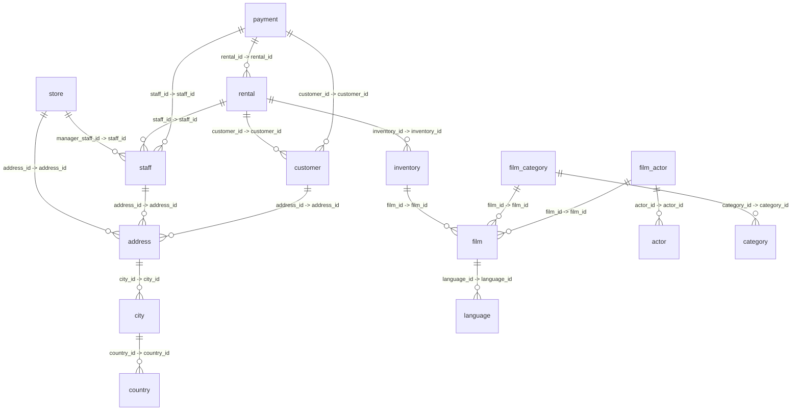

# PostgreSQL Schema Documentation

**Generated:** 9/5/2025, 5:11:36 PM
**Database:** PostgreSQL
**Analysis Type:** Comprehensive Schema Analysis

---

## 🌐 Interactive ER Diagram Viewer

> **🎯 Click the button below to open the interactive ER diagram in your browser**

**📱 [🖱️ Click to View Interactive ER Diagram](file:///Users/prateek/Desktop/peer-ai-mongo-documents/diagrams/er_diagram_1757072496372.html)**

**💻 Or run this command to open directly:** `open /Users/prateek/Desktop/peer-ai-mongo-documents/diagrams/er_diagram_1757072496372.html`

---

## 📋 Table of Contents

- [Tables](#tables)
  - [actor](#table-actor)
  - [actor_info](#table-actor_info)
  - [address](#table-address)
  - [category](#table-category)
  - [city](#table-city)
  - [country](#table-country)
  - [customer](#table-customer)
  - [customer_list](#table-customer_list)
  - [film](#table-film)
  - [film_actor](#table-film_actor)
  - [film_category](#table-film_category)
  - [film_list](#table-film_list)
  - [inventory](#table-inventory)
  - [language](#table-language)
  - [nicer_but_slower_film_list](#table-nicer_but_slower_film_list)
  - [payment](#table-payment)
  - [rental](#table-rental)
  - [sales_by_film_category](#table-sales_by_film_category)
  - [sales_by_store](#table-sales_by_store)
  - [staff](#table-staff)
  - [staff_list](#table-staff_list)
  - [store](#table-store)
- [Views](#views)
  - [actor_info](#view-actor_info)
  - [customer_list](#view-customer_list)
  - [film_list](#view-film_list)
  - [nicer_but_slower_film_list](#view-nicer_but_slower_film_list)
  - [sales_by_film_category](#view-sales_by_film_category)
  - [sales_by_store](#view-sales_by_store)
  - [staff_list](#view-staff_list)
- [Functions](#functions)
  - [_group_concat](#function-_group_concat)
  - [film_in_stock](#function-film_in_stock)
  - [film_not_in_stock](#function-film_not_in_stock)
  - [get_customer_balance](#function-get_customer_balance)
  - [group_concat](#function-group_concat)
  - [inventory_held_by_customer](#function-inventory_held_by_customer)
  - [inventory_in_stock](#function-inventory_in_stock)
  - [last_day](#function-last_day)
  - [last_updated](#function-last_updated)
  - [rewards_report](#function-rewards_report)
- [Triggers](#triggers)
  - [last_updated](#trigger-last_updated)
  - [last_updated](#trigger-last_updated)
  - [last_updated](#trigger-last_updated)
  - [last_updated](#trigger-last_updated)
  - [last_updated](#trigger-last_updated)
  - [last_updated](#trigger-last_updated)
  - [film_fulltext_trigger](#trigger-film_fulltext_trigger)
  - [last_updated](#trigger-last_updated)
  - [last_updated](#trigger-last_updated)
  - [last_updated](#trigger-last_updated)
  - [last_updated](#trigger-last_updated)
  - [last_updated](#trigger-last_updated)
  - [last_updated](#trigger-last_updated)
  - [last_updated](#trigger-last_updated)
  - [last_updated](#trigger-last_updated)
- [Indexes](#indexes)
- [Relationships](#relationships)
- [Semantic Relationships](#semantic-relationships)
- [Data Flow Patterns](#data-flow-patterns)
- [Business Processes](#business-processes)
- [Business Rules](#business-rules)
- [Impact Matrix](#impact-matrix)
- [Stored Procedures Analysis](#stored-procedures-analysis)
- [Metadata Analysis](#metadata-analysis)
- [DDL Statements](#ddl-statements)
- [Database Diagrams](#database-diagrams)

---

## 🏗️ Schema Overview

This database contains a comprehensive set of database objects designed for efficient data management and application support.

### 📊 Statistics
- **Total Tables:** 22
- **Total Views:** 7
- **Total Functions:** 10
- **Total Triggers:** 15
- **Total Indexes:** 32
- **Total Relationships:** 18
- **Last Analyzed:** 9/5/2025, 5:11:36 PM

### 🎯 Purpose
This database appears to be designed for complex business operations with relational data management. The schema demonstrates well-normalized structure with proper referential integrity, optimized for read performance with strategic indexing, abstraction layers for complex data access, business logic encapsulation at the database level.

### 🧠 Enhanced Relationship Analysis
This comprehensive analysis goes beyond traditional DDL relationships to provide business context and insights:

- **Semantic Relationships:** 18 business relationships discovered
- **Data Flow Patterns:** 9 workflow patterns identified
- **Business Processes:** 7 operational processes mapped
- **Business Rules:** 41 governance rules extracted
- **Impact Matrix:** Risk assessment for all 22 tables

---

## 📋 Tables

The following tables form the core data structure of the database:

### Table: `actor`

**Purpose:** Stores business data and supports application functionality

**Columns:**

| Column | Type | Nullable | Default | Primary | Foreign | Description |
|--------|------|----------|---------|---------|---------|-------------|
| `actor_id` | `integer` | NO |  |  |  | Unique identifier for the record |
| `first_name` | `character varying` | NO |  |  |  | Human-readable name or title |
| `last_name` | `character varying` | NO |  |  |  | Human-readable name or title |
| `last_update` | `timestamp without time zone` | NO |  |  |  | Timestamp of record creation or modification |

**Primary Key:** `actor_id`

**DDL:**

```sql
CREATE TABLE "actor" (
  "actor_id" integer NOT NULL,
  "first_name" character varying NOT NULL,
  "last_name" character varying NOT NULL,
  "last_update" timestamp without time zone NOT NULL,
  PRIMARY KEY ("actor_id")
);
```

---

### Table: `actor_info`

**Purpose:** Stores business data and supports application functionality

**Columns:**

| Column | Type | Nullable | Default | Primary | Foreign | Description |
|--------|------|----------|---------|---------|---------|-------------|
| `actor_id` | `integer` | YES |  |  |  | Unique identifier for the record |
| `first_name` | `character varying` | YES |  |  |  | Human-readable name or title |
| `last_name` | `character varying` | YES |  |  |  | Human-readable name or title |
| `film_info` | `text` | YES |  |  |  | Business data field |

**DDL:**

```sql
CREATE TABLE "actor_info" (
  "actor_id" integer,
  "first_name" character varying,
  "last_name" character varying,
  "film_info" text
);
```

---

### Table: `address`

**Purpose:** Stores business data and supports application functionality

**Columns:**

| Column | Type | Nullable | Default | Primary | Foreign | Description |
|--------|------|----------|---------|---------|---------|-------------|
| `address_id` | `integer` | NO |  |  |  | Unique identifier for the record |
| `address` | `character varying` | NO |  |  |  | Geographic or physical location information |
| `address2` | `character varying` | YES |  |  |  | Geographic or physical location information |
| `district` | `character varying` | NO |  |  |  | Business data field |
| `city_id` | `smallint` | NO |  |  |  | Unique identifier for the record |
| `postal_code` | `character varying` | YES |  |  |  | Business data field |
| `phone` | `character varying` | NO |  |  |  | Contact information |
| `last_update` | `timestamp without time zone` | NO |  |  |  | Timestamp of record creation or modification |

**Primary Key:** `address_id`

**Foreign Keys:**

- `city_id` → `city.city_id`

**DDL:**

```sql
CREATE TABLE "address" (
  "address_id" integer NOT NULL,
  "address" character varying NOT NULL,
  "address2" character varying,
  "district" character varying NOT NULL,
  "city_id" smallint NOT NULL,
  "postal_code" character varying,
  "phone" character varying NOT NULL,
  "last_update" timestamp without time zone NOT NULL,
  PRIMARY KEY ("address_id"),
  CONSTRAINT "city_id_fkey" FOREIGN KEY ("city_id") REFERENCES "city" ("city_id")
);
```

---

### Table: `category`

**Purpose:** Stores business data and supports application functionality

**Columns:**

| Column | Type | Nullable | Default | Primary | Foreign | Description |
|--------|------|----------|---------|---------|---------|-------------|
| `category_id` | `integer` | NO |  |  |  | Unique identifier for the record |
| `name` | `character varying` | NO |  |  |  | Human-readable name or title |
| `last_update` | `timestamp without time zone` | NO |  |  |  | Timestamp of record creation or modification |

**Primary Key:** `category_id`

**DDL:**

```sql
CREATE TABLE "category" (
  "category_id" integer NOT NULL,
  "name" character varying NOT NULL,
  "last_update" timestamp without time zone NOT NULL,
  PRIMARY KEY ("category_id")
);
```

---

### Table: `city`

**Purpose:** Stores business data and supports application functionality

**Columns:**

| Column | Type | Nullable | Default | Primary | Foreign | Description |
|--------|------|----------|---------|---------|---------|-------------|
| `city_id` | `integer` | NO |  |  |  | Unique identifier for the record |
| `city` | `character varying` | NO |  |  |  | Business data field |
| `country_id` | `smallint` | NO |  |  |  | Unique identifier for the record |
| `last_update` | `timestamp without time zone` | NO |  |  |  | Timestamp of record creation or modification |

**Primary Key:** `city_id`

**Foreign Keys:**

- `country_id` → `country.country_id`

**DDL:**

```sql
CREATE TABLE "city" (
  "city_id" integer NOT NULL,
  "city" character varying NOT NULL,
  "country_id" smallint NOT NULL,
  "last_update" timestamp without time zone NOT NULL,
  PRIMARY KEY ("city_id"),
  CONSTRAINT "country_id_fkey" FOREIGN KEY ("country_id") REFERENCES "country" ("country_id")
);
```

---

### Table: `country`

**Purpose:** Stores business data and supports application functionality

**Columns:**

| Column | Type | Nullable | Default | Primary | Foreign | Description |
|--------|------|----------|---------|---------|---------|-------------|
| `country_id` | `integer` | NO |  |  |  | Unique identifier for the record |
| `country` | `character varying` | NO |  |  |  | Numeric count or total value |
| `last_update` | `timestamp without time zone` | NO |  |  |  | Timestamp of record creation or modification |

**Primary Key:** `country_id`

**DDL:**

```sql
CREATE TABLE "country" (
  "country_id" integer NOT NULL,
  "country" character varying NOT NULL,
  "last_update" timestamp without time zone NOT NULL,
  PRIMARY KEY ("country_id")
);
```

---

### Table: `customer`

**Purpose:** Stores business data and supports application functionality

**Columns:**

| Column | Type | Nullable | Default | Primary | Foreign | Description |
|--------|------|----------|---------|---------|---------|-------------|
| `customer_id` | `integer` | NO |  |  |  | Unique identifier for the record |
| `store_id` | `smallint` | NO |  |  |  | Unique identifier for the record |
| `first_name` | `character varying` | NO |  |  |  | Human-readable name or title |
| `last_name` | `character varying` | NO |  |  |  | Human-readable name or title |
| `email` | `character varying` | YES |  |  |  | Contact information |
| `address_id` | `smallint` | NO |  |  |  | Unique identifier for the record |
| `activebool` | `boolean` | NO |  |  |  | Business data field |
| `create_date` | `date` | NO |  |  |  | Timestamp of record creation or modification |
| `last_update` | `timestamp without time zone` | YES |  |  |  | Timestamp of record creation or modification |
| `active` | `integer` | YES |  |  |  | Business data field |

**Primary Key:** `customer_id`

**Foreign Keys:**

- `address_id` → `address.address_id`

**DDL:**

```sql
CREATE TABLE "customer" (
  "customer_id" integer NOT NULL,
  "store_id" smallint NOT NULL,
  "first_name" character varying NOT NULL,
  "last_name" character varying NOT NULL,
  "email" character varying,
  "address_id" smallint NOT NULL,
  "activebool" boolean NOT NULL,
  "create_date" date NOT NULL,
  "last_update" timestamp without time zone,
  "active" integer,
  PRIMARY KEY ("customer_id"),
  CONSTRAINT "address_id_fkey" FOREIGN KEY ("address_id") REFERENCES "address" ("address_id")
);
```

---

### Table: `customer_list`

**Purpose:** Stores business data and supports application functionality

**Columns:**

| Column | Type | Nullable | Default | Primary | Foreign | Description |
|--------|------|----------|---------|---------|---------|-------------|
| `id` | `integer` | YES |  |  |  | Unique identifier for the record |
| `name` | `text` | YES |  |  |  | Human-readable name or title |
| `address` | `character varying` | YES |  |  |  | Geographic or physical location information |
| `zip code` | `character varying` | YES |  |  |  | Business data field |
| `phone` | `character varying` | YES |  |  |  | Contact information |
| `city` | `character varying` | YES |  |  |  | Business data field |
| `country` | `character varying` | YES |  |  |  | Numeric count or total value |
| `notes` | `text` | YES |  |  |  | Business data field |
| `sid` | `smallint` | YES |  |  |  | Business data field |

**DDL:**

```sql
CREATE TABLE "customer_list" (
  "id" integer,
  "name" text,
  "address" character varying,
  "zip code" character varying,
  "phone" character varying,
  "city" character varying,
  "country" character varying,
  "notes" text,
  "sid" smallint
);
```

---

### Table: `film`

**Purpose:** Stores business data and supports application functionality

**Columns:**

| Column | Type | Nullable | Default | Primary | Foreign | Description |
|--------|------|----------|---------|---------|---------|-------------|
| `film_id` | `integer` | NO |  |  |  | Unique identifier for the record |
| `title` | `character varying` | NO |  |  |  | Human-readable name or title |
| `description` | `text` | YES |  |  |  | Detailed explanation or notes |
| `release_year` | `integer` | YES |  |  |  | Business data field |
| `language_id` | `smallint` | NO |  |  |  | Unique identifier for the record |
| `rental_duration` | `smallint` | NO |  |  |  | Business data field |
| `rental_rate` | `numeric` | NO |  |  |  | Business data field |
| `length` | `smallint` | YES |  |  |  | Business data field |
| `replacement_cost` | `numeric` | NO |  |  |  | Monetary value or cost |
| `rating` | `USER-DEFINED` | YES |  |  |  | Business data field |
| `last_update` | `timestamp without time zone` | NO |  |  |  | Timestamp of record creation or modification |
| `special_features` | `ARRAY` | YES |  |  |  | Business data field |
| `fulltext` | `tsvector` | NO |  |  |  | Business data field |

**Primary Key:** `film_id`

**Foreign Keys:**

- `language_id` → `language.language_id`

**DDL:**

```sql
CREATE TABLE "film" (
  "film_id" integer NOT NULL,
  "title" character varying NOT NULL,
  "description" text,
  "release_year" integer,
  "language_id" smallint NOT NULL,
  "rental_duration" smallint NOT NULL,
  "rental_rate" numeric NOT NULL,
  "length" smallint,
  "replacement_cost" numeric NOT NULL,
  "rating" USER-DEFINED,
  "last_update" timestamp without time zone NOT NULL,
  "special_features" ARRAY,
  "fulltext" tsvector NOT NULL,
  PRIMARY KEY ("film_id"),
  CONSTRAINT "language_id_fkey" FOREIGN KEY ("language_id") REFERENCES "language" ("language_id")
);
```

---

### Table: `film_actor`

**Purpose:** Stores business data and supports application functionality

**Columns:**

| Column | Type | Nullable | Default | Primary | Foreign | Description |
|--------|------|----------|---------|---------|---------|-------------|
| `actor_id` | `smallint` | NO |  |  |  | Unique identifier for the record |
| `film_id` | `smallint` | NO |  |  |  | Unique identifier for the record |
| `last_update` | `timestamp without time zone` | NO |  |  |  | Timestamp of record creation or modification |

**Primary Key:** `actor_id`

**Foreign Keys:**

- `actor_id` → `actor.actor_id`
- `film_id` → `film.film_id`

**DDL:**

```sql
CREATE TABLE "film_actor" (
  "actor_id" smallint NOT NULL,
  "film_id" smallint NOT NULL,
  "last_update" timestamp without time zone NOT NULL,
  PRIMARY KEY ("actor_id"),
  CONSTRAINT "actor_id_fkey" FOREIGN KEY ("actor_id") REFERENCES "actor" ("actor_id"),
  CONSTRAINT "film_id_fkey" FOREIGN KEY ("film_id") REFERENCES "film" ("film_id")
);
```

---

### Table: `film_category`

**Purpose:** Stores business data and supports application functionality

**Columns:**

| Column | Type | Nullable | Default | Primary | Foreign | Description |
|--------|------|----------|---------|---------|---------|-------------|
| `film_id` | `smallint` | NO |  |  |  | Unique identifier for the record |
| `category_id` | `smallint` | NO |  |  |  | Unique identifier for the record |
| `last_update` | `timestamp without time zone` | NO |  |  |  | Timestamp of record creation or modification |

**Primary Key:** `film_id`

**Foreign Keys:**

- `category_id` → `category.category_id`
- `film_id` → `film.film_id`

**DDL:**

```sql
CREATE TABLE "film_category" (
  "film_id" smallint NOT NULL,
  "category_id" smallint NOT NULL,
  "last_update" timestamp without time zone NOT NULL,
  PRIMARY KEY ("film_id"),
  CONSTRAINT "category_id_fkey" FOREIGN KEY ("category_id") REFERENCES "category" ("category_id"),
  CONSTRAINT "film_id_fkey" FOREIGN KEY ("film_id") REFERENCES "film" ("film_id")
);
```

---

### Table: `film_list`

**Purpose:** Stores business data and supports application functionality

**Columns:**

| Column | Type | Nullable | Default | Primary | Foreign | Description |
|--------|------|----------|---------|---------|---------|-------------|
| `fid` | `integer` | YES |  |  |  | Business data field |
| `title` | `character varying` | YES |  |  |  | Human-readable name or title |
| `description` | `text` | YES |  |  |  | Detailed explanation or notes |
| `category` | `character varying` | YES |  |  |  | Classification or categorization |
| `price` | `numeric` | YES |  |  |  | Monetary value or cost |
| `length` | `smallint` | YES |  |  |  | Business data field |
| `rating` | `USER-DEFINED` | YES |  |  |  | Business data field |
| `actors` | `text` | YES |  |  |  | Business data field |

**DDL:**

```sql
CREATE TABLE "film_list" (
  "fid" integer,
  "title" character varying,
  "description" text,
  "category" character varying,
  "price" numeric,
  "length" smallint,
  "rating" USER-DEFINED,
  "actors" text
);
```

---

### Table: `inventory`

**Purpose:** Stores business data and supports application functionality

**Columns:**

| Column | Type | Nullable | Default | Primary | Foreign | Description |
|--------|------|----------|---------|---------|---------|-------------|
| `inventory_id` | `integer` | NO |  |  |  | Unique identifier for the record |
| `film_id` | `smallint` | NO |  |  |  | Unique identifier for the record |
| `store_id` | `smallint` | NO |  |  |  | Unique identifier for the record |
| `last_update` | `timestamp without time zone` | NO |  |  |  | Timestamp of record creation or modification |

**Primary Key:** `inventory_id`

**Foreign Keys:**

- `film_id` → `film.film_id`

**DDL:**

```sql
CREATE TABLE "inventory" (
  "inventory_id" integer NOT NULL,
  "film_id" smallint NOT NULL,
  "store_id" smallint NOT NULL,
  "last_update" timestamp without time zone NOT NULL,
  PRIMARY KEY ("inventory_id"),
  CONSTRAINT "film_id_fkey" FOREIGN KEY ("film_id") REFERENCES "film" ("film_id")
);
```

---

### Table: `language`

**Purpose:** Stores business data and supports application functionality

**Columns:**

| Column | Type | Nullable | Default | Primary | Foreign | Description |
|--------|------|----------|---------|---------|---------|-------------|
| `language_id` | `integer` | NO |  |  |  | Unique identifier for the record |
| `name` | `character` | NO |  |  |  | Human-readable name or title |
| `last_update` | `timestamp without time zone` | NO |  |  |  | Timestamp of record creation or modification |

**Primary Key:** `language_id`

**DDL:**

```sql
CREATE TABLE "language" (
  "language_id" integer NOT NULL,
  "name" character NOT NULL,
  "last_update" timestamp without time zone NOT NULL,
  PRIMARY KEY ("language_id")
);
```

---

### Table: `nicer_but_slower_film_list`

**Purpose:** Stores business data with complex relationships

**Columns:**

| Column | Type | Nullable | Default | Primary | Foreign | Description |
|--------|------|----------|---------|---------|---------|-------------|
| `fid` | `integer` | YES |  |  |  | Business data field |
| `title` | `character varying` | YES |  |  |  | Human-readable name or title |
| `description` | `text` | YES |  |  |  | Detailed explanation or notes |
| `category` | `character varying` | YES |  |  |  | Classification or categorization |
| `price` | `numeric` | YES |  |  |  | Monetary value or cost |
| `length` | `smallint` | YES |  |  |  | Business data field |
| `rating` | `USER-DEFINED` | YES |  |  |  | Business data field |
| `actors` | `text` | YES |  |  |  | Business data field |

**DDL:**

```sql
CREATE TABLE "nicer_but_slower_film_list" (
  "fid" integer,
  "title" character varying,
  "description" text,
  "category" character varying,
  "price" numeric,
  "length" smallint,
  "rating" USER-DEFINED,
  "actors" text
);
```

---

### Table: `payment`

**Purpose:** Stores business data and supports application functionality

**Columns:**

| Column | Type | Nullable | Default | Primary | Foreign | Description |
|--------|------|----------|---------|---------|---------|-------------|
| `payment_id` | `integer` | NO |  |  |  | Unique identifier for the record |
| `customer_id` | `smallint` | NO |  |  |  | Unique identifier for the record |
| `staff_id` | `smallint` | NO |  |  |  | Unique identifier for the record |
| `rental_id` | `integer` | NO |  |  |  | Unique identifier for the record |
| `amount` | `numeric` | NO |  |  |  | Monetary value or cost |
| `payment_date` | `timestamp without time zone` | NO |  |  |  | Timestamp of record creation or modification |

**Primary Key:** `payment_id`

**Foreign Keys:**

- `customer_id` → `customer.customer_id`
- `rental_id` → `rental.rental_id`
- `staff_id` → `staff.staff_id`

**DDL:**

```sql
CREATE TABLE "payment" (
  "payment_id" integer NOT NULL,
  "customer_id" smallint NOT NULL,
  "staff_id" smallint NOT NULL,
  "rental_id" integer NOT NULL,
  "amount" numeric NOT NULL,
  "payment_date" timestamp without time zone NOT NULL,
  PRIMARY KEY ("payment_id"),
  CONSTRAINT "customer_id_fkey" FOREIGN KEY ("customer_id") REFERENCES "customer" ("customer_id"),
  CONSTRAINT "rental_id_fkey" FOREIGN KEY ("rental_id") REFERENCES "rental" ("rental_id"),
  CONSTRAINT "staff_id_fkey" FOREIGN KEY ("staff_id") REFERENCES "staff" ("staff_id")
);
```

---

### Table: `rental`

**Purpose:** Stores business data and supports application functionality

**Columns:**

| Column | Type | Nullable | Default | Primary | Foreign | Description |
|--------|------|----------|---------|---------|---------|-------------|
| `rental_id` | `integer` | NO |  |  |  | Unique identifier for the record |
| `rental_date` | `timestamp without time zone` | NO |  |  |  | Timestamp of record creation or modification |
| `inventory_id` | `integer` | NO |  |  |  | Unique identifier for the record |
| `customer_id` | `smallint` | NO |  |  |  | Unique identifier for the record |
| `return_date` | `timestamp without time zone` | YES |  |  |  | Timestamp of record creation or modification |
| `staff_id` | `smallint` | NO |  |  |  | Unique identifier for the record |
| `last_update` | `timestamp without time zone` | NO |  |  |  | Timestamp of record creation or modification |

**Primary Key:** `rental_id`

**Foreign Keys:**

- `customer_id` → `customer.customer_id`
- `inventory_id` → `inventory.inventory_id`
- `staff_id` → `staff.staff_id`

**DDL:**

```sql
CREATE TABLE "rental" (
  "rental_id" integer NOT NULL,
  "rental_date" timestamp without time zone NOT NULL,
  "inventory_id" integer NOT NULL,
  "customer_id" smallint NOT NULL,
  "return_date" timestamp without time zone,
  "staff_id" smallint NOT NULL,
  "last_update" timestamp without time zone NOT NULL,
  PRIMARY KEY ("rental_id"),
  CONSTRAINT "customer_id_fkey" FOREIGN KEY ("customer_id") REFERENCES "customer" ("customer_id"),
  CONSTRAINT "inventory_id_fkey" FOREIGN KEY ("inventory_id") REFERENCES "inventory" ("inventory_id"),
  CONSTRAINT "staff_id_fkey" FOREIGN KEY ("staff_id") REFERENCES "staff" ("staff_id")
);
```

---

### Table: `sales_by_film_category`

**Purpose:** Stores business data with complex relationships

**Columns:**

| Column | Type | Nullable | Default | Primary | Foreign | Description |
|--------|------|----------|---------|---------|---------|-------------|
| `category` | `character varying` | YES |  |  |  | Classification or categorization |
| `total_sales` | `numeric` | YES |  |  |  | Numeric count or total value |

**DDL:**

```sql
CREATE TABLE "sales_by_film_category" (
  "category" character varying,
  "total_sales" numeric
);
```

---

### Table: `sales_by_store`

**Purpose:** Stores business data with complex relationships

**Columns:**

| Column | Type | Nullable | Default | Primary | Foreign | Description |
|--------|------|----------|---------|---------|---------|-------------|
| `store` | `text` | YES |  |  |  | Business data field |
| `manager` | `text` | YES |  |  |  | Business data field |
| `total_sales` | `numeric` | YES |  |  |  | Numeric count or total value |

**DDL:**

```sql
CREATE TABLE "sales_by_store" (
  "store" text,
  "manager" text,
  "total_sales" numeric
);
```

---

### Table: `staff`

**Purpose:** Stores business data and supports application functionality

**Columns:**

| Column | Type | Nullable | Default | Primary | Foreign | Description |
|--------|------|----------|---------|---------|---------|-------------|
| `staff_id` | `integer` | NO |  |  |  | Unique identifier for the record |
| `first_name` | `character varying` | NO |  |  |  | Human-readable name or title |
| `last_name` | `character varying` | NO |  |  |  | Human-readable name or title |
| `address_id` | `smallint` | NO |  |  |  | Unique identifier for the record |
| `email` | `character varying` | YES |  |  |  | Contact information |
| `store_id` | `smallint` | NO |  |  |  | Unique identifier for the record |
| `active` | `boolean` | NO |  |  |  | Business data field |
| `username` | `character varying` | NO |  |  |  | Human-readable name or title |
| `password` | `character varying` | YES |  |  |  | Business data field |
| `last_update` | `timestamp without time zone` | NO |  |  |  | Timestamp of record creation or modification |
| `picture` | `bytea` | YES |  |  |  | Business data field |

**Primary Key:** `staff_id`

**Foreign Keys:**

- `address_id` → `address.address_id`

**DDL:**

```sql
CREATE TABLE "staff" (
  "staff_id" integer NOT NULL,
  "first_name" character varying NOT NULL,
  "last_name" character varying NOT NULL,
  "address_id" smallint NOT NULL,
  "email" character varying,
  "store_id" smallint NOT NULL,
  "active" boolean NOT NULL,
  "username" character varying NOT NULL,
  "password" character varying,
  "last_update" timestamp without time zone NOT NULL,
  "picture" bytea,
  PRIMARY KEY ("staff_id"),
  CONSTRAINT "address_id_fkey" FOREIGN KEY ("address_id") REFERENCES "address" ("address_id")
);
```

---

### Table: `staff_list`

**Purpose:** Stores business data and supports application functionality

**Columns:**

| Column | Type | Nullable | Default | Primary | Foreign | Description |
|--------|------|----------|---------|---------|---------|-------------|
| `id` | `integer` | YES |  |  |  | Unique identifier for the record |
| `name` | `text` | YES |  |  |  | Human-readable name or title |
| `address` | `character varying` | YES |  |  |  | Geographic or physical location information |
| `zip code` | `character varying` | YES |  |  |  | Business data field |
| `phone` | `character varying` | YES |  |  |  | Contact information |
| `city` | `character varying` | YES |  |  |  | Business data field |
| `country` | `character varying` | YES |  |  |  | Numeric count or total value |
| `sid` | `smallint` | YES |  |  |  | Business data field |

**DDL:**

```sql
CREATE TABLE "staff_list" (
  "id" integer,
  "name" text,
  "address" character varying,
  "zip code" character varying,
  "phone" character varying,
  "city" character varying,
  "country" character varying,
  "sid" smallint
);
```

---

### Table: `store`

**Purpose:** Stores business data and supports application functionality

**Columns:**

| Column | Type | Nullable | Default | Primary | Foreign | Description |
|--------|------|----------|---------|---------|---------|-------------|
| `store_id` | `integer` | NO |  |  |  | Unique identifier for the record |
| `manager_staff_id` | `smallint` | NO |  |  |  | Unique identifier for the record |
| `address_id` | `smallint` | NO |  |  |  | Unique identifier for the record |
| `last_update` | `timestamp without time zone` | NO |  |  |  | Timestamp of record creation or modification |

**Primary Key:** `store_id`

**Foreign Keys:**

- `address_id` → `address.address_id`
- `manager_staff_id` → `staff.staff_id`

**DDL:**

```sql
CREATE TABLE "store" (
  "store_id" integer NOT NULL,
  "manager_staff_id" smallint NOT NULL,
  "address_id" smallint NOT NULL,
  "last_update" timestamp without time zone NOT NULL,
  PRIMARY KEY ("store_id"),
  CONSTRAINT "address_id_fkey" FOREIGN KEY ("address_id") REFERENCES "address" ("address_id"),
  CONSTRAINT "manager_staff_id_fkey" FOREIGN KEY ("manager_staff_id") REFERENCES "staff" ("staff_id")
);
```

---

## 👁️ Views

The following views provide simplified access to complex data relationships:

### View: `actor_info`

**Purpose:** Simplifies access to complex data relationships

**Dependencies:** film_category, film_actor, category

**Columns:**

| Column | Type | Nullable | Default |
|--------|------|----------|---------|
| `actor_id` | `integer` | YES |  |
| `first_name` | `character varying` | YES |  |
| `last_name` | `character varying` | YES |  |
| `film_info` | `text` | YES |  |

**Definition:**

```sql
 SELECT a.actor_id,
    a.first_name,
    a.last_name,
    group_concat(DISTINCT (((c.name)::text || ': '::text) || ( SELECT group_concat((f.title)::text) AS group_concat
           FROM ((film f
             JOIN film_category fc_1 ON ((f.film_id = fc_1.film_id)))
             JOIN film_actor fa_1 ON ((f.film_id = fa_1.film_id)))
          WHERE ((fc_1.category_id = c.category_id) AND (fa_1.actor_id = a.actor_id))
          GROUP BY fa_1.actor_id))) AS film_info
   FROM (((actor a
     LEFT JOIN film_actor fa ON ((a.actor_id = fa.actor_id)))
     LEFT JOIN film_category fc ON ((fa.film_id = fc.film_id)))
     LEFT JOIN category c ON ((fc.category_id = c.category_id)))
  GROUP BY a.actor_id, a.first_name, a.last_name;
```

---

### View: `customer_list`

**Purpose:** Provides a list or catalog view of data

**Dependencies:** address, city, country

**Columns:**

| Column | Type | Nullable | Default |
|--------|------|----------|---------|
| `id` | `integer` | YES |  |
| `name` | `text` | YES |  |
| `address` | `character varying` | YES |  |
| `zip code` | `character varying` | YES |  |
| `phone` | `character varying` | YES |  |
| `city` | `character varying` | YES |  |
| `country` | `character varying` | YES |  |
| `notes` | `text` | YES |  |
| `sid` | `smallint` | YES |  |

**Definition:**

```sql
 SELECT cu.customer_id AS id,
    (((cu.first_name)::text || ' '::text) || (cu.last_name)::text) AS name,
    a.address,
    a.postal_code AS "zip code",
    a.phone,
    city.city,
    country.country,
        CASE
            WHEN cu.activebool THEN 'active'::text
            ELSE ''::text
        END AS notes,
    cu.store_id AS sid
   FROM (((customer cu
     JOIN address a ON ((cu.address_id = a.address_id)))
     JOIN city ON ((a.city_id = city.city_id)))
     JOIN country ON ((city.country_id = country.country_id)));
```

---

### View: `film_list`

**Purpose:** Provides a list or catalog view of data

**Dependencies:** film_category, film, film_actor, actor

**Columns:**

| Column | Type | Nullable | Default |
|--------|------|----------|---------|
| `fid` | `integer` | YES |  |
| `title` | `character varying` | YES |  |
| `description` | `text` | YES |  |
| `category` | `character varying` | YES |  |
| `price` | `numeric` | YES |  |
| `length` | `smallint` | YES |  |
| `rating` | `USER-DEFINED` | YES |  |
| `actors` | `text` | YES |  |

**Definition:**

```sql
 SELECT film.film_id AS fid,
    film.title,
    film.description,
    category.name AS category,
    film.rental_rate AS price,
    film.length,
    film.rating,
    group_concat((((actor.first_name)::text || ' '::text) || (actor.last_name)::text)) AS actors
   FROM ((((category
     LEFT JOIN film_category ON ((category.category_id = film_category.category_id)))
     LEFT JOIN film ON ((film_category.film_id = film.film_id)))
     JOIN film_actor ON ((film.film_id = film_actor.film_id)))
     JOIN actor ON ((film_actor.actor_id = actor.actor_id)))
  GROUP BY film.film_id, film.title, film.description, category.name, film.rental_rate, film.length, film.rating;
```

---

### View: `nicer_but_slower_film_list`

**Purpose:** Provides a list or catalog view of data

**Dependencies:** film_category, film, film_actor, actor

**Columns:**

| Column | Type | Nullable | Default |
|--------|------|----------|---------|
| `fid` | `integer` | YES |  |
| `title` | `character varying` | YES |  |
| `description` | `text` | YES |  |
| `category` | `character varying` | YES |  |
| `price` | `numeric` | YES |  |
| `length` | `smallint` | YES |  |
| `rating` | `USER-DEFINED` | YES |  |
| `actors` | `text` | YES |  |

**Definition:**

```sql
 SELECT film.film_id AS fid,
    film.title,
    film.description,
    category.name AS category,
    film.rental_rate AS price,
    film.length,
    film.rating,
    group_concat((((upper("substring"((actor.first_name)::text, 1, 1)) || lower("substring"((actor.first_name)::text, 2))) || upper("substring"((actor.last_name)::text, 1, 1))) || lower("substring"((actor.last_name)::text, 2)))) AS actors
   FROM ((((category
     LEFT JOIN film_category ON ((category.category_id = film_category.category_id)))
     LEFT JOIN film ON ((film_category.film_id = film.film_id)))
     JOIN film_actor ON ((film.film_id = film_actor.film_id)))
     JOIN actor ON ((film_actor.actor_id = actor.actor_id)))
  GROUP BY film.film_id, film.title, film.description, category.name, film.rental_rate, film.length, film.rating;
```

---

### View: `sales_by_film_category`

**Purpose:** Simplifies access to complex data relationships

**Dependencies:** rental, inventory, film, film_category, category

**Columns:**

| Column | Type | Nullable | Default |
|--------|------|----------|---------|
| `category` | `character varying` | YES |  |
| `total_sales` | `numeric` | YES |  |

**Definition:**

```sql
 SELECT c.name AS category,
    sum(p.amount) AS total_sales
   FROM (((((payment p
     JOIN rental r ON ((p.rental_id = r.rental_id)))
     JOIN inventory i ON ((r.inventory_id = i.inventory_id)))
     JOIN film f ON ((i.film_id = f.film_id)))
     JOIN film_category fc ON ((f.film_id = fc.film_id)))
     JOIN category c ON ((fc.category_id = c.category_id)))
  GROUP BY c.name
  ORDER BY (sum(p.amount)) DESC;
```

---

### View: `sales_by_store`

**Purpose:** Simplifies access to complex data relationships

**Dependencies:** rental, inventory, store, address, city, country, staff

**Columns:**

| Column | Type | Nullable | Default |
|--------|------|----------|---------|
| `store` | `text` | YES |  |
| `manager` | `text` | YES |  |
| `total_sales` | `numeric` | YES |  |

**Definition:**

```sql
 SELECT (((c.city)::text || ','::text) || (cy.country)::text) AS store,
    (((m.first_name)::text || ' '::text) || (m.last_name)::text) AS manager,
    sum(p.amount) AS total_sales
   FROM (((((((payment p
     JOIN rental r ON ((p.rental_id = r.rental_id)))
     JOIN inventory i ON ((r.inventory_id = i.inventory_id)))
     JOIN store s ON ((i.store_id = s.store_id)))
     JOIN address a ON ((s.address_id = a.address_id)))
     JOIN city c ON ((a.city_id = c.city_id)))
     JOIN country cy ON ((c.country_id = cy.country_id)))
     JOIN staff m ON ((s.manager_staff_id = m.staff_id)))
  GROUP BY cy.country, c.city, s.store_id, m.first_name, m.last_name
  ORDER BY cy.country, c.city;
```

---

### View: `staff_list`

**Purpose:** Provides a list or catalog view of data

**Dependencies:** address, city, country

**Columns:**

| Column | Type | Nullable | Default |
|--------|------|----------|---------|
| `id` | `integer` | YES |  |
| `name` | `text` | YES |  |
| `address` | `character varying` | YES |  |
| `zip code` | `character varying` | YES |  |
| `phone` | `character varying` | YES |  |
| `city` | `character varying` | YES |  |
| `country` | `character varying` | YES |  |
| `sid` | `smallint` | YES |  |

**Definition:**

```sql
 SELECT s.staff_id AS id,
    (((s.first_name)::text || ' '::text) || (s.last_name)::text) AS name,
    a.address,
    a.postal_code AS "zip code",
    a.phone,
    city.city,
    country.country,
    s.store_id AS sid
   FROM (((staff s
     JOIN address a ON ((s.address_id = a.address_id)))
     JOIN city ON ((a.city_id = city.city_id)))
     JOIN country ON ((city.country_id = country.country_id)));
```

---

## ⚙️ Functions

The following functions provide business logic and data manipulation capabilities:

### Function: `_group_concat`

**Purpose:** Executes business logic or data manipulation

**Return Type:** `text`
**Language:** sql
**Volatility:** immutable

**Parameters:**

| Parameter | Type | Mode | Default |
|-----------|------|------|---------|
| `param1` | `text` | IN |  |
| `param2` | `text` | IN |  |
| `param3` | `unknown` | IN |  |

**Definition:**

```sql

SELECT CASE
  WHEN $2 IS NULL THEN $1
  WHEN $1 IS NULL THEN $2
  ELSE $1 || ', ' || $2
END

```

---

### Function: `film_in_stock`

**Purpose:** Executes business logic or data manipulation

**Return Type:** `SETOF integer`
**Language:** sql
**Volatility:** volatile

**Parameters:**

| Parameter | Type | Mode | Default |
|-----------|------|------|---------|
| `param1` | `integer` | IN |  |
| `param2` | `integer` | IN |  |
| `param3` | `unknown` | IN |  |

**Definition:**

```sql

     SELECT inventory_id
     FROM inventory
     WHERE film_id = $1
     AND store_id = $2
     AND inventory_in_stock(inventory_id);

```

---

### Function: `film_not_in_stock`

**Purpose:** Executes business logic or data manipulation

**Return Type:** `SETOF integer`
**Language:** sql
**Volatility:** volatile

**Parameters:**

| Parameter | Type | Mode | Default |
|-----------|------|------|---------|
| `param1` | `integer` | IN |  |
| `param2` | `integer` | IN |  |
| `param3` | `unknown` | IN |  |

**Definition:**

```sql

    SELECT inventory_id
    FROM inventory
    WHERE film_id = $1
    AND store_id = $2
    AND NOT inventory_in_stock(inventory_id);

```

---

### Function: `get_customer_balance`

**Purpose:** Retrieves data based on parameters

**Return Type:** `numeric`
**Language:** unknown
**Volatility:** volatile

**Parameters:**

| Parameter | Type | Mode | Default |
|-----------|------|------|---------|
| `param1` | `integer` | IN |  |
| `param2` | `timestamp without time zone` | IN |  |
| `param3` | `unknown` | IN |  |

**Definition:**

```sql

       --#OK, WE NEED TO CALCULATE THE CURRENT BALANCE GIVEN A CUSTOMER_ID AND A DATE
       --#THAT WE WANT THE BALANCE TO BE EFFECTIVE FOR. THE BALANCE IS:
       --#   1) RENTAL FEES FOR ALL PREVIOUS RENTALS
       --#   2) ONE DOLLAR FOR EVERY DAY THE PREVIOUS RENTALS ARE OVERDUE
       --#   3) IF A FILM IS MORE THAN RENTAL_DURATION * 2 OVERDUE, CHARGE THE REPLACEMENT_COST
       --#   4) SUBTRACT ALL PAYMENTS MADE BEFORE THE DATE SPECIFIED
DECLARE
    v_rentfees DECIMAL(5,2); --#FEES PAID TO RENT THE VIDEOS INITIALLY
    v_overfees INTEGER;      --#LATE FEES FOR PRIOR RENTALS
    v_payments DECIMAL(5,2); --#SUM OF PAYMENTS MADE PREVIOUSLY
BEGIN
    SELECT COALESCE(SUM(film.rental_rate),0) INTO v_rentfees
    FROM film, inventory, rental
    WHERE film.film_id = inventory.film_id
      AND inventory.inventory_id = rental.inventory_id
      AND rental.rental_date <= p_effective_date
      AND rental.customer_id = p_customer_id;

    SELECT COALESCE(SUM(IF((rental.return_date - rental.rental_date) > (film.rental_duration * '1 day'::interval),
        ((rental.return_date - rental.rental_date) - (film.rental_duration * '1 day'::interval)),0)),0) INTO v_overfees
    FROM rental, inventory, film
    WHERE film.film_id = inventory.film_id
      AND inventory.inventory_id = rental.inventory_id
      AND rental.rental_date <= p_effective_date
      AND rental.customer_id = p_customer_id;

    SELECT COALESCE(SUM(payment.amount),0) INTO v_payments
    FROM payment
    WHERE payment.payment_date <= p_effective_date
    AND payment.customer_id = p_customer_id;

    RETURN v_rentfees + v_overfees - v_payments;
END

```

---

### Function: `group_concat`

**Purpose:** Executes business logic or data manipulation

**Return Type:** `text`
**Language:** internal
**Volatility:** immutable

**Parameters:**

| Parameter | Type | Mode | Default |
|-----------|------|------|---------|
| `param1` | `text` | IN |  |
| `param2` | `unknown` | IN |  |

**Definition:**

```sql
aggregate_dummy
```

---

### Function: `inventory_held_by_customer`

**Purpose:** Executes business logic or data manipulation

**Return Type:** `integer`
**Language:** unknown
**Volatility:** volatile

**Parameters:**

| Parameter | Type | Mode | Default |
|-----------|------|------|---------|
| `param1` | `integer` | IN |  |
| `param2` | `unknown` | IN |  |

**Definition:**

```sql

DECLARE
    v_customer_id INTEGER;
BEGIN

  SELECT customer_id INTO v_customer_id
  FROM rental
  WHERE return_date IS NULL
  AND inventory_id = p_inventory_id;

  RETURN v_customer_id;
END 
```

---

### Function: `inventory_in_stock`

**Purpose:** Executes business logic or data manipulation

**Return Type:** `boolean`
**Language:** unknown
**Volatility:** volatile

**Parameters:**

| Parameter | Type | Mode | Default |
|-----------|------|------|---------|
| `param1` | `integer` | IN |  |
| `param2` | `unknown` | IN |  |

**Definition:**

```sql

DECLARE
    v_rentals INTEGER;
    v_out     INTEGER;
BEGIN
    -- AN ITEM IS IN-STOCK IF THERE ARE EITHER NO ROWS IN THE rental TABLE
    -- FOR THE ITEM OR ALL ROWS HAVE return_date POPULATED

    SELECT count(*) INTO v_rentals
    FROM rental
    WHERE inventory_id = p_inventory_id;

    IF v_rentals = 0 THEN
      RETURN TRUE;
    END IF;

    SELECT COUNT(rental_id) INTO v_out
    FROM inventory LEFT JOIN rental USING(inventory_id)
    WHERE inventory.inventory_id = p_inventory_id
    AND rental.return_date IS NULL;

    IF v_out > 0 THEN
      RETURN FALSE;
    ELSE
      RETURN TRUE;
    END IF;
END 
```

---

### Function: `last_day`

**Purpose:** Executes business logic or data manipulation

**Return Type:** `date`
**Language:** sql
**Volatility:** immutable

**Parameters:**

| Parameter | Type | Mode | Default |
|-----------|------|------|---------|
| `param1` | `timestamp without time zone` | IN |  |
| `param2` | `unknown` | IN |  |

**Definition:**

```sql

  SELECT CASE
    WHEN EXTRACT(MONTH FROM $1) = 12 THEN
      (((EXTRACT(YEAR FROM $1) + 1) operator(pg_catalog.||) '-01-01')::date - INTERVAL '1 day')::date
    ELSE
      ((EXTRACT(YEAR FROM $1) operator(pg_catalog.||) '-' operator(pg_catalog.||) (EXTRACT(MONTH FROM $1) + 1) operator(pg_catalog.||) '-01')::date - INTERVAL '1 day')::date
    END

```

---

### Function: `last_updated`

**Purpose:** Modifies existing records

**Return Type:** `trigger`
**Language:** unknown
**Volatility:** volatile

**Parameters:**

| Parameter | Type | Mode | Default |
|-----------|------|------|---------|
| `param1` | `unknown` | IN |  |

**Definition:**

```sql

BEGIN
    NEW.last_update = CURRENT_TIMESTAMP;
    RETURN NEW;
END 
```

---

### Function: `rewards_report`

**Purpose:** Executes business logic or data manipulation

**Return Type:** `SETOF customer`
**Language:** unknown
**Volatility:** volatile

**Parameters:**

| Parameter | Type | Mode | Default |
|-----------|------|------|---------|
| `param1` | `integer` | IN |  |
| `param2` | `numeric` | IN |  |
| `param3` | `unknown` | IN |  |

**Definition:**

```sql

DECLARE
    last_month_start DATE;
    last_month_end DATE;
rr RECORD;
tmpSQL TEXT;
BEGIN

    /* Some sanity checks... */
    IF min_monthly_purchases = 0 THEN
        RAISE EXCEPTION 'Minimum monthly purchases parameter must be > 0';
    END IF;
    IF min_dollar_amount_purchased = 0.00 THEN
        RAISE EXCEPTION 'Minimum monthly dollar amount purchased parameter must be > $0.00';
    END IF;

    last_month_start := CURRENT_DATE - '3 month'::interval;
    last_month_start := to_date((extract(YEAR FROM last_month_start) || '-' || extract(MONTH FROM last_month_start) || '-01'),'YYYY-MM-DD');
    last_month_end := LAST_DAY(last_month_start);

    /*
    Create a temporary storage area for Customer IDs.
    */
    CREATE TEMPORARY TABLE tmpCustomer (customer_id INTEGER NOT NULL PRIMARY KEY);

    /*
    Find all customers meeting the monthly purchase requirements
    */

    tmpSQL := 'INSERT INTO tmpCustomer (customer_id)
        SELECT p.customer_id
        FROM payment AS p
        WHERE DATE(p.payment_date) BETWEEN '||quote_literal(last_month_start) ||' AND '|| quote_literal(last_month_end) || '
        GROUP BY customer_id
        HAVING SUM(p.amount) > '|| min_dollar_amount_purchased || '
        AND COUNT(customer_id) > ' ||min_monthly_purchases ;

    EXECUTE tmpSQL;

    /*
    Output ALL customer information of matching rewardees.
    Customize output as needed.
    */
    FOR rr IN EXECUTE 'SELECT c.* FROM tmpCustomer AS t INNER JOIN customer AS c ON t.customer_id = c.customer_id' LOOP
        RETURN NEXT rr;
    END LOOP;

    /* Clean up */
    tmpSQL := 'DROP TABLE tmpCustomer';
    EXECUTE tmpSQL;

RETURN;
END

```

---

## 🔔 Triggers

The following triggers automate data integrity and business logic:

### Trigger: `last_updated`

**Table:** `actor`
**Event:** INSERT OR DELETE OR UPDATE
**Timing:** BEFORE
**Function:** `last_updated`
**Purpose:** Automatically updates related data

**Definition:**

```sql
CREATE TRIGGER last_updated BEFORE UPDATE ON public.actor FOR EACH ROW EXECUTE FUNCTION last_updated()
```

---

### Trigger: `last_updated`

**Table:** `address`
**Event:** INSERT OR DELETE OR UPDATE
**Timing:** BEFORE
**Function:** `last_updated`
**Purpose:** Automatically updates related data

**Definition:**

```sql
CREATE TRIGGER last_updated BEFORE UPDATE ON public.address FOR EACH ROW EXECUTE FUNCTION last_updated()
```

---

### Trigger: `last_updated`

**Table:** `category`
**Event:** INSERT OR DELETE OR UPDATE
**Timing:** BEFORE
**Function:** `last_updated`
**Purpose:** Automatically updates related data

**Definition:**

```sql
CREATE TRIGGER last_updated BEFORE UPDATE ON public.category FOR EACH ROW EXECUTE FUNCTION last_updated()
```

---

### Trigger: `last_updated`

**Table:** `city`
**Event:** INSERT OR DELETE OR UPDATE
**Timing:** BEFORE
**Function:** `last_updated`
**Purpose:** Automatically updates related data

**Definition:**

```sql
CREATE TRIGGER last_updated BEFORE UPDATE ON public.city FOR EACH ROW EXECUTE FUNCTION last_updated()
```

---

### Trigger: `last_updated`

**Table:** `country`
**Event:** INSERT OR DELETE OR UPDATE
**Timing:** BEFORE
**Function:** `last_updated`
**Purpose:** Automatically updates related data

**Definition:**

```sql
CREATE TRIGGER last_updated BEFORE UPDATE ON public.country FOR EACH ROW EXECUTE FUNCTION last_updated()
```

---

### Trigger: `last_updated`

**Table:** `customer`
**Event:** INSERT OR DELETE OR UPDATE
**Timing:** BEFORE
**Function:** `last_updated`
**Purpose:** Automatically updates related data

**Definition:**

```sql
CREATE TRIGGER last_updated BEFORE UPDATE ON public.customer FOR EACH ROW EXECUTE FUNCTION last_updated()
```

---

### Trigger: `film_fulltext_trigger`

**Table:** `film`
**Event:** INSERT OR DELETE OR UPDATE
**Timing:** BEFORE
**Function:** `tsvector_update_trigger`
**Purpose:** Automates data integrity and business logic

**Definition:**

```sql
CREATE TRIGGER film_fulltext_trigger BEFORE INSERT OR UPDATE ON public.film FOR EACH ROW EXECUTE FUNCTION tsvector_update_trigger('fulltext', 'pg_catalog.english', 'title', 'description')
```

---

### Trigger: `last_updated`

**Table:** `film`
**Event:** INSERT OR DELETE OR UPDATE
**Timing:** BEFORE
**Function:** `last_updated`
**Purpose:** Automatically updates related data

**Definition:**

```sql
CREATE TRIGGER last_updated BEFORE UPDATE ON public.film FOR EACH ROW EXECUTE FUNCTION last_updated()
```

---

### Trigger: `last_updated`

**Table:** `film_actor`
**Event:** INSERT OR DELETE OR UPDATE
**Timing:** BEFORE
**Function:** `last_updated`
**Purpose:** Automatically updates related data

**Definition:**

```sql
CREATE TRIGGER last_updated BEFORE UPDATE ON public.film_actor FOR EACH ROW EXECUTE FUNCTION last_updated()
```

---

### Trigger: `last_updated`

**Table:** `film_category`
**Event:** INSERT OR DELETE OR UPDATE
**Timing:** BEFORE
**Function:** `last_updated`
**Purpose:** Automatically updates related data

**Definition:**

```sql
CREATE TRIGGER last_updated BEFORE UPDATE ON public.film_category FOR EACH ROW EXECUTE FUNCTION last_updated()
```

---

### Trigger: `last_updated`

**Table:** `inventory`
**Event:** INSERT OR DELETE OR UPDATE
**Timing:** BEFORE
**Function:** `last_updated`
**Purpose:** Automatically updates related data

**Definition:**

```sql
CREATE TRIGGER last_updated BEFORE UPDATE ON public.inventory FOR EACH ROW EXECUTE FUNCTION last_updated()
```

---

### Trigger: `last_updated`

**Table:** `language`
**Event:** INSERT OR DELETE OR UPDATE
**Timing:** BEFORE
**Function:** `last_updated`
**Purpose:** Automatically updates related data

**Definition:**

```sql
CREATE TRIGGER last_updated BEFORE UPDATE ON public.language FOR EACH ROW EXECUTE FUNCTION last_updated()
```

---

### Trigger: `last_updated`

**Table:** `rental`
**Event:** INSERT OR DELETE OR UPDATE
**Timing:** BEFORE
**Function:** `last_updated`
**Purpose:** Automatically updates related data

**Definition:**

```sql
CREATE TRIGGER last_updated BEFORE UPDATE ON public.rental FOR EACH ROW EXECUTE FUNCTION last_updated()
```

---

### Trigger: `last_updated`

**Table:** `staff`
**Event:** INSERT OR DELETE OR UPDATE
**Timing:** BEFORE
**Function:** `last_updated`
**Purpose:** Automatically updates related data

**Definition:**

```sql
CREATE TRIGGER last_updated BEFORE UPDATE ON public.staff FOR EACH ROW EXECUTE FUNCTION last_updated()
```

---

### Trigger: `last_updated`

**Table:** `store`
**Event:** INSERT OR DELETE OR UPDATE
**Timing:** BEFORE
**Function:** `last_updated`
**Purpose:** Automatically updates related data

**Definition:**

```sql
CREATE TRIGGER last_updated BEFORE UPDATE ON public.store FOR EACH ROW EXECUTE FUNCTION last_updated()
```

---

## 🔑 Indexes

The following indexes optimize query performance and enforce data integrity:

### Table: `actor`

| Index Name | Fields | Type | Purpose |
|------------|--------|------|---------|
| `actor_pkey` | `{actor_id}` | Primary Key | Enforces primary key constraint and optimizes joins |
| `idx_actor_last_name` | `{last_name}` | Standard | Optimizes composite queries and sorting |

---

### Table: `address`

| Index Name | Fields | Type | Purpose |
|------------|--------|------|---------|
| `address_pkey` | `{address_id}` | Primary Key | Enforces primary key constraint and optimizes joins |
| `idx_fk_city_id` | `{city_id}` | Standard | Optimizes composite queries and sorting |

---

### Table: `category`

| Index Name | Fields | Type | Purpose |
|------------|--------|------|---------|
| `category_pkey` | `{category_id}` | Primary Key | Enforces primary key constraint and optimizes joins |

---

### Table: `city`

| Index Name | Fields | Type | Purpose |
|------------|--------|------|---------|
| `city_pkey` | `{city_id}` | Primary Key | Enforces primary key constraint and optimizes joins |
| `idx_fk_country_id` | `{country_id}` | Standard | Optimizes composite queries and sorting |

---

### Table: `country`

| Index Name | Fields | Type | Purpose |
|------------|--------|------|---------|
| `country_pkey` | `{country_id}` | Primary Key | Enforces primary key constraint and optimizes joins |

---

### Table: `customer`

| Index Name | Fields | Type | Purpose |
|------------|--------|------|---------|
| `customer_pkey` | `{customer_id}` | Primary Key | Enforces primary key constraint and optimizes joins |
| `idx_fk_address_id` | `{address_id}` | Standard | Optimizes composite queries and sorting |
| `idx_fk_store_id` | `{store_id}` | Standard | Optimizes composite queries and sorting |
| `idx_last_name` | `{last_name}` | Standard | Optimizes composite queries and sorting |

---

### Table: `film`

| Index Name | Fields | Type | Purpose |
|------------|--------|------|---------|
| `film_fulltext_idx` | `{fulltext}` | Standard | Optimizes composite queries and sorting |
| `film_pkey` | `{film_id}` | Primary Key | Enforces primary key constraint and optimizes joins |
| `idx_fk_language_id` | `{language_id}` | Standard | Optimizes composite queries and sorting |
| `idx_title` | `{title}` | Standard | Optimizes composite queries and sorting |

---

### Table: `film_actor`

| Index Name | Fields | Type | Purpose |
|------------|--------|------|---------|
| `film_actor_pkey` | `{actor_id,film_id}` | Primary Key | Enforces primary key constraint and optimizes joins |
| `idx_fk_film_id` | `{film_id}` | Standard | Optimizes composite queries and sorting |

---

### Table: `film_category`

| Index Name | Fields | Type | Purpose |
|------------|--------|------|---------|
| `film_category_pkey` | `{film_id,category_id}` | Primary Key | Enforces primary key constraint and optimizes joins |

---

### Table: `inventory`

| Index Name | Fields | Type | Purpose |
|------------|--------|------|---------|
| `idx_store_id_film_id` | `{store_id,film_id}` | Standard | Optimizes composite queries and sorting |
| `inventory_pkey` | `{inventory_id}` | Primary Key | Enforces primary key constraint and optimizes joins |

---

### Table: `language`

| Index Name | Fields | Type | Purpose |
|------------|--------|------|---------|
| `language_pkey` | `{language_id}` | Primary Key | Enforces primary key constraint and optimizes joins |

---

### Table: `payment`

| Index Name | Fields | Type | Purpose |
|------------|--------|------|---------|
| `idx_fk_customer_id` | `{customer_id}` | Standard | Optimizes composite queries and sorting |
| `idx_fk_rental_id` | `{rental_id}` | Standard | Optimizes composite queries and sorting |
| `idx_fk_staff_id` | `{staff_id}` | Standard | Optimizes composite queries and sorting |
| `payment_pkey` | `{payment_id}` | Primary Key | Enforces primary key constraint and optimizes joins |

---

### Table: `rental`

| Index Name | Fields | Type | Purpose |
|------------|--------|------|---------|
| `idx_fk_inventory_id` | `{inventory_id}` | Standard | Optimizes composite queries and sorting |
| `idx_unq_rental_rental_date_inventory_id_customer_id` | `{rental_date,inventory_id,customer_id}` | Unique | Ensures data uniqueness and optimizes equality searches |
| `rental_pkey` | `{rental_id}` | Primary Key | Enforces primary key constraint and optimizes joins |

---

### Table: `staff`

| Index Name | Fields | Type | Purpose |
|------------|--------|------|---------|
| `staff_pkey` | `{staff_id}` | Primary Key | Enforces primary key constraint and optimizes joins |

---

### Table: `store`

| Index Name | Fields | Type | Purpose |
|------------|--------|------|---------|
| `idx_unq_manager_staff_id` | `{manager_staff_id}` | Unique | Ensures data uniqueness and optimizes equality searches |
| `store_pkey` | `{store_id}` | Primary Key | Enforces primary key constraint and optimizes joins |

---

## 🔗 Relationships

The following relationships define referential integrity between tables:

| Source Table | Source Column | Target Table | Target Column | Delete Rule | Update Rule |
|--------------|---------------|--------------|---------------|-------------|-------------|
| `address` | `city_id` | `city` | `city_id` | NO ACTION | NO ACTION |
| `city` | `country_id` | `country` | `country_id` | NO ACTION | NO ACTION |
| `customer` | `address_id` | `address` | `address_id` | RESTRICT | CASCADE |
| `film` | `language_id` | `language` | `language_id` | RESTRICT | CASCADE |
| `film_actor` | `actor_id` | `actor` | `actor_id` | RESTRICT | CASCADE |
| `film_actor` | `film_id` | `film` | `film_id` | RESTRICT | CASCADE |
| `film_category` | `category_id` | `category` | `category_id` | RESTRICT | CASCADE |
| `film_category` | `film_id` | `film` | `film_id` | RESTRICT | CASCADE |
| `inventory` | `film_id` | `film` | `film_id` | RESTRICT | CASCADE |
| `payment` | `customer_id` | `customer` | `customer_id` | RESTRICT | CASCADE |
| `payment` | `rental_id` | `rental` | `rental_id` | SET NULL | CASCADE |
| `payment` | `staff_id` | `staff` | `staff_id` | RESTRICT | CASCADE |
| `rental` | `customer_id` | `customer` | `customer_id` | RESTRICT | CASCADE |
| `rental` | `inventory_id` | `inventory` | `inventory_id` | RESTRICT | CASCADE |
| `rental` | `staff_id` | `staff` | `staff_id` | NO ACTION | NO ACTION |
| `staff` | `address_id` | `address` | `address_id` | RESTRICT | CASCADE |
| `store` | `address_id` | `address` | `address_id` | RESTRICT | CASCADE |
| `store` | `manager_staff_id` | `staff` | `staff_id` | RESTRICT | CASCADE |

**Relationship Diagram:**



---

## 🧠 Semantic Relationships

Beyond the structural foreign key constraints, these tables have the following business relationships:

### address → city

**Business Purpose:** Data relationship between address and city

**Relationship Type:** business
**Data Flow Direction:** unidirectional
**Confidence Level:** 90%

**Business Rules:**
- Data integrity maintained through foreign key constraint
- Referential integrity enforced between address and city

**Usage Patterns:**
- JOIN operations between address and city
- Data validation and consistency checks

**Impact Analysis:**
- **Criticality:** MEDIUM
- **Business Impact:** Ensures data consistency between address and city
- **Data Integrity Risk:** LOW - Foreign key constraints enforced

---

### city → country

**Business Purpose:** Data relationship between city and country

**Relationship Type:** business
**Data Flow Direction:** unidirectional
**Confidence Level:** 90%

**Business Rules:**
- Data integrity maintained through foreign key constraint
- Referential integrity enforced between city and country

**Usage Patterns:**
- JOIN operations between city and country
- Data validation and consistency checks

**Impact Analysis:**
- **Criticality:** MEDIUM
- **Business Impact:** Ensures data consistency between city and country
- **Data Integrity Risk:** LOW - Foreign key constraints enforced

---

### customer → address

**Business Purpose:** Data relationship between customer and address

**Relationship Type:** business
**Data Flow Direction:** unidirectional
**Confidence Level:** 90%

**Business Rules:**
- Data integrity maintained through foreign key constraint
- Referential integrity enforced between customer and address

**Usage Patterns:**
- JOIN operations between customer and address
- Data validation and consistency checks

**Impact Analysis:**
- **Criticality:** MEDIUM
- **Business Impact:** Ensures data consistency between customer and address
- **Data Integrity Risk:** LOW - Foreign key constraints enforced

---

### film → language

**Business Purpose:** Data relationship between film and language

**Relationship Type:** business
**Data Flow Direction:** unidirectional
**Confidence Level:** 90%

**Business Rules:**
- Data integrity maintained through foreign key constraint
- Referential integrity enforced between film and language

**Usage Patterns:**
- JOIN operations between film and language
- Data validation and consistency checks

**Impact Analysis:**
- **Criticality:** MEDIUM
- **Business Impact:** Ensures data consistency between film and language
- **Data Integrity Risk:** LOW - Foreign key constraints enforced

---

### film_actor → actor

**Business Purpose:** Data relationship between film_actor and actor

**Relationship Type:** business
**Data Flow Direction:** unidirectional
**Confidence Level:** 90%

**Business Rules:**
- Data integrity maintained through foreign key constraint
- Referential integrity enforced between film_actor and actor

**Usage Patterns:**
- JOIN operations between film_actor and actor
- Data validation and consistency checks

**Impact Analysis:**
- **Criticality:** MEDIUM
- **Business Impact:** Ensures data consistency between film_actor and actor
- **Data Integrity Risk:** LOW - Foreign key constraints enforced

---

### film_actor → film

**Business Purpose:** Data relationship between film_actor and film

**Relationship Type:** business
**Data Flow Direction:** unidirectional
**Confidence Level:** 90%

**Business Rules:**
- Data integrity maintained through foreign key constraint
- Referential integrity enforced between film_actor and film

**Usage Patterns:**
- JOIN operations between film_actor and film
- Data validation and consistency checks

**Impact Analysis:**
- **Criticality:** MEDIUM
- **Business Impact:** Ensures data consistency between film_actor and film
- **Data Integrity Risk:** LOW - Foreign key constraints enforced

---

### film_category → category

**Business Purpose:** Data relationship between film_category and category

**Relationship Type:** business
**Data Flow Direction:** unidirectional
**Confidence Level:** 90%

**Business Rules:**
- Data integrity maintained through foreign key constraint
- Referential integrity enforced between film_category and category

**Usage Patterns:**
- JOIN operations between film_category and category
- Data validation and consistency checks

**Impact Analysis:**
- **Criticality:** MEDIUM
- **Business Impact:** Ensures data consistency between film_category and category
- **Data Integrity Risk:** LOW - Foreign key constraints enforced

---

### film_category → film

**Business Purpose:** Data relationship between film_category and film

**Relationship Type:** business
**Data Flow Direction:** unidirectional
**Confidence Level:** 90%

**Business Rules:**
- Data integrity maintained through foreign key constraint
- Referential integrity enforced between film_category and film

**Usage Patterns:**
- JOIN operations between film_category and film
- Data validation and consistency checks

**Impact Analysis:**
- **Criticality:** MEDIUM
- **Business Impact:** Ensures data consistency between film_category and film
- **Data Integrity Risk:** LOW - Foreign key constraints enforced

---

### inventory → film

**Business Purpose:** Data relationship between inventory and film

**Relationship Type:** business
**Data Flow Direction:** unidirectional
**Confidence Level:** 90%

**Business Rules:**
- Data integrity maintained through foreign key constraint
- Referential integrity enforced between inventory and film

**Usage Patterns:**
- JOIN operations between inventory and film
- Data validation and consistency checks

**Impact Analysis:**
- **Criticality:** MEDIUM
- **Business Impact:** Ensures data consistency between inventory and film
- **Data Integrity Risk:** LOW - Foreign key constraints enforced

---

### payment → customer

**Business Purpose:** Data relationship between payment and customer

**Relationship Type:** business
**Data Flow Direction:** unidirectional
**Confidence Level:** 90%

**Business Rules:**
- Data integrity maintained through foreign key constraint
- Referential integrity enforced between payment and customer

**Usage Patterns:**
- JOIN operations between payment and customer
- Data validation and consistency checks

**Impact Analysis:**
- **Criticality:** MEDIUM
- **Business Impact:** Ensures data consistency between payment and customer
- **Data Integrity Risk:** LOW - Foreign key constraints enforced

---

### payment → rental

**Business Purpose:** Data relationship between payment and rental

**Relationship Type:** business
**Data Flow Direction:** unidirectional
**Confidence Level:** 90%

**Business Rules:**
- Data integrity maintained through foreign key constraint
- Referential integrity enforced between payment and rental

**Usage Patterns:**
- JOIN operations between payment and rental
- Data validation and consistency checks

**Impact Analysis:**
- **Criticality:** MEDIUM
- **Business Impact:** Ensures data consistency between payment and rental
- **Data Integrity Risk:** LOW - Foreign key constraints enforced

---

### payment → staff

**Business Purpose:** Data relationship between payment and staff

**Relationship Type:** business
**Data Flow Direction:** unidirectional
**Confidence Level:** 90%

**Business Rules:**
- Data integrity maintained through foreign key constraint
- Referential integrity enforced between payment and staff

**Usage Patterns:**
- JOIN operations between payment and staff
- Data validation and consistency checks

**Impact Analysis:**
- **Criticality:** MEDIUM
- **Business Impact:** Ensures data consistency between payment and staff
- **Data Integrity Risk:** LOW - Foreign key constraints enforced

---

### rental → customer

**Business Purpose:** Data relationship between rental and customer

**Relationship Type:** business
**Data Flow Direction:** unidirectional
**Confidence Level:** 90%

**Business Rules:**
- Data integrity maintained through foreign key constraint
- Referential integrity enforced between rental and customer

**Usage Patterns:**
- JOIN operations between rental and customer
- Data validation and consistency checks

**Impact Analysis:**
- **Criticality:** MEDIUM
- **Business Impact:** Ensures data consistency between rental and customer
- **Data Integrity Risk:** LOW - Foreign key constraints enforced

---

### rental → inventory

**Business Purpose:** Data relationship between rental and inventory

**Relationship Type:** business
**Data Flow Direction:** unidirectional
**Confidence Level:** 90%

**Business Rules:**
- Data integrity maintained through foreign key constraint
- Referential integrity enforced between rental and inventory

**Usage Patterns:**
- JOIN operations between rental and inventory
- Data validation and consistency checks

**Impact Analysis:**
- **Criticality:** MEDIUM
- **Business Impact:** Ensures data consistency between rental and inventory
- **Data Integrity Risk:** LOW - Foreign key constraints enforced

---

### rental → staff

**Business Purpose:** Data relationship between rental and staff

**Relationship Type:** business
**Data Flow Direction:** unidirectional
**Confidence Level:** 90%

**Business Rules:**
- Data integrity maintained through foreign key constraint
- Referential integrity enforced between rental and staff

**Usage Patterns:**
- JOIN operations between rental and staff
- Data validation and consistency checks

**Impact Analysis:**
- **Criticality:** MEDIUM
- **Business Impact:** Ensures data consistency between rental and staff
- **Data Integrity Risk:** LOW - Foreign key constraints enforced

---

### staff → address

**Business Purpose:** Data relationship between staff and address

**Relationship Type:** business
**Data Flow Direction:** unidirectional
**Confidence Level:** 90%

**Business Rules:**
- Data integrity maintained through foreign key constraint
- Referential integrity enforced between staff and address

**Usage Patterns:**
- JOIN operations between staff and address
- Data validation and consistency checks

**Impact Analysis:**
- **Criticality:** MEDIUM
- **Business Impact:** Ensures data consistency between staff and address
- **Data Integrity Risk:** LOW - Foreign key constraints enforced

---

### store → address

**Business Purpose:** Data relationship between store and address

**Relationship Type:** business
**Data Flow Direction:** unidirectional
**Confidence Level:** 90%

**Business Rules:**
- Data integrity maintained through foreign key constraint
- Referential integrity enforced between store and address

**Usage Patterns:**
- JOIN operations between store and address
- Data validation and consistency checks

**Impact Analysis:**
- **Criticality:** MEDIUM
- **Business Impact:** Ensures data consistency between store and address
- **Data Integrity Risk:** LOW - Foreign key constraints enforced

---

### store → staff

**Business Purpose:** Data relationship between store and staff

**Relationship Type:** business
**Data Flow Direction:** unidirectional
**Confidence Level:** 90%

**Business Rules:**
- Data integrity maintained through foreign key constraint
- Referential integrity enforced between store and staff

**Usage Patterns:**
- JOIN operations between store and staff
- Data validation and consistency checks

**Impact Analysis:**
- **Criticality:** MEDIUM
- **Business Impact:** Ensures data consistency between store and staff
- **Data Integrity Risk:** LOW - Foreign key constraints enforced

---

## 🌊 Data Flow Patterns

The following patterns show how data flows through the system in business processes:

### Address Data Flow

**Description:** Data flow pattern for address and related operations

**Business Process:** Address Management
**Frequency:** medium
**Data Volume:** medium
**Performance Impact:** moderate

**Tables Involved:**
- `address`
- `city`
- `customer`
- `staff`
- `store`

**Flow Sequence:**
1. **read** on `address`
   - Access address information

2. **read** on `city`
   - Process city data
   - Dependencies: address

3. **read** on `customer`
   - Process customer data
   - Dependencies: payment, rental

4. **read** on `staff`
   - Process staff data
   - Dependencies: payment, rental, store

5. **write** on `store`
   - Process store data

---

### Film Data Flow

**Description:** Data flow pattern for film and related operations

**Business Process:** Film Management
**Frequency:** medium
**Data Volume:** large
**Performance Impact:** moderate

**Tables Involved:**
- `film`
- `language`
- `film_actor`
- `film_category`
- `inventory`

**Flow Sequence:**
1. **read** on `film`
   - Access film information

2. **read** on `language`
   - Process language data
   - Dependencies: film

3. **write** on `film_actor`
   - Process film_actor data

4. **write** on `film_category`
   - Process film_category data

5. **read** on `inventory`
   - Process inventory data
   - Dependencies: rental

---

### Rental Data Flow

**Description:** Data flow pattern for rental and related operations

**Business Process:** Rental Management
**Frequency:** medium
**Data Volume:** medium
**Performance Impact:** moderate

**Tables Involved:**
- `rental`
- `payment`
- `customer`
- `inventory`
- `staff`

**Flow Sequence:**
1. **read** on `rental`
   - Access rental information

2. **write** on `payment`
   - Process payment data

3. **read** on `customer`
   - Process customer data
   - Dependencies: payment, rental

4. **read** on `inventory`
   - Process inventory data
   - Dependencies: rental

5. **read** on `staff`
   - Process staff data
   - Dependencies: payment, rental, store

---

### Staff Data Flow

**Description:** Data flow pattern for staff and related operations

**Business Process:** Staff Management
**Frequency:** medium
**Data Volume:** large
**Performance Impact:** moderate

**Tables Involved:**
- `staff`
- `payment`
- `rental`
- `address`
- `store`

**Flow Sequence:**
1. **read** on `staff`
   - Access staff information

2. **write** on `payment`
   - Process payment data

3. **read** on `rental`
   - Process rental data
   - Dependencies: payment

4. **read** on `address`
   - Process address data
   - Dependencies: customer, staff, store

5. **write** on `store`
   - Process store data

---

### Customer Data Flow

**Description:** Data flow pattern for customer and related operations

**Business Process:** Customer Management
**Frequency:** low
**Data Volume:** medium
**Performance Impact:** minimal

**Tables Involved:**
- `customer`
- `address`
- `payment`
- `rental`

**Flow Sequence:**
1. **read** on `customer`
   - Access customer information

2. **read** on `address`
   - Process address data
   - Dependencies: customer, staff, store

3. **write** on `payment`
   - Process payment data

4. **read** on `rental`
   - Process rental data
   - Dependencies: payment

---

### Payment Data Flow

**Description:** Data flow pattern for payment and related operations

**Business Process:** Payment Management
**Frequency:** low
**Data Volume:** medium
**Performance Impact:** minimal

**Tables Involved:**
- `payment`
- `customer`
- `rental`
- `staff`

**Flow Sequence:**
1. **read** on `payment`
   - Access payment information

2. **read** on `customer`
   - Process customer data
   - Dependencies: payment, rental

3. **read** on `rental`
   - Process rental data
   - Dependencies: payment

4. **read** on `staff`
   - Process staff data
   - Dependencies: payment, rental, store

---

### City Data Flow

**Description:** Data flow pattern for city and related operations

**Business Process:** City Management
**Frequency:** low
**Data Volume:** small
**Performance Impact:** minimal

**Tables Involved:**
- `city`
- `address`
- `country`

**Flow Sequence:**
1. **read** on `city`
   - Access city information

2. **read** on `address`
   - Process address data
   - Dependencies: customer, staff, store

3. **read** on `country`
   - Process country data
   - Dependencies: city

---

### Film_actor Data Flow

**Description:** Data flow pattern for film_actor and related operations

**Business Process:** Film_actor Management
**Frequency:** low
**Data Volume:** small
**Performance Impact:** minimal

**Tables Involved:**
- `film_actor`
- `actor`
- `film`

**Flow Sequence:**
1. **read** on `film_actor`
   - Access film_actor information

2. **read** on `actor`
   - Process actor data
   - Dependencies: film_actor

3. **read** on `film`
   - Process film data
   - Dependencies: film_actor, film_category, inventory

---

### Film_category Data Flow

**Description:** Data flow pattern for film_category and related operations

**Business Process:** Film_category Management
**Frequency:** low
**Data Volume:** small
**Performance Impact:** minimal

**Tables Involved:**
- `film_category`
- `category`
- `film`

**Flow Sequence:**
1. **read** on `film_category`
   - Access film_category information

2. **read** on `category`
   - Process category data
   - Dependencies: film_category

3. **read** on `film`
   - Process film data
   - Dependencies: film_actor, film_category, inventory

---

## 🏢 Business Processes

The following business processes are supported by this database:

### Address Management Process

**Description:** Process for managing address and related operations

**Owner:** System Users
**Trigger:** User request or system event
**Criticality:** HIGH
**Stakeholders:**
- Users
- Administrators

**Tables Involved:**
- `address`
- `city`
- `customer`
- `staff`
- `store`

**Process Steps:**
1. **Access** on `address`
   - Access address information
   - Business Rules: Ensure proper access permissions for address

2. **Access** on `city`
   - Process city data
   - Business Rules: Maintain relationship integrity with address
   - Dependencies: address

3. **Access** on `customer`
   - Process customer data
   - Business Rules: Maintain relationship integrity with address
   - Dependencies: address

4. **Access** on `staff`
   - Process staff data
   - Business Rules: Maintain relationship integrity with address
   - Dependencies: address

5. **Write** on `store`
   - Process store data
   - Business Rules: Maintain relationship integrity with address
   - Dependencies: address

**Business Rules:**
- address must have a unique identifier
- address must maintain referential integrity with related tables
- Changes to address may affect 4 related tables

---

### Film Management Process

**Description:** Process for managing film and related operations

**Owner:** System Users
**Trigger:** User request or system event
**Criticality:** HIGH
**Stakeholders:**
- Users
- Administrators

**Tables Involved:**
- `film`
- `language`
- `film_actor`
- `film_category`
- `inventory`

**Process Steps:**
1. **Access** on `film`
   - Access film information
   - Business Rules: Ensure proper access permissions for film

2. **Read** on `language`
   - Process language data
   - Business Rules: Maintain relationship integrity with film
   - Dependencies: film

3. **Write** on `film_actor`
   - Process film_actor data
   - Business Rules: Maintain relationship integrity with film
   - Dependencies: film

4. **Write** on `film_category`
   - Process film_category data
   - Business Rules: Maintain relationship integrity with film
   - Dependencies: film

5. **Access** on `inventory`
   - Process inventory data
   - Business Rules: Maintain relationship integrity with film
   - Dependencies: film

**Business Rules:**
- film must have a unique identifier
- film must maintain referential integrity with related tables
- Changes to film may affect 4 related tables

---

### Rental Management Process

**Description:** Process for managing rental and related operations

**Owner:** System Users
**Trigger:** User request or system event
**Criticality:** HIGH
**Stakeholders:**
- Users
- Administrators

**Tables Involved:**
- `rental`
- `payment`
- `customer`
- `inventory`
- `staff`

**Process Steps:**
1. **Access** on `rental`
   - Access rental information
   - Business Rules: Ensure proper access permissions for rental

2. **Write** on `payment`
   - Process payment data
   - Business Rules: Maintain relationship integrity with rental
   - Dependencies: rental

3. **Access** on `customer`
   - Process customer data
   - Business Rules: Maintain relationship integrity with rental
   - Dependencies: rental

4. **Access** on `inventory`
   - Process inventory data
   - Business Rules: Maintain relationship integrity with rental
   - Dependencies: rental

5. **Access** on `staff`
   - Process staff data
   - Business Rules: Maintain relationship integrity with rental
   - Dependencies: rental

**Business Rules:**
- rental must have a unique identifier
- rental must maintain referential integrity with related tables
- Changes to rental may affect 4 related tables

---

### Staff Management Process

**Description:** Process for managing staff and related operations

**Owner:** System Users
**Trigger:** User request or system event
**Criticality:** HIGH
**Stakeholders:**
- Users
- Administrators

**Tables Involved:**
- `staff`
- `payment`
- `rental`
- `address`
- `store`

**Process Steps:**
1. **Access** on `staff`
   - Access staff information
   - Business Rules: Ensure proper access permissions for staff

2. **Write** on `payment`
   - Process payment data
   - Business Rules: Maintain relationship integrity with staff
   - Dependencies: staff

3. **Access** on `rental`
   - Process rental data
   - Business Rules: Maintain relationship integrity with staff
   - Dependencies: staff

4. **Access** on `address`
   - Process address data
   - Business Rules: Maintain relationship integrity with staff
   - Dependencies: staff

5. **Write** on `store`
   - Process store data
   - Business Rules: Maintain relationship integrity with staff
   - Dependencies: staff

**Business Rules:**
- staff must have a unique identifier
- staff must maintain referential integrity with related tables
- Changes to staff may affect 4 related tables

---

### Customer Management Process

**Description:** Process for managing customer and related operations

**Owner:** System Users
**Trigger:** User request or system event
**Criticality:** MEDIUM
**Stakeholders:**
- Users
- Administrators

**Tables Involved:**
- `customer`
- `address`
- `payment`
- `rental`

**Process Steps:**
1. **Access** on `customer`
   - Access customer information
   - Business Rules: Ensure proper access permissions for customer

2. **Access** on `address`
   - Process address data
   - Business Rules: Maintain relationship integrity with customer
   - Dependencies: customer

3. **Write** on `payment`
   - Process payment data
   - Business Rules: Maintain relationship integrity with customer
   - Dependencies: customer

4. **Access** on `rental`
   - Process rental data
   - Business Rules: Maintain relationship integrity with customer
   - Dependencies: customer

**Business Rules:**
- customer must have a unique identifier
- customer must maintain referential integrity with related tables
- Changes to customer may affect 3 related tables

---

### Payment Management Process

**Description:** Process for managing payment and related operations

**Owner:** System Users
**Trigger:** User request or system event
**Criticality:** MEDIUM
**Stakeholders:**
- Users
- Administrators

**Tables Involved:**
- `payment`
- `customer`
- `rental`
- `staff`

**Process Steps:**
1. **Access** on `payment`
   - Access payment information
   - Business Rules: Ensure proper access permissions for payment

2. **Access** on `customer`
   - Process customer data
   - Business Rules: Maintain relationship integrity with payment
   - Dependencies: payment

3. **Access** on `rental`
   - Process rental data
   - Business Rules: Maintain relationship integrity with payment
   - Dependencies: payment

4. **Access** on `staff`
   - Process staff data
   - Business Rules: Maintain relationship integrity with payment
   - Dependencies: payment

**Business Rules:**
- payment must have a unique identifier
- payment must maintain referential integrity with related tables
- Changes to payment may affect 3 related tables

---

### City Management Process

**Description:** Process for managing city and related operations

**Owner:** System Users
**Trigger:** User request or system event
**Criticality:** MEDIUM
**Stakeholders:**
- Users
- Administrators

**Tables Involved:**
- `city`
- `address`
- `country`

**Process Steps:**
1. **Access** on `city`
   - Access city information
   - Business Rules: Ensure proper access permissions for city

2. **Access** on `address`
   - Process address data
   - Business Rules: Maintain relationship integrity with city
   - Dependencies: city

3. **Read** on `country`
   - Process country data
   - Business Rules: Maintain relationship integrity with city
   - Dependencies: city

**Business Rules:**
- city must have a unique identifier
- city must maintain referential integrity with related tables
- Changes to city may affect 2 related tables

---

## 📋 Business Rules

The following business rules govern data integrity and business logic:

### Data Integrity

#### Trigger Rule: last_updated

**Description:** Business rule inferred from trigger: last_updated on table actor

**Rule Type:** validation
**Enforcement:** database
**Impact:** MEDIUM

**Tables:**
- `actor`

**Rule Definition:**
Trigger last_updated on table actor fires when INSERT OR DELETE OR UPDATE BEFORE

**Dependencies:**
- actor

---

#### Trigger Rule: last_updated

**Description:** Business rule inferred from trigger: last_updated on table address

**Rule Type:** validation
**Enforcement:** database
**Impact:** MEDIUM

**Tables:**
- `address`

**Rule Definition:**
Trigger last_updated on table address fires when INSERT OR DELETE OR UPDATE BEFORE

**Dependencies:**
- address

---

#### Trigger Rule: last_updated

**Description:** Business rule inferred from trigger: last_updated on table category

**Rule Type:** validation
**Enforcement:** database
**Impact:** MEDIUM

**Tables:**
- `category`

**Rule Definition:**
Trigger last_updated on table category fires when INSERT OR DELETE OR UPDATE BEFORE

**Dependencies:**
- category

---

#### Trigger Rule: last_updated

**Description:** Business rule inferred from trigger: last_updated on table city

**Rule Type:** validation
**Enforcement:** database
**Impact:** MEDIUM

**Tables:**
- `city`

**Rule Definition:**
Trigger last_updated on table city fires when INSERT OR DELETE OR UPDATE BEFORE

**Dependencies:**
- city

---

#### Trigger Rule: last_updated

**Description:** Business rule inferred from trigger: last_updated on table country

**Rule Type:** validation
**Enforcement:** database
**Impact:** MEDIUM

**Tables:**
- `country`

**Rule Definition:**
Trigger last_updated on table country fires when INSERT OR DELETE OR UPDATE BEFORE

**Dependencies:**
- country

---

#### Trigger Rule: last_updated

**Description:** Business rule inferred from trigger: last_updated on table customer

**Rule Type:** validation
**Enforcement:** database
**Impact:** MEDIUM

**Tables:**
- `customer`

**Rule Definition:**
Trigger last_updated on table customer fires when INSERT OR DELETE OR UPDATE BEFORE

**Dependencies:**
- customer

---

#### Trigger Rule: film_fulltext_trigger

**Description:** Business rule inferred from trigger: film_fulltext_trigger on table film

**Rule Type:** validation
**Enforcement:** database
**Impact:** MEDIUM

**Tables:**
- `film`

**Rule Definition:**
Trigger film_fulltext_trigger on table film fires when INSERT OR DELETE OR UPDATE BEFORE

**Dependencies:**
- film

---

#### Trigger Rule: last_updated

**Description:** Business rule inferred from trigger: last_updated on table film

**Rule Type:** validation
**Enforcement:** database
**Impact:** MEDIUM

**Tables:**
- `film`

**Rule Definition:**
Trigger last_updated on table film fires when INSERT OR DELETE OR UPDATE BEFORE

**Dependencies:**
- film

---

#### Trigger Rule: last_updated

**Description:** Business rule inferred from trigger: last_updated on table film_actor

**Rule Type:** validation
**Enforcement:** database
**Impact:** MEDIUM

**Tables:**
- `film_actor`

**Rule Definition:**
Trigger last_updated on table film_actor fires when INSERT OR DELETE OR UPDATE BEFORE

**Dependencies:**
- film_actor

---

#### Trigger Rule: last_updated

**Description:** Business rule inferred from trigger: last_updated on table film_category

**Rule Type:** validation
**Enforcement:** database
**Impact:** MEDIUM

**Tables:**
- `film_category`

**Rule Definition:**
Trigger last_updated on table film_category fires when INSERT OR DELETE OR UPDATE BEFORE

**Dependencies:**
- film_category

---

#### Trigger Rule: last_updated

**Description:** Business rule inferred from trigger: last_updated on table inventory

**Rule Type:** validation
**Enforcement:** database
**Impact:** MEDIUM

**Tables:**
- `inventory`

**Rule Definition:**
Trigger last_updated on table inventory fires when INSERT OR DELETE OR UPDATE BEFORE

**Dependencies:**
- inventory

---

#### Trigger Rule: last_updated

**Description:** Business rule inferred from trigger: last_updated on table language

**Rule Type:** validation
**Enforcement:** database
**Impact:** MEDIUM

**Tables:**
- `language`

**Rule Definition:**
Trigger last_updated on table language fires when INSERT OR DELETE OR UPDATE BEFORE

**Dependencies:**
- language

---

#### Trigger Rule: last_updated

**Description:** Business rule inferred from trigger: last_updated on table rental

**Rule Type:** validation
**Enforcement:** database
**Impact:** MEDIUM

**Tables:**
- `rental`

**Rule Definition:**
Trigger last_updated on table rental fires when INSERT OR DELETE OR UPDATE BEFORE

**Dependencies:**
- rental

---

#### Trigger Rule: last_updated

**Description:** Business rule inferred from trigger: last_updated on table staff

**Rule Type:** validation
**Enforcement:** database
**Impact:** MEDIUM

**Tables:**
- `staff`

**Rule Definition:**
Trigger last_updated on table staff fires when INSERT OR DELETE OR UPDATE BEFORE

**Dependencies:**
- staff

---

#### Trigger Rule: last_updated

**Description:** Business rule inferred from trigger: last_updated on table store

**Rule Type:** validation
**Enforcement:** database
**Impact:** MEDIUM

**Tables:**
- `store`

**Rule Definition:**
Trigger last_updated on table store fires when INSERT OR DELETE OR UPDATE BEFORE

**Dependencies:**
- store

---

#### Primary Key Rule: actor

**Description:** Business rule inferred from primary key constraint on table actor

**Rule Type:** constraint
**Enforcement:** database
**Impact:** HIGH

**Tables:**
- `actor`

**Columns:**
- `actor_id`

**Rule Definition:**
Table actor has primary key constraint on column actor_id.

**Dependencies:**
- actor

---

#### Foreign Key Rule: address

**Description:** Business rule inferred from foreign key constraints on table address

**Rule Type:** constraint
**Enforcement:** database
**Impact:** MEDIUM

**Tables:**
- `address`

**Rule Definition:**
Table address has foreign key constraints to other tables.

**Dependencies:**
- address

---

#### Primary Key Rule: address

**Description:** Business rule inferred from primary key constraint on table address

**Rule Type:** constraint
**Enforcement:** database
**Impact:** HIGH

**Tables:**
- `address`

**Columns:**
- `address_id`

**Rule Definition:**
Table address has primary key constraint on column address_id.

**Dependencies:**
- address

---

#### Primary Key Rule: category

**Description:** Business rule inferred from primary key constraint on table category

**Rule Type:** constraint
**Enforcement:** database
**Impact:** HIGH

**Tables:**
- `category`

**Columns:**
- `category_id`

**Rule Definition:**
Table category has primary key constraint on column category_id.

**Dependencies:**
- category

---

#### Foreign Key Rule: city

**Description:** Business rule inferred from foreign key constraints on table city

**Rule Type:** constraint
**Enforcement:** database
**Impact:** MEDIUM

**Tables:**
- `city`

**Rule Definition:**
Table city has foreign key constraints to other tables.

**Dependencies:**
- city

---

#### Primary Key Rule: city

**Description:** Business rule inferred from primary key constraint on table city

**Rule Type:** constraint
**Enforcement:** database
**Impact:** HIGH

**Tables:**
- `city`

**Columns:**
- `city_id`

**Rule Definition:**
Table city has primary key constraint on column city_id.

**Dependencies:**
- city

---

#### Primary Key Rule: country

**Description:** Business rule inferred from primary key constraint on table country

**Rule Type:** constraint
**Enforcement:** database
**Impact:** HIGH

**Tables:**
- `country`

**Columns:**
- `country_id`

**Rule Definition:**
Table country has primary key constraint on column country_id.

**Dependencies:**
- country

---

#### Foreign Key Rule: customer

**Description:** Business rule inferred from foreign key constraints on table customer

**Rule Type:** constraint
**Enforcement:** database
**Impact:** MEDIUM

**Tables:**
- `customer`

**Rule Definition:**
Table customer has foreign key constraints to other tables.

**Dependencies:**
- customer

---

#### Primary Key Rule: customer

**Description:** Business rule inferred from primary key constraint on table customer

**Rule Type:** constraint
**Enforcement:** database
**Impact:** HIGH

**Tables:**
- `customer`

**Columns:**
- `customer_id`

**Rule Definition:**
Table customer has primary key constraint on column customer_id.

**Dependencies:**
- customer

---

#### Foreign Key Rule: film

**Description:** Business rule inferred from foreign key constraints on table film

**Rule Type:** constraint
**Enforcement:** database
**Impact:** MEDIUM

**Tables:**
- `film`

**Rule Definition:**
Table film has foreign key constraints to other tables.

**Dependencies:**
- film

---

#### Primary Key Rule: film

**Description:** Business rule inferred from primary key constraint on table film

**Rule Type:** constraint
**Enforcement:** database
**Impact:** HIGH

**Tables:**
- `film`

**Columns:**
- `film_id`

**Rule Definition:**
Table film has primary key constraint on column film_id.

**Dependencies:**
- film

---

#### Foreign Key Rule: film_actor

**Description:** Business rule inferred from foreign key constraints on table film_actor

**Rule Type:** constraint
**Enforcement:** database
**Impact:** MEDIUM

**Tables:**
- `film_actor`

**Rule Definition:**
Table film_actor has foreign key constraints to other tables.

**Dependencies:**
- film_actor

---

#### Primary Key Rule: film_actor

**Description:** Business rule inferred from primary key constraint on table film_actor

**Rule Type:** constraint
**Enforcement:** database
**Impact:** HIGH

**Tables:**
- `film_actor`

**Columns:**
- `actor_id`

**Rule Definition:**
Table film_actor has primary key constraint on column actor_id.

**Dependencies:**
- film_actor

---

#### Foreign Key Rule: film_category

**Description:** Business rule inferred from foreign key constraints on table film_category

**Rule Type:** constraint
**Enforcement:** database
**Impact:** MEDIUM

**Tables:**
- `film_category`

**Rule Definition:**
Table film_category has foreign key constraints to other tables.

**Dependencies:**
- film_category

---

#### Primary Key Rule: film_category

**Description:** Business rule inferred from primary key constraint on table film_category

**Rule Type:** constraint
**Enforcement:** database
**Impact:** HIGH

**Tables:**
- `film_category`

**Columns:**
- `film_id`

**Rule Definition:**
Table film_category has primary key constraint on column film_id.

**Dependencies:**
- film_category

---

#### Foreign Key Rule: inventory

**Description:** Business rule inferred from foreign key constraints on table inventory

**Rule Type:** constraint
**Enforcement:** database
**Impact:** MEDIUM

**Tables:**
- `inventory`

**Rule Definition:**
Table inventory has foreign key constraints to other tables.

**Dependencies:**
- inventory

---

#### Primary Key Rule: inventory

**Description:** Business rule inferred from primary key constraint on table inventory

**Rule Type:** constraint
**Enforcement:** database
**Impact:** HIGH

**Tables:**
- `inventory`

**Columns:**
- `inventory_id`

**Rule Definition:**
Table inventory has primary key constraint on column inventory_id.

**Dependencies:**
- inventory

---

#### Primary Key Rule: language

**Description:** Business rule inferred from primary key constraint on table language

**Rule Type:** constraint
**Enforcement:** database
**Impact:** HIGH

**Tables:**
- `language`

**Columns:**
- `language_id`

**Rule Definition:**
Table language has primary key constraint on column language_id.

**Dependencies:**
- language

---

#### Foreign Key Rule: payment

**Description:** Business rule inferred from foreign key constraints on table payment

**Rule Type:** constraint
**Enforcement:** database
**Impact:** MEDIUM

**Tables:**
- `payment`

**Rule Definition:**
Table payment has foreign key constraints to other tables.

**Dependencies:**
- payment

---

#### Primary Key Rule: payment

**Description:** Business rule inferred from primary key constraint on table payment

**Rule Type:** constraint
**Enforcement:** database
**Impact:** HIGH

**Tables:**
- `payment`

**Columns:**
- `payment_id`

**Rule Definition:**
Table payment has primary key constraint on column payment_id.

**Dependencies:**
- payment

---

#### Foreign Key Rule: rental

**Description:** Business rule inferred from foreign key constraints on table rental

**Rule Type:** constraint
**Enforcement:** database
**Impact:** MEDIUM

**Tables:**
- `rental`

**Rule Definition:**
Table rental has foreign key constraints to other tables.

**Dependencies:**
- rental

---

#### Primary Key Rule: rental

**Description:** Business rule inferred from primary key constraint on table rental

**Rule Type:** constraint
**Enforcement:** database
**Impact:** HIGH

**Tables:**
- `rental`

**Columns:**
- `rental_id`

**Rule Definition:**
Table rental has primary key constraint on column rental_id.

**Dependencies:**
- rental

---

#### Foreign Key Rule: staff

**Description:** Business rule inferred from foreign key constraints on table staff

**Rule Type:** constraint
**Enforcement:** database
**Impact:** MEDIUM

**Tables:**
- `staff`

**Rule Definition:**
Table staff has foreign key constraints to other tables.

**Dependencies:**
- staff

---

#### Primary Key Rule: staff

**Description:** Business rule inferred from primary key constraint on table staff

**Rule Type:** constraint
**Enforcement:** database
**Impact:** HIGH

**Tables:**
- `staff`

**Columns:**
- `staff_id`

**Rule Definition:**
Table staff has primary key constraint on column staff_id.

**Dependencies:**
- staff

---

#### Foreign Key Rule: store

**Description:** Business rule inferred from foreign key constraints on table store

**Rule Type:** constraint
**Enforcement:** database
**Impact:** MEDIUM

**Tables:**
- `store`

**Rule Definition:**
Table store has foreign key constraints to other tables.

**Dependencies:**
- store

---

#### Primary Key Rule: store

**Description:** Business rule inferred from primary key constraint on table store

**Rule Type:** constraint
**Enforcement:** database
**Impact:** HIGH

**Tables:**
- `store`

**Columns:**
- `store_id`

**Rule Definition:**
Table store has primary key constraint on column store_id.

**Dependencies:**
- store

---

## 📊 Impact Matrix

The following matrix shows the business impact and risk assessment for each table:

| Table | Business Criticality | Data Quality Impact | Business Process Impact | Compliance Impact |
|-------|---------------------|---------------------|------------------------|-------------------|
| `actor` | MEDIUM | Table actor has 2 dependencies and 0 foreign keys... | Affects 2 related business processes... | Primary key and constraint enforcement for data in... |
| `actor_info` | LOW | Table actor_info has 0 dependencies and 0 foreign ... | Affects 0 related business processes... | Primary key and constraint enforcement for data in... |
| `address` | MEDIUM | Table address has 5 dependencies and 1 foreign key... | Affects 5 related business processes... | Primary key and constraint enforcement for data in... |
| `category` | MEDIUM | Table category has 2 dependencies and 0 foreign ke... | Affects 2 related business processes... | Primary key and constraint enforcement for data in... |
| `city` | MEDIUM | Table city has 2 dependencies and 1 foreign keys... | Affects 2 related business processes... | Primary key and constraint enforcement for data in... |
| `country` | MEDIUM | Table country has 1 dependencies and 0 foreign key... | Affects 1 related business processes... | Primary key and constraint enforcement for data in... |
| `customer` | MEDIUM | Table customer has 4 dependencies and 1 foreign ke... | Affects 4 related business processes... | Primary key and constraint enforcement for data in... |
| `customer_list` | LOW | Table customer_list has 0 dependencies and 0 forei... | Affects 0 related business processes... | Primary key and constraint enforcement for data in... |
| `film` | MEDIUM | Table film has 5 dependencies and 1 foreign keys... | Affects 5 related business processes... | Primary key and constraint enforcement for data in... |
| `film_actor` | HIGH | Table film_actor has 3 dependencies and 2 foreign ... | Affects 3 related business processes... | Primary key and constraint enforcement for data in... |
| `film_category` | HIGH | Table film_category has 3 dependencies and 2 forei... | Affects 3 related business processes... | Primary key and constraint enforcement for data in... |
| `film_list` | LOW | Table film_list has 0 dependencies and 0 foreign k... | Affects 0 related business processes... | Primary key and constraint enforcement for data in... |
| `inventory` | MEDIUM | Table inventory has 3 dependencies and 1 foreign k... | Affects 3 related business processes... | Primary key and constraint enforcement for data in... |
| `language` | MEDIUM | Table language has 2 dependencies and 0 foreign ke... | Affects 2 related business processes... | Primary key and constraint enforcement for data in... |
| `nicer_but_slower_film_list` | LOW | Table nicer_but_slower_film_list has 0 dependencie... | Affects 0 related business processes... | Primary key and constraint enforcement for data in... |
| `payment` | HIGH | Table payment has 4 dependencies and 3 foreign key... | Affects 4 related business processes... | Primary key and constraint enforcement for data in... |
| `rental` | HIGH | Table rental has 5 dependencies and 2 foreign keys... | Affects 5 related business processes... | Primary key and constraint enforcement for data in... |
| `sales_by_film_category` | LOW | Table sales_by_film_category has 0 dependencies an... | Affects 0 related business processes... | Primary key and constraint enforcement for data in... |
| `sales_by_store` | LOW | Table sales_by_store has 0 dependencies and 0 fore... | Affects 0 related business processes... | Primary key and constraint enforcement for data in... |
| `staff` | MEDIUM | Table staff has 5 dependencies and 1 foreign keys... | Affects 5 related business processes... | Primary key and constraint enforcement for data in... |
| `staff_list` | LOW | Table staff_list has 0 dependencies and 0 foreign ... | Affects 0 related business processes... | Primary key and constraint enforcement for data in... |
| `store` | HIGH | Table store has 3 dependencies and 2 foreign keys... | Affects 3 related business processes... | Primary key and constraint enforcement for data in... |

### Table: `actor`

**Business Criticality:** MEDIUM

**Data Quality Impact:** Table actor has 2 dependencies and 0 foreign keys
**Business Process Impact:** Affects 2 related business processes
**Compliance Impact:** Primary key and constraint enforcement for data integrity

**Risk Factors:**
- High dependency count: 2
- Foreign key relationships: 0
- Data integrity constraints: 1

**Mitigation Strategies:**
- Regular data quality audits
- Backup and recovery procedures
- Change impact analysis before modifications

---

### Table: `actor_info`

**Business Criticality:** LOW

**Data Quality Impact:** Table actor_info has 0 dependencies and 0 foreign keys
**Business Process Impact:** Affects 0 related business processes
**Compliance Impact:** Primary key and constraint enforcement for data integrity

**Risk Factors:**
- High dependency count: 0
- Foreign key relationships: 0
- Data integrity constraints: 0

**Mitigation Strategies:**
- Regular data quality audits
- Backup and recovery procedures
- Change impact analysis before modifications

---

### Table: `address`

**Business Criticality:** MEDIUM

**Data Quality Impact:** Table address has 5 dependencies and 1 foreign keys
**Business Process Impact:** Affects 5 related business processes
**Compliance Impact:** Primary key and constraint enforcement for data integrity

**Risk Factors:**
- High dependency count: 5
- Foreign key relationships: 1
- Data integrity constraints: 1

**Mitigation Strategies:**
- Regular data quality audits
- Backup and recovery procedures
- Change impact analysis before modifications

---

### Table: `category`

**Business Criticality:** MEDIUM

**Data Quality Impact:** Table category has 2 dependencies and 0 foreign keys
**Business Process Impact:** Affects 2 related business processes
**Compliance Impact:** Primary key and constraint enforcement for data integrity

**Risk Factors:**
- High dependency count: 2
- Foreign key relationships: 0
- Data integrity constraints: 1

**Mitigation Strategies:**
- Regular data quality audits
- Backup and recovery procedures
- Change impact analysis before modifications

---

### Table: `city`

**Business Criticality:** MEDIUM

**Data Quality Impact:** Table city has 2 dependencies and 1 foreign keys
**Business Process Impact:** Affects 2 related business processes
**Compliance Impact:** Primary key and constraint enforcement for data integrity

**Risk Factors:**
- High dependency count: 2
- Foreign key relationships: 1
- Data integrity constraints: 1

**Mitigation Strategies:**
- Regular data quality audits
- Backup and recovery procedures
- Change impact analysis before modifications

---

### Table: `country`

**Business Criticality:** MEDIUM

**Data Quality Impact:** Table country has 1 dependencies and 0 foreign keys
**Business Process Impact:** Affects 1 related business processes
**Compliance Impact:** Primary key and constraint enforcement for data integrity

**Risk Factors:**
- High dependency count: 1
- Foreign key relationships: 0
- Data integrity constraints: 1

**Mitigation Strategies:**
- Regular data quality audits
- Backup and recovery procedures
- Change impact analysis before modifications

---

### Table: `customer`

**Business Criticality:** MEDIUM

**Data Quality Impact:** Table customer has 4 dependencies and 1 foreign keys
**Business Process Impact:** Affects 4 related business processes
**Compliance Impact:** Primary key and constraint enforcement for data integrity

**Risk Factors:**
- High dependency count: 4
- Foreign key relationships: 1
- Data integrity constraints: 1

**Mitigation Strategies:**
- Regular data quality audits
- Backup and recovery procedures
- Change impact analysis before modifications

---

### Table: `customer_list`

**Business Criticality:** LOW

**Data Quality Impact:** Table customer_list has 0 dependencies and 0 foreign keys
**Business Process Impact:** Affects 0 related business processes
**Compliance Impact:** Primary key and constraint enforcement for data integrity

**Risk Factors:**
- High dependency count: 0
- Foreign key relationships: 0
- Data integrity constraints: 0

**Mitigation Strategies:**
- Regular data quality audits
- Backup and recovery procedures
- Change impact analysis before modifications

---

### Table: `film`

**Business Criticality:** MEDIUM

**Data Quality Impact:** Table film has 5 dependencies and 1 foreign keys
**Business Process Impact:** Affects 5 related business processes
**Compliance Impact:** Primary key and constraint enforcement for data integrity

**Risk Factors:**
- High dependency count: 5
- Foreign key relationships: 1
- Data integrity constraints: 1

**Mitigation Strategies:**
- Regular data quality audits
- Backup and recovery procedures
- Change impact analysis before modifications

---

### Table: `film_actor`

**Business Criticality:** HIGH

**Data Quality Impact:** Table film_actor has 3 dependencies and 2 foreign keys
**Business Process Impact:** Affects 3 related business processes
**Compliance Impact:** Primary key and constraint enforcement for data integrity

**Risk Factors:**
- High dependency count: 3
- Foreign key relationships: 2
- Data integrity constraints: 1

**Mitigation Strategies:**
- Regular data quality audits
- Backup and recovery procedures
- Change impact analysis before modifications

---

### Table: `film_category`

**Business Criticality:** HIGH

**Data Quality Impact:** Table film_category has 3 dependencies and 2 foreign keys
**Business Process Impact:** Affects 3 related business processes
**Compliance Impact:** Primary key and constraint enforcement for data integrity

**Risk Factors:**
- High dependency count: 3
- Foreign key relationships: 2
- Data integrity constraints: 1

**Mitigation Strategies:**
- Regular data quality audits
- Backup and recovery procedures
- Change impact analysis before modifications

---

### Table: `film_list`

**Business Criticality:** LOW

**Data Quality Impact:** Table film_list has 0 dependencies and 0 foreign keys
**Business Process Impact:** Affects 0 related business processes
**Compliance Impact:** Primary key and constraint enforcement for data integrity

**Risk Factors:**
- High dependency count: 0
- Foreign key relationships: 0
- Data integrity constraints: 0

**Mitigation Strategies:**
- Regular data quality audits
- Backup and recovery procedures
- Change impact analysis before modifications

---

### Table: `inventory`

**Business Criticality:** MEDIUM

**Data Quality Impact:** Table inventory has 3 dependencies and 1 foreign keys
**Business Process Impact:** Affects 3 related business processes
**Compliance Impact:** Primary key and constraint enforcement for data integrity

**Risk Factors:**
- High dependency count: 3
- Foreign key relationships: 1
- Data integrity constraints: 1

**Mitigation Strategies:**
- Regular data quality audits
- Backup and recovery procedures
- Change impact analysis before modifications

---

### Table: `language`

**Business Criticality:** MEDIUM

**Data Quality Impact:** Table language has 2 dependencies and 0 foreign keys
**Business Process Impact:** Affects 2 related business processes
**Compliance Impact:** Primary key and constraint enforcement for data integrity

**Risk Factors:**
- High dependency count: 2
- Foreign key relationships: 0
- Data integrity constraints: 1

**Mitigation Strategies:**
- Regular data quality audits
- Backup and recovery procedures
- Change impact analysis before modifications

---

### Table: `nicer_but_slower_film_list`

**Business Criticality:** LOW

**Data Quality Impact:** Table nicer_but_slower_film_list has 0 dependencies and 0 foreign keys
**Business Process Impact:** Affects 0 related business processes
**Compliance Impact:** Primary key and constraint enforcement for data integrity

**Risk Factors:**
- High dependency count: 0
- Foreign key relationships: 0
- Data integrity constraints: 0

**Mitigation Strategies:**
- Regular data quality audits
- Backup and recovery procedures
- Change impact analysis before modifications

---

### Table: `payment`

**Business Criticality:** HIGH

**Data Quality Impact:** Table payment has 4 dependencies and 3 foreign keys
**Business Process Impact:** Affects 4 related business processes
**Compliance Impact:** Primary key and constraint enforcement for data integrity

**Risk Factors:**
- High dependency count: 4
- Foreign key relationships: 3
- Data integrity constraints: 1

**Mitigation Strategies:**
- Regular data quality audits
- Backup and recovery procedures
- Change impact analysis before modifications

---

### Table: `rental`

**Business Criticality:** HIGH

**Data Quality Impact:** Table rental has 5 dependencies and 2 foreign keys
**Business Process Impact:** Affects 5 related business processes
**Compliance Impact:** Primary key and constraint enforcement for data integrity

**Risk Factors:**
- High dependency count: 5
- Foreign key relationships: 2
- Data integrity constraints: 1

**Mitigation Strategies:**
- Regular data quality audits
- Backup and recovery procedures
- Change impact analysis before modifications

---

### Table: `sales_by_film_category`

**Business Criticality:** LOW

**Data Quality Impact:** Table sales_by_film_category has 0 dependencies and 0 foreign keys
**Business Process Impact:** Affects 0 related business processes
**Compliance Impact:** Primary key and constraint enforcement for data integrity

**Risk Factors:**
- High dependency count: 0
- Foreign key relationships: 0
- Data integrity constraints: 0

**Mitigation Strategies:**
- Regular data quality audits
- Backup and recovery procedures
- Change impact analysis before modifications

---

### Table: `sales_by_store`

**Business Criticality:** LOW

**Data Quality Impact:** Table sales_by_store has 0 dependencies and 0 foreign keys
**Business Process Impact:** Affects 0 related business processes
**Compliance Impact:** Primary key and constraint enforcement for data integrity

**Risk Factors:**
- High dependency count: 0
- Foreign key relationships: 0
- Data integrity constraints: 0

**Mitigation Strategies:**
- Regular data quality audits
- Backup and recovery procedures
- Change impact analysis before modifications

---

### Table: `staff`

**Business Criticality:** MEDIUM

**Data Quality Impact:** Table staff has 5 dependencies and 1 foreign keys
**Business Process Impact:** Affects 5 related business processes
**Compliance Impact:** Primary key and constraint enforcement for data integrity

**Risk Factors:**
- High dependency count: 5
- Foreign key relationships: 1
- Data integrity constraints: 1

**Mitigation Strategies:**
- Regular data quality audits
- Backup and recovery procedures
- Change impact analysis before modifications

---

### Table: `staff_list`

**Business Criticality:** LOW

**Data Quality Impact:** Table staff_list has 0 dependencies and 0 foreign keys
**Business Process Impact:** Affects 0 related business processes
**Compliance Impact:** Primary key and constraint enforcement for data integrity

**Risk Factors:**
- High dependency count: 0
- Foreign key relationships: 0
- Data integrity constraints: 0

**Mitigation Strategies:**
- Regular data quality audits
- Backup and recovery procedures
- Change impact analysis before modifications

---

### Table: `store`

**Business Criticality:** HIGH

**Data Quality Impact:** Table store has 3 dependencies and 2 foreign keys
**Business Process Impact:** Affects 3 related business processes
**Compliance Impact:** Primary key and constraint enforcement for data integrity

**Risk Factors:**
- High dependency count: 3
- Foreign key relationships: 2
- Data integrity constraints: 1

**Mitigation Strategies:**
- Regular data quality audits
- Backup and recovery procedures
- Change impact analysis before modifications

---


## 🔧 Stored Procedures Analysis

This section provides a comprehensive analysis of all stored procedures in the database, including their business purpose, complexity assessment, and migration strategies for MongoDB.

### 📊 Summary Statistics

- **Total Procedures:** 4
- **Complexity Distribution:**
  - 🟠 HIGH: 1 procedures
  - 🟢 LOW: 1 procedures
  - 🟡 MEDIUM: 1 procedures
  - 🔴 CRITICAL: 1 procedures


### 📋 Detailed Procedure Analysis

#### 🟠 get_customer_balance

**Schema:** `public`  
**Language:** plpgsql  
**Security:** INVOKER  
**Complexity:** HIGH  
**Business Purpose:** Business calculations and computations

**Parameters:**
- `p_customer_id` (integer, IN) - Identifier parameter
- `p_effective_date` (timestamp, IN) - Date/time parameter
- `without` (time, IN) - time parameter

**Dependencies:**
- TABLE: `film` (SELECT) - Table accessed by procedure
- TABLE: `rental` (SELECT) - Table accessed by procedure
- TABLE: `payment` (SELECT) - Table accessed by procedure

**Characteristics:** VOLATILE

**Migration Strategy:** Convert to MongoDB aggregation pipeline or application-level query

**Definition:**
```sql
CREATE OR REPLACE FUNCTION public.get_customer_balance(p_customer_id integer, p_effective_date timestamp without time zone)
 RETURNS numeric
 LANGUAGE plpgsql
AS $function$
       --#OK, WE NEED TO CALCULATE THE CURRENT BALANCE GIVEN A CUSTOMER_ID AND A DATE
       --#THAT WE WANT THE BALANCE TO BE EFFECTIVE FOR. THE BALANCE IS:
       --#   1) RENTAL FEES FOR ALL PREVIOUS RENTALS
       --#   2) ONE DOLLAR FOR EVERY DAY THE PREVIOUS RENTALS ARE OVERDUE
       --#   3) IF A FILM IS MORE THAN REN...
```

---

#### 🟢 inventory_held_by_customer

**Schema:** `public`  
**Language:** plpgsql  
**Security:** INVOKER  
**Complexity:** LOW  
**Business Purpose:** General business logic and data operations

**Parameters:**
- `p_inventory_id` (integer, IN) - Identifier parameter

**Dependencies:**
- TABLE: `rental` (SELECT) - Table accessed by procedure

**Characteristics:** VOLATILE

**Migration Strategy:** Convert to MongoDB aggregation pipeline or application-level query

**Definition:**
```sql
CREATE OR REPLACE FUNCTION public.inventory_held_by_customer(p_inventory_id integer)
 RETURNS integer
 LANGUAGE plpgsql
AS $function$
DECLARE
    v_customer_id INTEGER;
BEGIN

  SELECT customer_id INTO v_customer_id
  FROM rental
  WHERE return_date IS NULL
  AND inventory_id = p_inventory_id;

  RETURN v_customer_id;
END $function$

```

---

#### 🟡 inventory_in_stock

**Schema:** `public`  
**Language:** plpgsql  
**Security:** INVOKER  
**Complexity:** MEDIUM  
**Business Purpose:** Complex data retrieval and analysis

**Parameters:**
- `p_inventory_id` (integer, IN) - Identifier parameter

**Dependencies:**
- TABLE: `rental` (SELECT) - Table accessed by procedure
- TABLE: `inventory` (SELECT) - Table accessed by procedure

**Characteristics:** VOLATILE

**Migration Strategy:** Convert to MongoDB aggregation pipeline or application-level query

**Definition:**
```sql
CREATE OR REPLACE FUNCTION public.inventory_in_stock(p_inventory_id integer)
 RETURNS boolean
 LANGUAGE plpgsql
AS $function$
DECLARE
    v_rentals INTEGER;
    v_out     INTEGER;
BEGIN
    -- AN ITEM IS IN-STOCK IF THERE ARE EITHER NO ROWS IN THE rental TABLE
    -- FOR THE ITEM OR ALL ROWS HAVE return_date POPULATED

    SELECT count(*) INTO v_rentals
    FROM rental
    WHERE inventory_id = p_inventory_id;

    IF v_rentals = 0 THEN
      RETURN TRUE;
    END IF;

    SELECT COUNT(rental_id) ...
```

---

#### 🔴 rewards_report

**Schema:** `public`  
**Language:** plpgsql  
**Security:** DEFINER  
**Complexity:** CRITICAL  
**Business Purpose:** Report generation and data aggregation

**Parameters:**
- `min_monthly_purchases` (integer, IN) - integer parameter
- `min_dollar_amount_purchased` (numeric, IN) - numeric parameter

**Dependencies:**
- TABLE: `last_month_start` (SELECT) - Table accessed by procedure
- TABLE: `tmpCustomer` (SELECT) - Table accessed by procedure
- TABLE: `payment` (SELECT) - Table accessed by procedure
- TABLE: `customer` (SELECT) - Table accessed by procedure

**Characteristics:** VOLATILE, SECURITY DEFINER

**Migration Strategy:** Convert to MongoDB operations with application-level transaction handling

**Definition:**
```sql
CREATE OR REPLACE FUNCTION public.rewards_report(min_monthly_purchases integer, min_dollar_amount_purchased numeric)
 RETURNS SETOF customer
 LANGUAGE plpgsql
 SECURITY DEFINER
AS $function$
DECLARE
    last_month_start DATE;
    last_month_end DATE;
rr RECORD;
tmpSQL TEXT;
BEGIN

    /* Some sanity checks... */
    IF min_monthly_purchases = 0 THEN
        RAISE EXCEPTION 'Minimum monthly purchases parameter must be > 0';
    END IF;
    IF min_dollar_amount_purchased = 0.00 THEN
        RAISE ...
```


## 📊 Metadata Analysis

This section provides comprehensive database metadata analysis including performance metrics, storage statistics, and optimization recommendations.

### 🗄️ Database Information

- **Database Name:** dvdrental
- **Version:** PostgreSQL 17.5 on x86_64-apple-darwin23.6.0, compiled by Apple clang version 16.0.0 (clang-1600.0.26.6), 64-bit
- **Encoding:** UTF8
- **Collation:** en_US.UTF-8
- **Timezone:** Asia/Kolkata
- **Total Size:** 15 MB
- **Data Size:** 15 MB
- **Index Size:** 0 bytes

### 🔍 Index Statistics

| Index Name | Table | Size | Usage Count | Efficiency | Recommendations |
|------------|-------|------|-------------|------------|-----------------|
| staff_pkey | staff | 16 kB | 30643 | 🟢 100% | None |
| customer_pkey | customer | 32 kB | 30643 | 🟢 100% | None |
| inventory_pkey | inventory | 120 kB | 16511 | 🟢 98% | None |
| rental_pkey | rental | 368 kB | 14831 | 🟢 100% | None |
| film_pkey | film | 40 kB | 12553 | 🟢 100% | None |
| category_pkey | category | 16 kB | 6590 | 🟢 100% | None |
| actor_pkey | actor | 16 kB | 6166 | 🟢 100% | None |
| film_category_pkey | film_category | 40 kB | 1885 | 🟢 100% | None |
| city_pkey | city | 32 kB | 1308 | 🟢 100% | None |
| country_pkey | country | 16 kB | 1301 | 🟢 100% | None |
| idx_fk_film_id | film_actor | 88 kB | 1162 | 🔴 0% | None |
| language_pkey | language | 16 kB | 1118 | 🟢 100% | None |
| address_pkey | address | 32 kB | 849 | 🟢 100% | None |
| idx_fk_city_id | address | 40 kB | 701 | 🟢 100% | None |
| film_actor_pkey | film_actor | 136 kB | 698 | 🔴 0% | None |
| idx_fk_country_id | city | 16 kB | 698 | 🟢 100% | None |
| idx_fk_inventory_id | rental | 312 kB | 464 | 🔴 0% | None |
| idx_fk_rental_id | payment | 432 kB | 464 | 🔴 0% | None |
| idx_fk_address_id | customer | 32 kB | 234 | 🟢 100% | None |
| store_pkey | store | 16 kB | 4 | 🟢 100% | Low usage index - monitor for potential removal |
| payment_pkey | payment | 336 kB | 1 | 🟢 100% | Low usage index - monitor for potential removal |
| idx_title | film | 56 kB | 1 | 🟢 100% | Low usage index - monitor for potential removal |
| idx_unq_rental_rental_date_inventory_id_customer_id | rental | 592 kB | 0 | 🔴 0% | Consider dropping unused index |
| film_fulltext_idx | film | 80 kB | 0 | 🔴 0% | Consider dropping unused index |
| idx_actor_last_name | actor | 16 kB | 0 | 🔴 0% | Consider dropping unused index |
| idx_fk_customer_id | payment | 168 kB | 0 | 🔴 0% | Consider dropping unused index |
| idx_fk_language_id | film | 16 kB | 0 | 🔴 0% | Consider dropping unused index |
| idx_fk_staff_id | payment | 112 kB | 0 | 🔴 0% | Consider dropping unused index |
| idx_fk_store_id | customer | 16 kB | 0 | 🔴 0% | Consider dropping unused index |
| idx_last_name | customer | 40 kB | 0 | 🔴 0% | Consider dropping unused index |
| idx_store_id_film_id | inventory | 112 kB | 0 | 🔴 0% | Consider dropping unused index |
| idx_unq_manager_staff_id | store | 16 kB | 0 | 🔴 0% | Consider dropping unused index |

### ⚡ Performance Metrics

- **Average Query Time:** 0ms
- **Slow Queries:** 0
- **Active Connections:** 1
- **Cache Hit Ratio:** 0%
- **Lock Wait Time:** 0ms

**Performance Recommendations:**
- Enable pg_stat_statements for detailed performance analysis

### 🎯 Data Quality Metrics

- **Total Tables:** 15
- **Tables with Nulls:** 0
- **Tables with Duplicates:** 0
- **Orphaned Records:** 2
- **Data Completeness:** 95%
- **Quality Score:** 85/100

### 💾 Storage Analysis

- **Total Size:** 15 MB
- **Data Size:** 15 MB
- **Index Size:** 0 bytes
- **Unused Space:** 0 MB
- **Fragmentation Level:** LOW

**Storage Optimization Opportunities:**
- Consider VACUUM ANALYZE for better statistics

### 💡 Optimization Recommendations

1. Review unused indexes: idx_unq_rental_rental_date_inventory_id_customer_id, film_fulltext_idx, idx_actor_last_name, idx_fk_customer_id, idx_fk_language_id, idx_fk_staff_id, idx_fk_store_id, idx_last_name, idx_store_id_film_id, idx_unq_manager_staff_id

**Analysis Generated:** 9/5/2025, 5:11:36 PM

## 📝 DDL Statements

Complete Data Definition Language statements for all database objects:

### Tables

#### Table: `actor`

```sql
CREATE TABLE "actor" (
  "actor_id" integer NOT NULL,
  "first_name" character varying NOT NULL,
  "last_name" character varying NOT NULL,
  "last_update" timestamp without time zone NOT NULL,
  PRIMARY KEY ("actor_id")
);
```

#### Table: `actor_info`

```sql
CREATE TABLE "actor_info" (
  "actor_id" integer,
  "first_name" character varying,
  "last_name" character varying,
  "film_info" text
);
```

#### Table: `address`

```sql
CREATE TABLE "address" (
  "address_id" integer NOT NULL,
  "address" character varying NOT NULL,
  "address2" character varying,
  "district" character varying NOT NULL,
  "city_id" smallint NOT NULL,
  "postal_code" character varying,
  "phone" character varying NOT NULL,
  "last_update" timestamp without time zone NOT NULL,
  PRIMARY KEY ("address_id"),
  CONSTRAINT "city_id_fkey" FOREIGN KEY ("city_id") REFERENCES "city" ("city_id")
);
```

#### Table: `category`

```sql
CREATE TABLE "category" (
  "category_id" integer NOT NULL,
  "name" character varying NOT NULL,
  "last_update" timestamp without time zone NOT NULL,
  PRIMARY KEY ("category_id")
);
```

#### Table: `city`

```sql
CREATE TABLE "city" (
  "city_id" integer NOT NULL,
  "city" character varying NOT NULL,
  "country_id" smallint NOT NULL,
  "last_update" timestamp without time zone NOT NULL,
  PRIMARY KEY ("city_id"),
  CONSTRAINT "country_id_fkey" FOREIGN KEY ("country_id") REFERENCES "country" ("country_id")
);
```

#### Table: `country`

```sql
CREATE TABLE "country" (
  "country_id" integer NOT NULL,
  "country" character varying NOT NULL,
  "last_update" timestamp without time zone NOT NULL,
  PRIMARY KEY ("country_id")
);
```

#### Table: `customer`

```sql
CREATE TABLE "customer" (
  "customer_id" integer NOT NULL,
  "store_id" smallint NOT NULL,
  "first_name" character varying NOT NULL,
  "last_name" character varying NOT NULL,
  "email" character varying,
  "address_id" smallint NOT NULL,
  "activebool" boolean NOT NULL,
  "create_date" date NOT NULL,
  "last_update" timestamp without time zone,
  "active" integer,
  PRIMARY KEY ("customer_id"),
  CONSTRAINT "address_id_fkey" FOREIGN KEY ("address_id") REFERENCES "address" ("address_id")
);
```

#### Table: `customer_list`

```sql
CREATE TABLE "customer_list" (
  "id" integer,
  "name" text,
  "address" character varying,
  "zip code" character varying,
  "phone" character varying,
  "city" character varying,
  "country" character varying,
  "notes" text,
  "sid" smallint
);
```

#### Table: `film`

```sql
CREATE TABLE "film" (
  "film_id" integer NOT NULL,
  "title" character varying NOT NULL,
  "description" text,
  "release_year" integer,
  "language_id" smallint NOT NULL,
  "rental_duration" smallint NOT NULL,
  "rental_rate" numeric NOT NULL,
  "length" smallint,
  "replacement_cost" numeric NOT NULL,
  "rating" USER-DEFINED,
  "last_update" timestamp without time zone NOT NULL,
  "special_features" ARRAY,
  "fulltext" tsvector NOT NULL,
  PRIMARY KEY ("film_id"),
  CONSTRAINT "language_id_fkey" FOREIGN KEY ("language_id") REFERENCES "language" ("language_id")
);
```

#### Table: `film_actor`

```sql
CREATE TABLE "film_actor" (
  "actor_id" smallint NOT NULL,
  "film_id" smallint NOT NULL,
  "last_update" timestamp without time zone NOT NULL,
  PRIMARY KEY ("actor_id"),
  CONSTRAINT "actor_id_fkey" FOREIGN KEY ("actor_id") REFERENCES "actor" ("actor_id"),
  CONSTRAINT "film_id_fkey" FOREIGN KEY ("film_id") REFERENCES "film" ("film_id")
);
```

#### Table: `film_category`

```sql
CREATE TABLE "film_category" (
  "film_id" smallint NOT NULL,
  "category_id" smallint NOT NULL,
  "last_update" timestamp without time zone NOT NULL,
  PRIMARY KEY ("film_id"),
  CONSTRAINT "category_id_fkey" FOREIGN KEY ("category_id") REFERENCES "category" ("category_id"),
  CONSTRAINT "film_id_fkey" FOREIGN KEY ("film_id") REFERENCES "film" ("film_id")
);
```

#### Table: `film_list`

```sql
CREATE TABLE "film_list" (
  "fid" integer,
  "title" character varying,
  "description" text,
  "category" character varying,
  "price" numeric,
  "length" smallint,
  "rating" USER-DEFINED,
  "actors" text
);
```

#### Table: `inventory`

```sql
CREATE TABLE "inventory" (
  "inventory_id" integer NOT NULL,
  "film_id" smallint NOT NULL,
  "store_id" smallint NOT NULL,
  "last_update" timestamp without time zone NOT NULL,
  PRIMARY KEY ("inventory_id"),
  CONSTRAINT "film_id_fkey" FOREIGN KEY ("film_id") REFERENCES "film" ("film_id")
);
```

#### Table: `language`

```sql
CREATE TABLE "language" (
  "language_id" integer NOT NULL,
  "name" character NOT NULL,
  "last_update" timestamp without time zone NOT NULL,
  PRIMARY KEY ("language_id")
);
```

#### Table: `nicer_but_slower_film_list`

```sql
CREATE TABLE "nicer_but_slower_film_list" (
  "fid" integer,
  "title" character varying,
  "description" text,
  "category" character varying,
  "price" numeric,
  "length" smallint,
  "rating" USER-DEFINED,
  "actors" text
);
```

#### Table: `payment`

```sql
CREATE TABLE "payment" (
  "payment_id" integer NOT NULL,
  "customer_id" smallint NOT NULL,
  "staff_id" smallint NOT NULL,
  "rental_id" integer NOT NULL,
  "amount" numeric NOT NULL,
  "payment_date" timestamp without time zone NOT NULL,
  PRIMARY KEY ("payment_id"),
  CONSTRAINT "customer_id_fkey" FOREIGN KEY ("customer_id") REFERENCES "customer" ("customer_id"),
  CONSTRAINT "rental_id_fkey" FOREIGN KEY ("rental_id") REFERENCES "rental" ("rental_id"),
  CONSTRAINT "staff_id_fkey" FOREIGN KEY ("staff_id") REFERENCES "staff" ("staff_id")
);
```

#### Table: `rental`

```sql
CREATE TABLE "rental" (
  "rental_id" integer NOT NULL,
  "rental_date" timestamp without time zone NOT NULL,
  "inventory_id" integer NOT NULL,
  "customer_id" smallint NOT NULL,
  "return_date" timestamp without time zone,
  "staff_id" smallint NOT NULL,
  "last_update" timestamp without time zone NOT NULL,
  PRIMARY KEY ("rental_id"),
  CONSTRAINT "customer_id_fkey" FOREIGN KEY ("customer_id") REFERENCES "customer" ("customer_id"),
  CONSTRAINT "inventory_id_fkey" FOREIGN KEY ("inventory_id") REFERENCES "inventory" ("inventory_id"),
  CONSTRAINT "staff_id_fkey" FOREIGN KEY ("staff_id") REFERENCES "staff" ("staff_id")
);
```

#### Table: `sales_by_film_category`

```sql
CREATE TABLE "sales_by_film_category" (
  "category" character varying,
  "total_sales" numeric
);
```

#### Table: `sales_by_store`

```sql
CREATE TABLE "sales_by_store" (
  "store" text,
  "manager" text,
  "total_sales" numeric
);
```

#### Table: `staff`

```sql
CREATE TABLE "staff" (
  "staff_id" integer NOT NULL,
  "first_name" character varying NOT NULL,
  "last_name" character varying NOT NULL,
  "address_id" smallint NOT NULL,
  "email" character varying,
  "store_id" smallint NOT NULL,
  "active" boolean NOT NULL,
  "username" character varying NOT NULL,
  "password" character varying,
  "last_update" timestamp without time zone NOT NULL,
  "picture" bytea,
  PRIMARY KEY ("staff_id"),
  CONSTRAINT "address_id_fkey" FOREIGN KEY ("address_id") REFERENCES "address" ("address_id")
);
```

#### Table: `staff_list`

```sql
CREATE TABLE "staff_list" (
  "id" integer,
  "name" text,
  "address" character varying,
  "zip code" character varying,
  "phone" character varying,
  "city" character varying,
  "country" character varying,
  "sid" smallint
);
```

#### Table: `store`

```sql
CREATE TABLE "store" (
  "store_id" integer NOT NULL,
  "manager_staff_id" smallint NOT NULL,
  "address_id" smallint NOT NULL,
  "last_update" timestamp without time zone NOT NULL,
  PRIMARY KEY ("store_id"),
  CONSTRAINT "address_id_fkey" FOREIGN KEY ("address_id") REFERENCES "address" ("address_id"),
  CONSTRAINT "manager_staff_id_fkey" FOREIGN KEY ("manager_staff_id") REFERENCES "staff" ("staff_id")
);
```

### Views

#### View: `actor_info`

```sql
 SELECT a.actor_id,
    a.first_name,
    a.last_name,
    group_concat(DISTINCT (((c.name)::text || ': '::text) || ( SELECT group_concat((f.title)::text) AS group_concat
           FROM ((film f
             JOIN film_category fc_1 ON ((f.film_id = fc_1.film_id)))
             JOIN film_actor fa_1 ON ((f.film_id = fa_1.film_id)))
          WHERE ((fc_1.category_id = c.category_id) AND (fa_1.actor_id = a.actor_id))
          GROUP BY fa_1.actor_id))) AS film_info
   FROM (((actor a
     LEFT JOIN film_actor fa ON ((a.actor_id = fa.actor_id)))
     LEFT JOIN film_category fc ON ((fa.film_id = fc.film_id)))
     LEFT JOIN category c ON ((fc.category_id = c.category_id)))
  GROUP BY a.actor_id, a.first_name, a.last_name;
```

#### View: `customer_list`

```sql
 SELECT cu.customer_id AS id,
    (((cu.first_name)::text || ' '::text) || (cu.last_name)::text) AS name,
    a.address,
    a.postal_code AS "zip code",
    a.phone,
    city.city,
    country.country,
        CASE
            WHEN cu.activebool THEN 'active'::text
            ELSE ''::text
        END AS notes,
    cu.store_id AS sid
   FROM (((customer cu
     JOIN address a ON ((cu.address_id = a.address_id)))
     JOIN city ON ((a.city_id = city.city_id)))
     JOIN country ON ((city.country_id = country.country_id)));
```

#### View: `film_list`

```sql
 SELECT film.film_id AS fid,
    film.title,
    film.description,
    category.name AS category,
    film.rental_rate AS price,
    film.length,
    film.rating,
    group_concat((((actor.first_name)::text || ' '::text) || (actor.last_name)::text)) AS actors
   FROM ((((category
     LEFT JOIN film_category ON ((category.category_id = film_category.category_id)))
     LEFT JOIN film ON ((film_category.film_id = film.film_id)))
     JOIN film_actor ON ((film.film_id = film_actor.film_id)))
     JOIN actor ON ((film_actor.actor_id = actor.actor_id)))
  GROUP BY film.film_id, film.title, film.description, category.name, film.rental_rate, film.length, film.rating;
```

#### View: `nicer_but_slower_film_list`

```sql
 SELECT film.film_id AS fid,
    film.title,
    film.description,
    category.name AS category,
    film.rental_rate AS price,
    film.length,
    film.rating,
    group_concat((((upper("substring"((actor.first_name)::text, 1, 1)) || lower("substring"((actor.first_name)::text, 2))) || upper("substring"((actor.last_name)::text, 1, 1))) || lower("substring"((actor.last_name)::text, 2)))) AS actors
   FROM ((((category
     LEFT JOIN film_category ON ((category.category_id = film_category.category_id)))
     LEFT JOIN film ON ((film_category.film_id = film.film_id)))
     JOIN film_actor ON ((film.film_id = film_actor.film_id)))
     JOIN actor ON ((film_actor.actor_id = actor.actor_id)))
  GROUP BY film.film_id, film.title, film.description, category.name, film.rental_rate, film.length, film.rating;
```

#### View: `sales_by_film_category`

```sql
 SELECT c.name AS category,
    sum(p.amount) AS total_sales
   FROM (((((payment p
     JOIN rental r ON ((p.rental_id = r.rental_id)))
     JOIN inventory i ON ((r.inventory_id = i.inventory_id)))
     JOIN film f ON ((i.film_id = f.film_id)))
     JOIN film_category fc ON ((f.film_id = fc.film_id)))
     JOIN category c ON ((fc.category_id = c.category_id)))
  GROUP BY c.name
  ORDER BY (sum(p.amount)) DESC;
```

#### View: `sales_by_store`

```sql
 SELECT (((c.city)::text || ','::text) || (cy.country)::text) AS store,
    (((m.first_name)::text || ' '::text) || (m.last_name)::text) AS manager,
    sum(p.amount) AS total_sales
   FROM (((((((payment p
     JOIN rental r ON ((p.rental_id = r.rental_id)))
     JOIN inventory i ON ((r.inventory_id = i.inventory_id)))
     JOIN store s ON ((i.store_id = s.store_id)))
     JOIN address a ON ((s.address_id = a.address_id)))
     JOIN city c ON ((a.city_id = c.city_id)))
     JOIN country cy ON ((c.country_id = cy.country_id)))
     JOIN staff m ON ((s.manager_staff_id = m.staff_id)))
  GROUP BY cy.country, c.city, s.store_id, m.first_name, m.last_name
  ORDER BY cy.country, c.city;
```

#### View: `staff_list`

```sql
 SELECT s.staff_id AS id,
    (((s.first_name)::text || ' '::text) || (s.last_name)::text) AS name,
    a.address,
    a.postal_code AS "zip code",
    a.phone,
    city.city,
    country.country,
    s.store_id AS sid
   FROM (((staff s
     JOIN address a ON ((s.address_id = a.address_id)))
     JOIN city ON ((a.city_id = city.city_id)))
     JOIN country ON ((city.country_id = country.country_id)));
```

### Functions

#### Function: `_group_concat`

```sql

SELECT CASE
  WHEN $2 IS NULL THEN $1
  WHEN $1 IS NULL THEN $2
  ELSE $1 || ', ' || $2
END

```

#### Function: `film_in_stock`

```sql

     SELECT inventory_id
     FROM inventory
     WHERE film_id = $1
     AND store_id = $2
     AND inventory_in_stock(inventory_id);

```

#### Function: `film_not_in_stock`

```sql

    SELECT inventory_id
    FROM inventory
    WHERE film_id = $1
    AND store_id = $2
    AND NOT inventory_in_stock(inventory_id);

```

#### Function: `get_customer_balance`

```sql

       --#OK, WE NEED TO CALCULATE THE CURRENT BALANCE GIVEN A CUSTOMER_ID AND A DATE
       --#THAT WE WANT THE BALANCE TO BE EFFECTIVE FOR. THE BALANCE IS:
       --#   1) RENTAL FEES FOR ALL PREVIOUS RENTALS
       --#   2) ONE DOLLAR FOR EVERY DAY THE PREVIOUS RENTALS ARE OVERDUE
       --#   3) IF A FILM IS MORE THAN RENTAL_DURATION * 2 OVERDUE, CHARGE THE REPLACEMENT_COST
       --#   4) SUBTRACT ALL PAYMENTS MADE BEFORE THE DATE SPECIFIED
DECLARE
    v_rentfees DECIMAL(5,2); --#FEES PAID TO RENT THE VIDEOS INITIALLY
    v_overfees INTEGER;      --#LATE FEES FOR PRIOR RENTALS
    v_payments DECIMAL(5,2); --#SUM OF PAYMENTS MADE PREVIOUSLY
BEGIN
    SELECT COALESCE(SUM(film.rental_rate),0) INTO v_rentfees
    FROM film, inventory, rental
    WHERE film.film_id = inventory.film_id
      AND inventory.inventory_id = rental.inventory_id
      AND rental.rental_date <= p_effective_date
      AND rental.customer_id = p_customer_id;

    SELECT COALESCE(SUM(IF((rental.return_date - rental.rental_date) > (film.rental_duration * '1 day'::interval),
        ((rental.return_date - rental.rental_date) - (film.rental_duration * '1 day'::interval)),0)),0) INTO v_overfees
    FROM rental, inventory, film
    WHERE film.film_id = inventory.film_id
      AND inventory.inventory_id = rental.inventory_id
      AND rental.rental_date <= p_effective_date
      AND rental.customer_id = p_customer_id;

    SELECT COALESCE(SUM(payment.amount),0) INTO v_payments
    FROM payment
    WHERE payment.payment_date <= p_effective_date
    AND payment.customer_id = p_customer_id;

    RETURN v_rentfees + v_overfees - v_payments;
END

```

#### Function: `group_concat`

```sql
aggregate_dummy
```

#### Function: `inventory_held_by_customer`

```sql

DECLARE
    v_customer_id INTEGER;
BEGIN

  SELECT customer_id INTO v_customer_id
  FROM rental
  WHERE return_date IS NULL
  AND inventory_id = p_inventory_id;

  RETURN v_customer_id;
END 
```

#### Function: `inventory_in_stock`

```sql

DECLARE
    v_rentals INTEGER;
    v_out     INTEGER;
BEGIN
    -- AN ITEM IS IN-STOCK IF THERE ARE EITHER NO ROWS IN THE rental TABLE
    -- FOR THE ITEM OR ALL ROWS HAVE return_date POPULATED

    SELECT count(*) INTO v_rentals
    FROM rental
    WHERE inventory_id = p_inventory_id;

    IF v_rentals = 0 THEN
      RETURN TRUE;
    END IF;

    SELECT COUNT(rental_id) INTO v_out
    FROM inventory LEFT JOIN rental USING(inventory_id)
    WHERE inventory.inventory_id = p_inventory_id
    AND rental.return_date IS NULL;

    IF v_out > 0 THEN
      RETURN FALSE;
    ELSE
      RETURN TRUE;
    END IF;
END 
```

#### Function: `last_day`

```sql

  SELECT CASE
    WHEN EXTRACT(MONTH FROM $1) = 12 THEN
      (((EXTRACT(YEAR FROM $1) + 1) operator(pg_catalog.||) '-01-01')::date - INTERVAL '1 day')::date
    ELSE
      ((EXTRACT(YEAR FROM $1) operator(pg_catalog.||) '-' operator(pg_catalog.||) (EXTRACT(MONTH FROM $1) + 1) operator(pg_catalog.||) '-01')::date - INTERVAL '1 day')::date
    END

```

#### Function: `last_updated`

```sql

BEGIN
    NEW.last_update = CURRENT_TIMESTAMP;
    RETURN NEW;
END 
```

#### Function: `rewards_report`

```sql

DECLARE
    last_month_start DATE;
    last_month_end DATE;
rr RECORD;
tmpSQL TEXT;
BEGIN

    /* Some sanity checks... */
    IF min_monthly_purchases = 0 THEN
        RAISE EXCEPTION 'Minimum monthly purchases parameter must be > 0';
    END IF;
    IF min_dollar_amount_purchased = 0.00 THEN
        RAISE EXCEPTION 'Minimum monthly dollar amount purchased parameter must be > $0.00';
    END IF;

    last_month_start := CURRENT_DATE - '3 month'::interval;
    last_month_start := to_date((extract(YEAR FROM last_month_start) || '-' || extract(MONTH FROM last_month_start) || '-01'),'YYYY-MM-DD');
    last_month_end := LAST_DAY(last_month_start);

    /*
    Create a temporary storage area for Customer IDs.
    */
    CREATE TEMPORARY TABLE tmpCustomer (customer_id INTEGER NOT NULL PRIMARY KEY);

    /*
    Find all customers meeting the monthly purchase requirements
    */

    tmpSQL := 'INSERT INTO tmpCustomer (customer_id)
        SELECT p.customer_id
        FROM payment AS p
        WHERE DATE(p.payment_date) BETWEEN '||quote_literal(last_month_start) ||' AND '|| quote_literal(last_month_end) || '
        GROUP BY customer_id
        HAVING SUM(p.amount) > '|| min_dollar_amount_purchased || '
        AND COUNT(customer_id) > ' ||min_monthly_purchases ;

    EXECUTE tmpSQL;

    /*
    Output ALL customer information of matching rewardees.
    Customize output as needed.
    */
    FOR rr IN EXECUTE 'SELECT c.* FROM tmpCustomer AS t INNER JOIN customer AS c ON t.customer_id = c.customer_id' LOOP
        RETURN NEXT rr;
    END LOOP;

    /* Clean up */
    tmpSQL := 'DROP TABLE tmpCustomer';
    EXECUTE tmpSQL;

RETURN;
END

```

### Triggers

#### Trigger: `last_updated`

```sql
CREATE TRIGGER last_updated BEFORE UPDATE ON public.actor FOR EACH ROW EXECUTE FUNCTION last_updated()
```

#### Trigger: `last_updated`

```sql
CREATE TRIGGER last_updated BEFORE UPDATE ON public.address FOR EACH ROW EXECUTE FUNCTION last_updated()
```

#### Trigger: `last_updated`

```sql
CREATE TRIGGER last_updated BEFORE UPDATE ON public.category FOR EACH ROW EXECUTE FUNCTION last_updated()
```

#### Trigger: `last_updated`

```sql
CREATE TRIGGER last_updated BEFORE UPDATE ON public.city FOR EACH ROW EXECUTE FUNCTION last_updated()
```

#### Trigger: `last_updated`

```sql
CREATE TRIGGER last_updated BEFORE UPDATE ON public.country FOR EACH ROW EXECUTE FUNCTION last_updated()
```

#### Trigger: `last_updated`

```sql
CREATE TRIGGER last_updated BEFORE UPDATE ON public.customer FOR EACH ROW EXECUTE FUNCTION last_updated()
```

#### Trigger: `film_fulltext_trigger`

```sql
CREATE TRIGGER film_fulltext_trigger BEFORE INSERT OR UPDATE ON public.film FOR EACH ROW EXECUTE FUNCTION tsvector_update_trigger('fulltext', 'pg_catalog.english', 'title', 'description')
```

#### Trigger: `last_updated`

```sql
CREATE TRIGGER last_updated BEFORE UPDATE ON public.film FOR EACH ROW EXECUTE FUNCTION last_updated()
```

#### Trigger: `last_updated`

```sql
CREATE TRIGGER last_updated BEFORE UPDATE ON public.film_actor FOR EACH ROW EXECUTE FUNCTION last_updated()
```

#### Trigger: `last_updated`

```sql
CREATE TRIGGER last_updated BEFORE UPDATE ON public.film_category FOR EACH ROW EXECUTE FUNCTION last_updated()
```

#### Trigger: `last_updated`

```sql
CREATE TRIGGER last_updated BEFORE UPDATE ON public.inventory FOR EACH ROW EXECUTE FUNCTION last_updated()
```

#### Trigger: `last_updated`

```sql
CREATE TRIGGER last_updated BEFORE UPDATE ON public.language FOR EACH ROW EXECUTE FUNCTION last_updated()
```

#### Trigger: `last_updated`

```sql
CREATE TRIGGER last_updated BEFORE UPDATE ON public.rental FOR EACH ROW EXECUTE FUNCTION last_updated()
```

#### Trigger: `last_updated`

```sql
CREATE TRIGGER last_updated BEFORE UPDATE ON public.staff FOR EACH ROW EXECUTE FUNCTION last_updated()
```

#### Trigger: `last_updated`

```sql
CREATE TRIGGER last_updated BEFORE UPDATE ON public.store FOR EACH ROW EXECUTE FUNCTION last_updated()
```

---

## 📚 Additional Information

This documentation was automatically generated by the PeerAI MongoMigrator. For questions or updates, please refer to the database administrator or use the agent's interactive mode.

**Generated by:** PeerAI MongoMigrator v2.0
**Generation Date:** 9/5/2025, 5:11:36 PM
